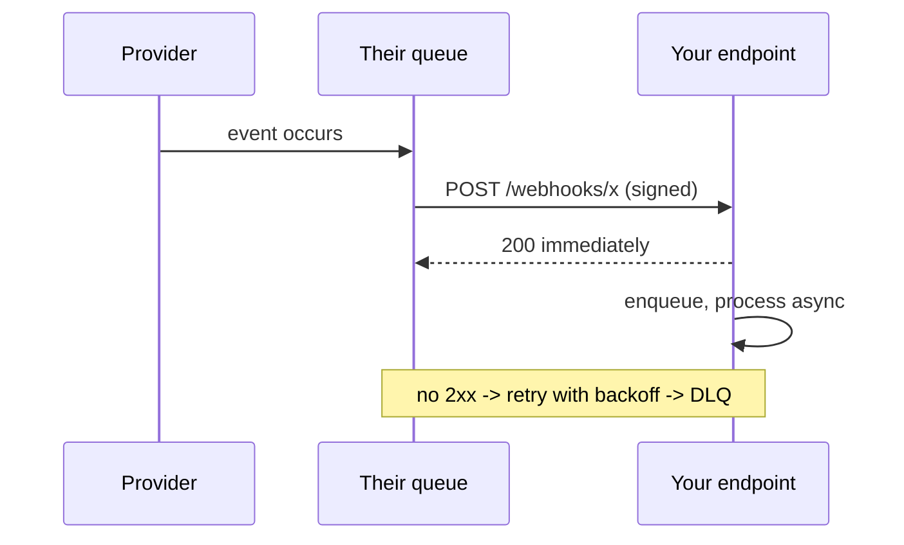

# API design

> The [framework](the-framework.html) gives API design five minutes in phase 3.
> This page is what to say inside those five minutes, and what to say when the
> interviewer decides the API *is* the deep dive.

---

## 1 · REST, GraphQL, gRPC

| | REST | GraphQL | gRPC |
|---|---|---|---|
| **Transport** | HTTP/1.1 or 2, JSON | HTTP, JSON | HTTP/2, protobuf binary |
| **Shape** | Resources and verbs | One endpoint, a query language | Typed method calls |
| **Over/under-fetching** | Both, routinely | **Solved — client asks for exactly what it needs** | Fixed per method |
| **Caching** | **Trivial — HTTP caching just works** | Hard; POST to one URL | Needs custom work |
| **Browser support** | Native | Native | Needs a proxy (grpc-web) |
| **Payload size** | Verbose JSON | Verbose JSON | **Compact binary** |
| **Streaming** | SSE or WebSocket | Subscriptions | **Native, bidirectional** |
| **Schema** | OpenAPI, optional | **Mandatory and typed** | **Mandatory, .proto** |
| **Debuggability** | curl | Reasonable | Binary — needs tooling |

### How to actually choose

> **Public API → REST. Internal service-to-service → gRPC. A client with wildly
> varying data needs, especially mobile → GraphQL.**

**REST for anything public**, and the reason is caching and familiarity: HTTP
caching, CDNs, proxies and every debugging tool on earth already understand it.
A public GraphQL API means every consumer must learn your schema and you lose
edge caching.

**gRPC internally**, where you control both ends: binary payloads, HTTP/2
multiplexing, generated clients, and a schema that breaks the build rather than
production when it changes. The browser problem does not apply between your own
services.

**GraphQL when the client's needs vary and round trips are expensive.** The
canonical case is a mobile app that would otherwise make six REST calls to
render one screen.

**GraphQL's real costs — name them, because they are what the follow-up probes:**

| Cost | Detail |
|---|---|
| **The N+1 problem** | A query for 100 posts, each with an author, becomes 101 database calls unless you batch. Fixed with DataLoader-style per-request batching — **know this name** |
| **Query cost is unbounded** | A client can request a deeply nested graph. You need depth limits, complexity scoring, or persisted queries |
| **Caching is largely lost** | One POST endpoint defeats HTTP caching; you cache at the resolver instead |
| **Rate limiting is harder** | "100 requests" is meaningless when one request can cost 1000× another. Price by computed cost |

---

## 2 · REST done properly

```
GET    /v1/users/{id}                 -> 200 the user
GET    /v1/users/{id}/posts?limit=20  -> 200 a page
POST   /v1/posts                      -> 201 + Location header
PATCH  /v1/posts/{id}                 -> 200 partial update
DELETE /v1/posts/{id}                 -> 204 no content
```

| Rule | Why |
|---|---|
| **Nouns, not verbs** | `/users/123`, never `/getUser?id=123` |
| **Plural collections** | `/users`, `/posts` — consistency beats grammar debates |
| **Nest one level, then stop** | `/users/1/posts` is fine; `/users/1/posts/2/comments/3` is not — use `/comments?post=2` |
| **`PUT` replaces, `PATCH` updates** | And `PUT` is idempotent by definition |
| **Return the created resource** | Saves the client an immediate GET |

**Status codes that carry information:**

| Code | Means |
|---|---|
| 200 / 201 / 204 | OK / created / done, nothing to return |
| **400** | Your request is malformed |
| **401 vs 403** | Not authenticated **vs** authenticated but not allowed |
| **404** | Not found — *or* found but you may not know it exists |
| **409** | Conflict — a version clash, or a duplicate |
| **422** | Well-formed but semantically invalid |
| **429** | [Rate limited](rate-limiting.html) — with `Retry-After` |
| **5xx** | Our fault. Never return 200 with an error in the body |

> **401 versus 403 is a small thing that gets noticed.** And returning 404
> instead of 403 for resources the caller may not know about is a deliberate
> information-leak defence worth mentioning.

---

## 3 · Pagination

**Cursor, not offset**, and be able to say why:

```
OFFSET:  GET /posts?page=3&limit=20
  - the database SKIPS 40 rows to return 20 -- cost grows with page number
  - a row inserted at the head SHIFTS everything: the reader sees an item
    twice, or misses one entirely
  - deep pages get slower and slower

CURSOR:  GET /posts?after=eyJ0IjoxNzAwfQ&limit=20
  - WHERE (created_at, id) < (cursor) ORDER BY ... LIMIT 20
  - uses the index directly; page 1000 costs the same as page 1
  - stable under concurrent inserts
```

**Encode the cursor opaquely** — base64 of `(sort_key, id)` — so clients cannot
construct one and you can change the scheme later. Include the tiebreaker `id`,
or rows sharing a timestamp are skipped or repeated.

**The honest trade-off:** cursors cannot jump to page 50. If the product needs
numbered pages, you need offset — so cap the depth, and say so.

---

## 4 · Versioning

| Approach | Example | Note |
|---|---|---|
| **URL path** | `/v1/users` | **Most common.** Obvious, cacheable, ugly |
| Header | `Accept: application/vnd.api.v1+json` | Cleaner URLs, easy to get wrong, harder to test |
| Query param | `/users?version=1` | Simple; pollutes caching |
| **No versioning** | Additive changes only | **The real goal** |

> **The best versioning strategy is not needing one.** Adding a field is
> backward-compatible; removing or renaming one is not. If every change is
> additive and clients ignore unknown fields, you may never cut v2. Version when
> you must break something — and then run both for a deprecation window with
> usage metrics telling you when the old one is safe to retire.

---

## 5 · Webhooks

The server calls *you* when something happens — the inverse of polling.



**Five things a webhook receiver must do**, and they map exactly onto
[idempotency](idempotency.html):

| Requirement | Why |
|---|---|
| **Verify the signature** | An HMAC over the body with a shared secret. Otherwise anyone can POST you fake events |
| **Return 2xx fast, process later** | Providers time out in seconds. Ack, enqueue, work asynchronously |
| **Be idempotent** | Delivery is at-least-once; **you will receive duplicates** |
| **Tolerate out-of-order arrival** | Retries mean event 5 can land before event 4. Use a version or timestamp |
| **Expect replays** | Providers redeliver after outages |

**Webhooks versus polling versus streaming:**

| | Use when |
|---|---|
| **Polling** | Low frequency, or you cannot expose an endpoint. Simple, wasteful |
| **Webhooks** | Events are infrequent and you have a public endpoint |
| **WebSocket / SSE** | Continuous updates to an active client — see [chat](design-chat.html) |

---

## 6 · The API gateway

One entry point in front of many services.

| Does | Instead of |
|---|---|
| TLS termination | Every service holding certificates |
| AuthN, and coarse authZ | Every service re-implementing it |
| [Rate limiting](rate-limiting.html) | Per-service limiters that do not compose |
| Routing and versioning | Clients knowing service topology |
| Request/response shaping | Coupling clients to internal models |
| Metrics and tracing entry | Inconsistent instrumentation |

> **The anti-pattern: business logic in the gateway.** It becomes a shared
> component every team must change and no team owns — a distributed monolith with
> extra latency. **Keep it to cross-cutting concerns.**

**BFF (backend-for-frontend)** is worth naming: one gateway per client type —
web, iOS, Android — each shaping responses for that client's needs. It solves
the same over-fetching problem GraphQL does, without adopting GraphQL.

---

## 7 · What to say in the round

> *"REST over HTTP for the public API — it caches at the edge for free and every
> client already understands it. Cursor pagination rather than offset, because
> offset re-scans and shifts under concurrent inserts. Internal service calls are
> gRPC: binary, multiplexed, and the schema breaks the build instead of
> production.*
>
> *Version in the path, but I'd aim never to cut v2 — additive changes with
> clients ignoring unknown fields. Writes carry an idempotency key so a client
> retry after a timeout cannot double-charge, and the gateway handles TLS, auth
> and rate limiting so no service re-implements them."*

---

## 8 · Interview questions

| Question | What to say |
|---|---|
| ⭐ "REST or GraphQL?" | REST for public APIs — HTTP caching, CDNs and every tool already work. GraphQL when one client needs wildly varying data and round trips are expensive, typically mobile. But then I own the N+1 problem, unbounded query cost, and losing edge caching. |
| ⭐ "What is the N+1 problem?" | A GraphQL query for 100 posts with their authors resolves the author field 100 separate times — 101 queries. Fixed by per-request batching, DataLoader-style: collect the IDs requested in one tick and issue a single `WHERE id IN (...)`. |
| ⭐ "Why cursor pagination?" | Offset makes the database skip rows, so deep pages get slower, and an insert at the head shifts everything so readers see duplicates or gaps. A cursor on `(sort_key, id)` uses the index directly and is stable under writes. The cost is that you cannot jump to page 50. |
| "How do you version?" | Path versioning, but the aim is never to need v2 — keep changes additive and have clients ignore unknown fields. When you must break, run both with usage metrics telling you when it is safe to retire the old one. |
| ⭐ "Design a webhook receiver." | Verify the HMAC signature, return 2xx immediately and process asynchronously, dedupe on the event ID because delivery is at-least-once, and tolerate out-of-order arrival using a version or timestamp. Providers also replay after outages. |
| "What belongs in the gateway?" | Cross-cutting concerns only — TLS, auth, rate limiting, routing, tracing. Business logic there creates a component every team must change and none owns, which is a distributed monolith with an extra hop. |
| "gRPC in the browser?" | Not directly — it needs grpc-web and a proxy. That is a large part of why gRPC stays internal and REST or GraphQL faces the public. |

---

## Stop condition

You know this block when you can:

1. choose between REST, GraphQL and gRPC on caching, control and payload grounds,
2. explain the N+1 problem and name the batching fix,
3. give both reasons offset pagination fails,
4. argue that the best versioning is additive change,
5. list the five requirements of a webhook receiver, and
6. say what must *not* go in a gateway.
