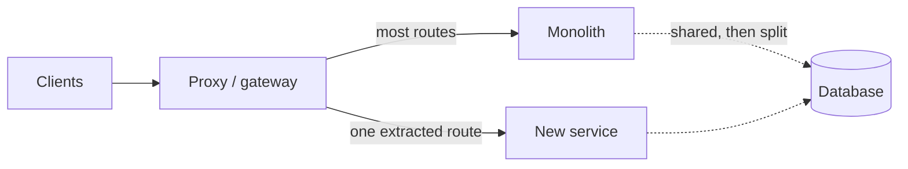
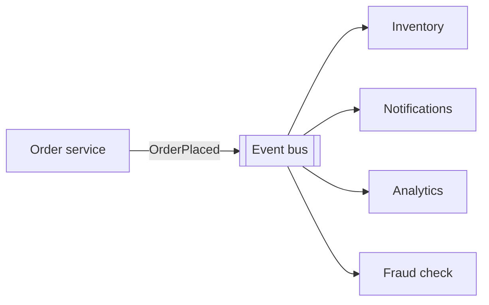

# Architectural patterns

> **"Would you use microservices?" is a trap question**, and the trap is
> enthusiasm. The expected answer is not yes. It is *"what problem are we
> solving, and is it an organisational one or a technical one?"*

---

## 1 · Monolith versus microservices

### The honest default is a monolith

**Start with a well-structured monolith.** Not a legacy big ball of mud — a
single deployable with clear internal module boundaries.

| | Monolith | Microservices |
|---|---|---|
| **Deploy** | One artefact | Many, independently |
| **Local dev** | Run it | Run 15 things, or mock them |
| **A function call** | Nanoseconds, always succeeds | Milliseconds, can fail, needs a timeout |
| **Transactions** | One database, ACID | Saga + compensation |
| **Refactoring across boundaries** | An IDE rename | A coordinated multi-team release |
| **Debugging one request** | A stack trace | Distributed tracing, if you built it |
| **Scaling** | Whole app together | Per service |
| **Team autonomy** | Coordination required | Independent |
| **Failure blast radius** | All or nothing | Contained — *if* you built bulkheads |

> **The decisive argument, and it is not technical.** Microservices are a
> solution to an *organisational* problem: too many engineers contending on one
> codebase and one release train. Conway's law is the real driver. With eight
> engineers you do not have that problem, and you pay every cost above for
> nothing.

**What microservices actually cost**, stated as availability arithmetic:

```
A request touching 5 services, each 99.9% available:
    0.999^5 = 99.5%   -> ~44 hours of downtime a year

The same logic in one process: 99.9%   -> ~9 hours

You did not add reliability by splitting. You multiplied the ways to fail.
```

Every network hop needs a timeout, a retry policy, a circuit breaker, and a
fallback — see [failure & resilience](failure-and-resilience.html). None of that
exists in a function call.

### When splitting is genuinely right

| Signal | Why it justifies a split |
|---|---|
| **Teams blocking each other on releases** | The real reason. Independent deploys |
| **One component's scaling profile differs wildly** | Video transcoding needs GPUs; the API does not |
| **Genuinely different availability requirements** | Checkout must not be taken down by recommendations |
| **A compliance boundary** | Payment data in an isolated, audited service |
| **A different language is genuinely warranted** | An ML serving path in Python beside a Java core |

**Not on that list:** "it is modern", "it scales better" (a monolith scales
horizontally too), or "we might need it later."

### The migration path

**The strangler fig, and it is the answer to "how would you migrate?"**



```
1. Put a proxy in front of the monolith. Change nothing else.
2. Extract ONE service -- pick a leaf with few dependencies.
3. Route just its traffic to the new service. Everything else untouched.
4. Split its data LAST, once the service boundary has proven correct.
5. Repeat. Stop when the pain stops.
```

> **Splitting the database is the hard part, and it comes last.** Services
> sharing a database are not really independent — a schema change still couples
> them. But splitting data first, before you know the boundary is right, means
> migrating data twice. **Get the boundary right while the data is still
> together, because that is the cheap time to be wrong.**

**"Stop when the pain stops" is deliberate.** There is no prize for finishing.

---

## 2 · Serverless

Functions run on demand; the platform handles scaling and you pay per
invocation.

| Good for | Bad for |
|---|---|
| Spiky, unpredictable traffic | Steady high load — **more expensive than servers** |
| Event handlers, glue, cron | Latency-critical paths (cold starts) |
| Low or zero baseline traffic | Long-running work (execution limits) |
| Small teams avoiding ops | Anything needing persistent connections |

**The three real constraints:**

**Cold starts.** An idle function must be initialised — tens of milliseconds to
seconds depending on runtime and package size. Fine for a webhook; not fine for
a p99-sensitive read path.

**No persistent connections.** Each invocation may be a new instance, so
database connection pools do not work in the usual way. This is why serverless
plus a traditional relational database needs a proxy or pooler in between — a
genuinely common production failure.

**Cost inverts at scale.** Per-invocation pricing is cheap when idle and
expensive when busy. There is a crossover point, and past it a reserved instance
is dramatically cheaper.

> **The best serverless answer in a design round is narrow**: use it for the
> bursty, stateless, non-latency-critical edges — image thumbnailing, webhook
> receipt, scheduled jobs — and keep the steady-state request path on ordinary
> servers.

---

## 3 · Event-driven architecture

Services emit events; other services react. No synchronous call between them.



| Buys | Costs |
|---|---|
| Producers do not know consumers | **The flow exists in no single place** |
| Add a consumer without touching the producer | Debugging spans many logs |
| Natural load levelling | Eventual consistency everywhere |
| Replay, if it is a log | Ordering only per partition |

**Two things worth distinguishing**, because interviewers probe it:

| | Event notification | Event-carrying state transfer |
|---|---|---|
| Payload | Just an ID — "order 123 placed" | The full order object |
| Consumer must | Call back for details | Nothing — it has what it needs |
| Coupling | Higher — a callback dependency | Lower |
| Payload size | Tiny | Large, and can go stale |

> **The failure mode nobody mentions until it bites: no one can answer "what
> happens when an order is placed?"** In a synchronous design you read the
> function. In an event-driven one, you grep the whole organisation for
> subscribers. That is the price of the decoupling, and saying it out loud is the
> senior move.

**Event sourcing** is a further step — store the events as the source of truth
and derive state by replaying them. It gives a perfect audit log and
time-travel, at the cost of schema evolution being genuinely hard, since you
must replay events written by old code. Mention it; do not reach for it unqueried.

---

## 4 · Peer-to-peer

No central server for the data path; peers exchange directly.

**Used by:** BitTorrent, WebRTC video calls, blockchain, Netflix's Open Connect
in a hybrid form.

| Buys | Costs |
|---|---|
| Bandwidth scales *with* users | NAT traversal is genuinely hard |
| No central bandwidth bill | Peer discovery still needs a server |
| Censorship resistance | No guarantee any peer is available |
| Lower latency between nearby peers | Trust, verification, incentive design |

> **Almost all "P2P" systems are hybrid**, and saying so is the accurate answer:
> a central server handles discovery, authentication and signalling, then peers
> talk directly. WebRTC still needs a signalling server to exchange connection
> details, and a TURN relay when NAT traversal fails — which is a substantial
> minority of connections.

**In a design round, P2P is right for exactly one reason: the data is large and
the bandwidth bill would otherwise be yours.** Video calls and file distribution
qualify. A social feed does not.

---

## 5 · Choosing, in the round

| Situation | Say |
|---|---|
| Startup, small team, unknown product | **Modular monolith.** One deploy, clean internal boundaries |
| Teams blocking each other | Extract services along team lines — strangler fig |
| One component scales differently | Extract *that one*, leave the rest |
| Bursty, stateless edge work | Serverless for that piece only |
| Many independent reactions to one event | Event-driven, and name the debugging cost |
| Large media, bandwidth-dominated | Hybrid P2P or CDN |

> *"I'd start with a modular monolith — one deployment, but strict internal
> boundaries so extraction is cheap later. I'd split when a team is blocked on
> someone else's release, or when a component's scaling profile genuinely
> differs, not before. The cost I want to name up front is availability: five
> services at three nines each is 99.5%, worse than the monolith it replaced,
> unless I build the timeouts, breakers and bulkheads to go with it."*

---

## 6 · Interview questions

| Question | What to say |
|---|---|
| ⭐ "Monolith or microservices?" | Monolith by default, with real internal module boundaries. Microservices solve an organisational problem — teams contending on one release train — not a technical one. Below roughly that threshold you pay every cost and get nothing. |
| ⭐ "What do microservices cost?" | Availability multiplies down: five services at 99.9% is 99.5%. Every call needs a timeout, retry policy, breaker and fallback. Transactions become sagas. Local development needs the whole fleet or mocks. And a cross-boundary refactor becomes a multi-team release. |
| ⭐ "How would you migrate a monolith?" | Strangler fig: proxy in front, extract one leaf service, route only its traffic, and **split its data last**. Getting the boundary wrong is cheap while the data is still together and expensive after. Stop when the pain stops — there is no prize for finishing. |
| "When is serverless right?" | Bursty, stateless, non-latency-critical work — webhooks, thumbnails, cron. Not the steady request path: cold starts hurt p99, connection pooling does not work naturally, and per-invocation pricing inverts against reserved capacity at scale. |
| ⭐ "Event-driven — what is the catch?" | The business process exists in no single place. You cannot read one function to learn what happens when an order is placed; you search for subscribers. That is the real cost of the decoupling, alongside eventual consistency and per-partition ordering. |
| "Event notification or state transfer?" | Notification keeps payloads small but couples consumers back to the producer for details. State transfer removes that call but ships larger payloads that can be stale. I'd default to notification plus a versioned read API. |
| "Is P2P realistic here?" | Only if bandwidth is the dominant cost — file distribution or video calls. And it is always hybrid: you still need a server for discovery and signalling, plus a relay for the NAT traversals that fail. |

---

## Stop condition

You know this block when you can:

1. give the organisational argument for microservices, not the technical one,
2. do the availability multiplication out loud,
3. describe the strangler fig **and** say why data splits last,
4. name serverless's three real constraints,
5. state event-driven's debugging cost unprompted, and
6. say why every real P2P system is hybrid.
