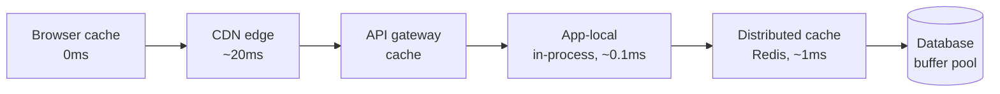

# Caching

> **Caching appears in essentially every design round**, which means saying "and
> we'll add a cache" is worth nothing. The score is in *where*, *which pattern*,
> *how it is invalidated*, and *what happens when it fails*.

---

## 1 · Where caches live

There are six layers, and a good answer names the one it means.



| Layer | Latency | Good for | Watch out for |
|---|---|---|---|
| **Browser** | 0 | Static assets, user's own data | You cannot invalidate it; only expire it |
| **CDN** | 10–50 ms | Public, cacheable-by-URL content | Purge is eventually consistent |
| **API gateway** | ~1 ms | Identical anonymous responses | Per-user content needs care |
| **In-process** | ~0.1 ms | Tiny, hot, tolerant of staleness | **N copies, N inconsistencies** |
| **Distributed (Redis)** | ~1 ms | The workhorse — shared, invalidatable | Network hop; it can fail |
| **DB buffer pool** | — | Free; already happening | Not something you design |

> **In-process caching is faster and much more dangerous.** Every instance holds
> its own copy, so an invalidation must reach all of them and a user can see a
> value flip back and forth depending on which server they hit. It is the right
> answer for small, slow-changing config; the wrong answer for anything a user
> just edited. Saying that distinction out loud is a depth signal.

---

## 2 · The read patterns

### Cache-aside (lazy loading) — the default

The application owns the logic.

```python
def get_user(user_id):
    key = f"user:{user_id}"
    cached = cache.get(key)
    if cached is not None:
        return cached                      # hit

    user = db.query("SELECT ... WHERE id = ?", user_id)   # miss
    cache.set(key, user, ttl=300)
    return user
```

| | |
|---|---|
| **Good** | Only requested data is cached; a cache outage degrades rather than breaks; works with any store |
| **Bad** | Every miss pays cache + DB; the app repeats this logic everywhere; a window exists where cache and DB disagree |

**This is the right default and the right first answer.** Say "cache-aside" by
name.

### Read-through

The cache sits inline and fetches on miss itself. Simpler application code,
but the cache becomes a hard dependency — if it is down, you are down.

---

## 3 · The write patterns

This is where the interesting trade-off lives.

| Pattern | Write goes | Durability | Read-after-write | Use when |
|---|---|---|---|---|
| **Write-through** | Cache **and** DB, synchronously | Safe | Consistent | Reads follow writes closely |
| **Write-around** | DB only; cache filled on read | Safe | Stale until miss | Write-heavy, rarely re-read |
| **Write-back** | Cache now, DB asynchronously | **Can lose data** | Consistent | Extreme write throughput |
| **Invalidate-on-write** | DB, then **delete** the key | Safe | Consistent | The pragmatic default |

> **Delete the key; do not update it.** Updating on write invites a lost-update
> race: two concurrent writers can leave the cache holding the older value
> permanently. Deleting means the next read repopulates from the source of
> truth. The worst case is an extra miss, not permanent corruption.

**Write-back is the one to mention carefully.** It is the fastest and the only
one that can silently lose acknowledged writes when a cache node dies. Legitimate
for view counters and metrics; unacceptable for anything a user would notice
missing. Saying *"write-back, but only because losing a few view counts is
acceptable"* is exactly the kind of scoped trade-off the round rewards.

---

## 4 · Eviction and TTL

| Policy | Evicts | Good for |
|---|---|---|
| **LRU** | Least recently used | General purpose — the default |
| **LFU** | Least frequently used | Stable hot sets; resists scan pollution |
| **FIFO** | Oldest inserted | Rarely right |
| **TTL only** | Whatever expired | Freshness matters more than hit rate |
| **Random** | Any | Cheap; surprisingly decent at scale |

**LRU's weakness is worth knowing:** one large scan — a batch job reading every
row — evicts the entire hot set. LFU or a segmented LRU resists this. Redis's
`allkeys-lru` is approximate (it samples rather than maintaining an exact list),
which is a good example of trading precision for O(1).

**On TTLs:**

- **Always set one**, even when you invalidate explicitly. It is the backstop
  for the invalidation you will eventually miss.
- **Jitter it.** A thousand keys written together with `ttl=300` all expire in
  the same second. `ttl = 300 + random(0, 60)` spreads the reload.

---

## 5 · The three failure modes

**This section is the depth.** Candidates who can name and fix these are visibly
different from candidates who cannot.

### Stampede (dogpile)

A hot key expires; 10,000 concurrent requests all miss and all hit the database
at once.

```
t=0    key "top_posts" expires
t=0.1  10,000 requests miss simultaneously
t=0.1  10,000 identical queries hit the database
t=0.2  database saturates -> everything is slow -> more requests pile up
```

| Fix | How |
|---|---|
| **Lock / single-flight** | First miss takes a lock and recomputes; the others wait or serve stale |
| **Probabilistic early expiry** | Each read may refresh slightly before the TTL, with probability rising as expiry nears — so one request refreshes while the rest still hit a valid entry |
| **Never expire; refresh async** | A background job keeps hot keys warm |
| **Serve stale while revalidating** | Return the old value immediately, refresh behind it |

**Single-flight is the answer to give**, and "serve stale while revalidating" is
the one that impresses, because it keeps p99 flat during the refresh.

### Penetration

Requests for keys that *do not exist* — often an attack. Every one misses the
cache and hits the database, which is exactly what the cache was meant to
prevent.

| Fix | How |
|---|---|
| **Cache the negative** | Store a null marker with a short TTL (30–60s) |
| **Bloom filter** | Membership check in front; a definite "no" never reaches the DB |
| **Validate input** | Reject malformed IDs before any lookup |

**A Bloom filter is the textbook answer here** and is worth being able to
justify: it can produce false positives (a wasted lookup) but never false
negatives, so it can only ever say "definitely not present" — which is exactly
the guarantee you need, in a fraction of the memory of the full key set.

### Avalanche

A large fraction of the cache disappears at once — a node dies, or many keys
share an expiry — and the full read load lands on the database.

| Fix | How |
|---|---|
| **Jittered TTLs** | Never let a batch of keys expire together |
| **Consistent hashing** | One dead node costs 1/N of the cache, not all of it |
| **Replicated cache** | A replica takes over with a warm dataset |
| **Circuit breaker** | Shed load rather than let the DB fall over |
| **Size the DB for a partial miss** | Assume you may lose a node and survive it |

> **The question behind all three is the same: "what is your cache hit rate, and
> is the database sized for what happens when it drops?"** A design that only
> works at 99% hit rate and collapses at 70% is fragile, and saying so about
> your own design is strong.

---

## 6 · Invalidation

The hard part, and the honest answer is that there are only three strategies:

| Strategy | Mechanism | Trade-off |
|---|---|---|
| **TTL** | Let it expire | Simple; stale for up to the TTL |
| **Explicit** | Delete on write | Fresh; you *will* miss a path |
| **Versioned key** | `user:42:v7` — bump the version | No deletion needed; old entries age out; costs memory |

**Versioned keys are underrated in interviews.** Instead of invalidating, change
the key: bump a version counter on write and every reader naturally computes a
new key. There is no invalidation to get wrong, and no thundering delete. The
cost is that the old entries linger until evicted.

For a *group* of keys, keep the version on the group:

```
key = f"feed:{user_id}:v{get_version(user_id)}"
# one INCR on the version invalidates every cached page of that feed
```

---

## 7 · Hit rate

```
hit rate = hits / (hits + misses)
```

**Effective latency** is what actually matters:

```
90% hit:  0.9 x 1ms + 0.1 x 50ms  =  5.9 ms
95% hit:  0.95 x 1ms + 0.05 x 50ms =  3.5 ms
99% hit:  0.99 x 1ms + 0.01 x 50ms =  1.5 ms
```

> **Going from 90% to 99% roughly quarters your latency — and cuts database load
> by 10×.** That second effect is the bigger one, and it is why hit rate is a
> capacity number rather than a performance nicety. Quoting this computation is
> a compact way to justify the whole cache tier.

If the hit rate is genuinely low (< 50%), the cache may be the wrong tool: the
access pattern has no locality, and you are paying a network hop to miss.

---

## 8 · What to say in the round

> *"Cache-aside in Redis for user and post lookups, TTL 5 minutes with jitter,
> and I delete the key on write rather than updating it — updating races. For
> the hot keys I'd use single-flight so an expiry doesn't stampede the database,
> and I'd rather serve stale for a moment than queue behind a refresh. Sizing
> assumes a 95% hit rate; if a cache node is lost, consistent hashing means we
> lose 1/N, and the database needs headroom for that."*

**Six decisions, each justified, in one breath** — pattern, TTL, jitter,
invalidation, stampede protection, and failure sizing. That is a complete
caching answer.

---

## 9 · Interview questions

| Question | What to say |
|---|---|
| ⭐ "Cache-aside or write-through?" | Cache-aside by default — only requested data gets cached and a cache outage degrades instead of breaking. Write-through when reads follow writes closely enough that the extra write cost pays for itself. |
| ⭐ "How do you invalidate?" | Delete the key on write rather than updating it, because updating races and can leave the stale value permanently. Always keep a TTL as the backstop. For groups, a versioned key prefix invalidates everything with one INCR. |
| ⭐ "A hot key expires and 10k requests miss at once." | That is a stampede. Single-flight — one request recomputes under a lock while others wait or serve stale — plus probabilistic early expiry so hot keys refresh before they actually expire. Serving stale during revalidation keeps p99 flat. |
| "How do you handle lookups for keys that don't exist?" | Cache the negative result with a short TTL, and put a Bloom filter in front if it is adversarial — it never gives a false negative, so a "not present" answer is safe to trust and never reaches the database. |
| "What if the cache goes down?" | With cache-aside the system degrades rather than fails, but only if the database can take the load. So the real question is whether it is sized for a 0% hit rate — usually not, which is why I'd add a circuit breaker and load shedding rather than pretend it can. |
| "Where would you *not* cache?" | Data with no locality — a low hit rate means paying a network hop to miss. Data that must be strictly consistent. And anything where a stale read has real cost, like a balance check before a transfer. |

---

## Stop condition

You know this block when you can:

1. name the six cache layers and the danger of the in-process one,
2. explain why you delete rather than update on write,
3. name all three failure modes and a fix for each,
4. justify a Bloom filter by its one-sided error, and
5. compute effective latency at 90% versus 99% hit rate.
