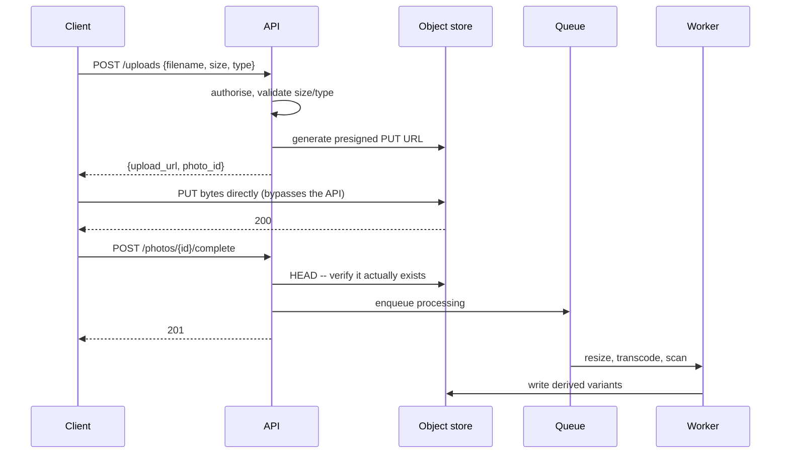

# CDN and object storage

> **Any design involving images, video, or files has the same two moves:** the
> bytes go in object storage, the database keeps metadata, and a CDN serves the
> reads. Getting to that quickly and then going deep on the *upload path* is
> where the marks are.

---

## 1 · Never put blobs in the database

The reasons, in order of how much they matter:

| Reason | Detail |
|---|---|
| **Cost** | Object storage is ~10–20× cheaper per TB than database storage |
| **Backups** | A 50 TB database takes hours to restore; the metadata alone takes minutes |
| **Buffer pool** | Blobs evict the hot rows your queries actually need |
| **Replication** | Every replica now copies terabytes of immutable bytes |
| **Serving** | You cannot put a CDN in front of a `SELECT` |

**The architecture is always:**

```
  metadata in the database          bytes in object storage
  ------------------------          -----------------------
  photo_id, owner_id, caption  ->   s3://bucket/photos/{photo_id}
  created_at, width, height
  storage_key  -------------------->
```

> **The one legitimate exception is small and rare**: thumbnails under a few KB
> where an extra round trip costs more than the storage. Naming the exception is
> better than an absolute rule, because absolutes invite a counterexample.

---

## 2 · The upload path

**This is the deep dive**, and the naive answer — client uploads to your API,
your API forwards to storage — is wrong in a specific, explainable way.



**Why presigned URLs, said properly:**

> *"The client uploads straight to object storage with a short-lived presigned
> URL. If it went through my API, every byte would consume an application
> server's bandwidth, memory, and a request thread for the whole duration of the
> upload — a hundred concurrent 50 MB uploads would occupy the fleet doing
> nothing but copying. The API only issues credentials and records metadata, so
> it stays fast and stateless."*

**The details that show you have built this:**

| Detail | Why |
|---|---|
| **Short expiry** (5–15 min) | A leaked URL stops being useful quickly |
| **Constrain the policy** | Pin content-type and max size in the signature, or clients upload anything |
| **Verify on complete** | The client can lie; `HEAD` the object before marking it ready |
| **Multipart above ~100 MB** | Parallel parts, and a failed part retries alone rather than restarting |
| **Orphan cleanup** | Clients abandon uploads; a lifecycle rule deletes unreferenced objects |
| **Scan before serving** | Malware and content moderation happen in the worker, not inline |

---

## 3 · Storage classes and lifecycle

| Class | Access | Cost | Use |
|---|---|---|---|
| Standard | Instant | Baseline | Active data |
| Infrequent access | Instant, higher per-request | ~50% less | Older but still served |
| Archive (Glacier) | Minutes to hours | ~85% less | Compliance, backups |
| Deep archive | Hours | ~95% less | Legal retention |

**Lifecycle rules are the cost lever**, and they matter because access is
heavily skewed: most objects are read within days of creation and then almost
never. *"Standard for 30 days, infrequent access to 90, archive after"* is a
one-sentence answer to "how would you control storage cost", and it is the right
one.

**Durability versus availability** is worth distinguishing since candidates
conflate them: object stores advertise 11 nines of *durability* (your bytes are
not lost) but only 3–4 nines of *availability* (you can reach them right now).
Erasure coding across zones gives durability cheaply — roughly 1.5× overhead
instead of 3× for full replication.

---

## 4 · The CDN

A network of edge caches near users. Two reasons, and the second is usually the
bigger one:

1. **Latency** — 20 ms to a nearby PoP instead of 150 ms across an ocean. You
   cannot cache around the speed of light, so you move the bytes closer.
2. **Origin offload and egress cost** — at 95% offload your origin serves 1/20th
   the traffic, and CDN egress is materially cheaper than cloud egress.

### Push versus pull

| | Pull (origin-pull) | Push |
|---|---|---|
| **How** | First request at an edge misses and fetches from origin | You upload to the CDN ahead of time |
| **Good** | No wasted storage; nothing to manage | No cold-miss penalty |
| **Bad** | First user per region pays the miss | You push everything, including the unpopular |
| **Use** | Almost always | Large predictable launches — a game patch, an episode drop |

**Pull is the default.** Mention push only for a known simultaneous spike, where
the cold-miss stampede across every edge would hammer the origin at once.

### Cache-control, and the trick

```http
# Immutable, content-addressed assets -- the important case
Cache-Control: public, max-age=31536000, immutable

# HTML that must revalidate
Cache-Control: no-cache

# Private user data at the edge -- usually don't
Cache-Control: private, max-age=0
```

> **The versioned-filename trick is the answer to CDN invalidation**, and it is
> worth stating explicitly: purging a CDN is slow and eventually consistent, so
> you avoid needing to. Name assets by a content hash — `app.4f3a9c.js` — and
> cache them for a year as immutable. A new deploy produces a *new URL*, so
> there is nothing to invalidate; the old file simply stops being requested.

**`stale-while-revalidate`** is the other directive worth knowing: serve the
stale copy immediately and refresh behind it, so a cache expiry never costs a
user latency.

---

## 5 · Signed URLs for private content

Public CDN content is simple. Private content — a paid video, a user's own
files — needs the edge to enforce access without calling your API on every
request.

```
https://cdn.example.com/video/abc.m3u8
    ?Expires=1735689600
    &Signature=<HMAC over path + expiry + optional client IP>
    &Key-Pair-Id=K2JCJMDEHXQW5F
```

The edge verifies the signature itself. **Your origin is not consulted**, which
is the whole point — authorisation happened once, when you minted the URL.

The trade-off to state: **a signed URL is bearer credential.** Anyone holding it
has access until it expires. Keep expiries short, bind to client IP where the
client is not behind a shifting NAT, and for video use short-lived per-segment
URLs so a leaked link stops working in seconds.

---

## 6 · Bandwidth is the cost driver

For a media system the interesting number is usually **egress, not QPS** — and
noticing that is what separates a real answer from a template.

```
20,000 image requests/s x 200 KB  =  4 GB/s  =  32 Gbps

At a rough $0.05/GB cloud egress:
  4 GB/s x 86,400 = 345 TB/day = ~$17k/day  = $6M/year

With 95% CDN offload and cheaper CDN egress, that falls by roughly an
order of magnitude -- which is why the CDN is not an optimisation here,
it is the architecture.
```

**The single biggest lever is not the CDN, though — it is serving the right
size.** Delivering a resized 200 KB variant instead of a 4 MB original is a 20×
bandwidth reduction and dwarfs every other saving on the table. Generate
variants in the async worker, pick by device, and use modern formats (WebP,
AVIF) for another 30%.

---

## 7 · What to say in the round

> *"Photos go to object storage; the database holds only metadata and the
> storage key. Clients upload directly with a presigned PUT — short expiry, with
> content-type and size pinned in the policy — so no upload bytes ever touch my
> API servers. On completion I `HEAD` the object to verify it, then enqueue a
> worker to generate variants and run moderation. Serving is CDN-fronted with
> content-hashed, immutable URLs, so I never need to purge. Lifecycle rules move
> objects to infrequent access after 30 days. The dominant cost here is egress,
> not compute — which is why serving a 200 KB variant rather than the original
> matters more than anything else I've said."*

---

## 8 · Interview questions

| Question | What to say |
|---|---|
| ⭐ "Where do the images go?" | Object storage for the bytes, database for metadata. Blobs in a database cost 10–20× more, bloat backups and replication, evict the buffer pool, and cannot be CDN-fronted. |
| ⭐ "How does the upload work?" | Presigned URL straight to storage. If uploads went through the API, every byte would consume a server's bandwidth and hold a thread for the upload's duration. The API issues a short-lived, policy-constrained URL and records metadata; the client PUTs directly and then calls back, and I verify with a HEAD before marking it ready. |
| "What about very large files?" | Multipart upload — parallel parts, and a failed part retries on its own instead of restarting a 5 GB transfer. Plus a lifecycle rule to abort incomplete multipart uploads, or they accumulate and you pay for them. |
| ⭐ "How do you invalidate the CDN?" | Ideally you never do — purges are slow and eventually consistent. Content-hash the filename and serve it immutable for a year, so a deploy creates a new URL and the old one just stops being requested. For genuinely mutable paths, short TTLs with stale-while-revalidate. |
| "Private content on a CDN?" | Signed URLs verified at the edge, so the origin is never consulted. They are bearer credentials, so keep expiries short and, for video, sign per segment. |
| "How would you cut cost?" | Serve resized variants rather than originals — usually a 20× bandwidth reduction and the largest single lever. Then modern formats, then CDN offload, then lifecycle rules to colder storage classes. |
| "Push or pull CDN?" | Pull, almost always — no wasted storage and nothing to manage. Push only for a known simultaneous spike, where every edge would miss at once and stampede the origin. |

---

## Stop condition

You know this block when you can:

1. give three reasons blobs do not belong in a database,
2. draw the presigned-upload sequence and say why the API must not proxy bytes,
3. explain immutable content-hashed URLs as the answer to invalidation,
4. distinguish durability from availability, and
5. identify egress as the binding cost and name the 20× lever.
