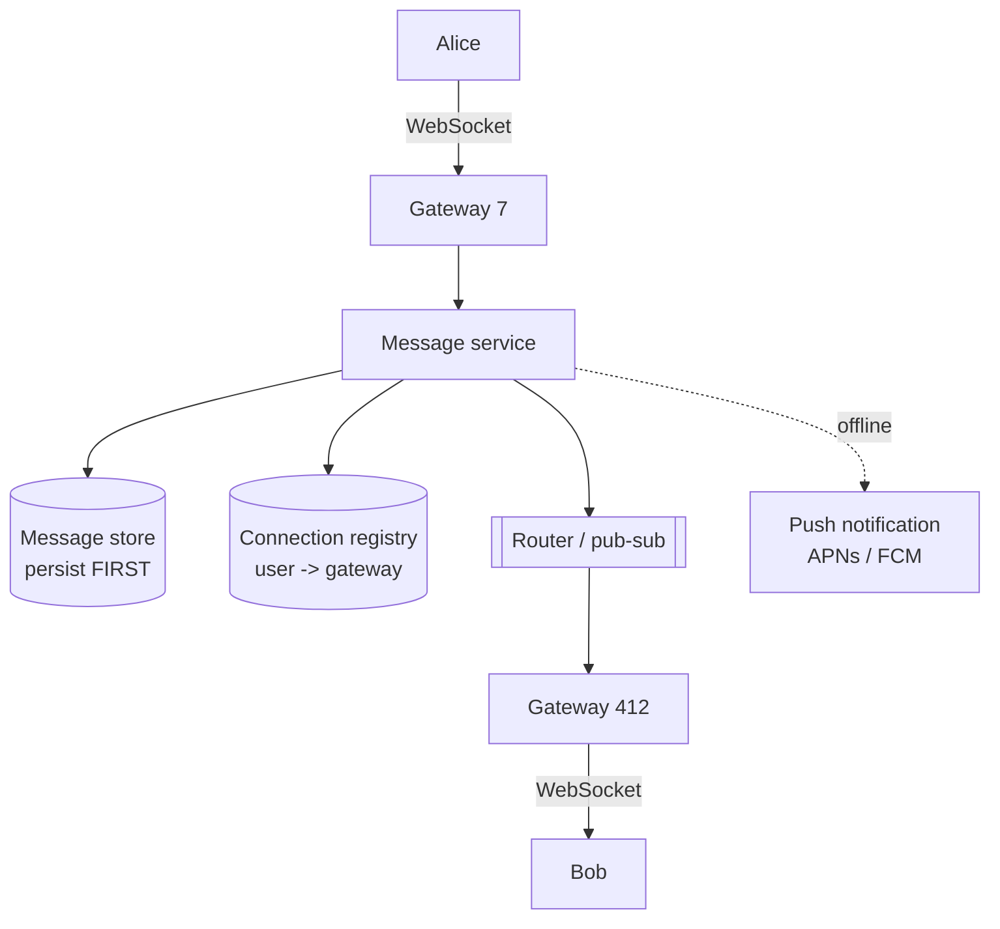

# Design a chat system

> **A different shape from the request/response designs.** The hard parts are
> stateful connections, per-conversation ordering, and the fact that the
> *cheapest-looking* feature — presence — is the most expensive thing in the
> system.

WhatsApp, Messenger, Slack — same core.

---

## 1 · Scope (0–5)

```
IN SCOPE                          OUT OF SCOPE
- 1:1 messaging                   - voice / video calls
- small group chat (<= 100)       - end-to-end encryption details
- online/offline presence         - message search
- delivery + read receipts        - large broadcast channels
- message history

NON-FUNCTIONAL
- 50M DAU, ~40 messages/user/day
- delivery latency p99 < 500ms when both online
- messages must NEVER be lost      <- durability is the hard requirement
- ordering consistent WITHIN a conversation
- offline users receive on reconnect
```

> **"Never lost" is the requirement that shapes everything.** It means persist
> before acknowledging, at-least-once delivery, and client-side deduplication —
> and it rules out fire-and-forget push as the primary path.

---

## 2 · Estimation (5–8)

```
MESSAGES  50M x 40 = 2B/day = ~23,000/s, peak ~70,000/s

CONNECTIONS  ~10M concurrent WebSockets
  at ~10k-50k connections per server -> 200-1,000 gateway servers
  each connection costs memory (buffers + TLS state), roughly 10-50 KB
  -> 10M x 30 KB = ~300 GB of RAM across the fleet, just to hold sockets

STORAGE  2e9/day x 300 B = 600 GB/day = ~220 TB/year
         x3 replication = ~660 TB/year  -> sharded, with tiering

CONCLUSION
  - Connection COUNT, not message rate, sizes the gateway fleet
  - 70,000 writes/s of small immutable rows, read by conversation and
    time -> wide-column store, not a relational primary
  - Presence updates could dwarf messages -- see below
```

**The insight to voice: this is a connection-management problem more than a
throughput problem.** 23,000 messages/s is unremarkable; 10 million persistent
connections is the engineering.

---

## 3 · Transport

| Option | Latency | Cost | Verdict |
|---|---|---|---|
| Short polling | Bad | Wasteful | No |
| Long polling | OK | Held connections anyway | Fallback |
| Server-sent events | Good | One-directional | Not for chat |
| **WebSocket** | **Best** | Stateful, full duplex | **Yes** |

**WebSocket, with long polling as a fallback** for restrictive networks. Say
that — it shows awareness that not every client can hold a WebSocket.

**The consequence of stateful connections** is the thing to discuss:

| Problem | Handling |
|---|---|
| Gateways are stateful | Cannot load balance freely; need a connection registry |
| Deploys drop connections | Drain slowly; clients reconnect with backoff + jitter |
| Reconnect storms | **Jittered backoff is mandatory** — 10M clients reconnecting together will kill you |
| Idle detection | Application-level heartbeat; TCP alone will not tell you |

> **The reconnect storm is the failure mode worth naming.** If a gateway fleet
> restarts, every disconnected client reconnects at once. Without jittered
> backoff that thundering herd takes down the fleet that just came back — the
> outage becomes self-sustaining.

---

## 4 · The routing problem

Alice is on gateway 7; Bob is on gateway 412. How does Alice's message reach
Bob?



**The order of operations is the correctness question:**

```
1. Alice's client sends {client_msg_id, conversation_id, text}
2. Gateway -> message service
3. PERSIST to the message store          <- BEFORE anything else
4. ACK to Alice ("sent")                  <- she can stop retrying
5. Look up Bob's gateway in the registry
6. Route to that gateway -> push over Bob's socket
7. Bob's client ACKs -> mark "delivered"
8. Bob opens the chat -> "read"
```

> **Persist before acknowledging.** If you ack first and the store write fails,
> the message is gone and the sender believes it was sent — which violates the
> one hard requirement. This ordering is the single most important thing in the
> design and is worth stating explicitly.

**The connection registry** maps `user_id → gateway_id`, in Redis with a TTL
refreshed by heartbeat. It is hot and small. If the lookup says a user is
connected but the gateway has since died, the send fails and falls through to
the offline path — so **the offline path must be the fallback for every failed
delivery**, not just for genuinely offline users.

**Group messages** fan out to each member's gateway. For groups capped at 100
this is trivial; for large channels it becomes the news-feed problem again, and
saying so connects the two designs.

---

## 5 · The message store

**The schema is the design.** Access is always "messages in this conversation,
newest first, paginated backwards."

```
Wide-column (Cassandra / DynamoDB):

  partition key:  conversation_id       <- all of a chat on one partition
  clustering key: message_id DESC       <- sorted within it, newest first

  SELECT * FROM messages
   WHERE conversation_id = ?
   AND message_id < ?          -- cursor
   ORDER BY message_id DESC
   LIMIT 50
```

**Why this shape:**

| Property | Reason |
|---|---|
| Partition by conversation | Every read is one partition — no scatter-gather |
| Clustered by message ID descending | The dominant query needs no sort |
| Write-heavy, append-only | LSM storage is exactly right |
| Immutable rows | No update contention |

**The hot-partition caveat, which you should volunteer:** a very active group
chat is a single hot partition. For groups above some size, bucket the partition
key by time — `(conversation_id, day)` — so load spreads. The cost is that a
read may span two buckets at a boundary.

**Message IDs must sort correctly.** Snowflake IDs (timestamp-prefixed, unique
without coordination) give ordering and uniqueness without a central allocator,
and reuse the point from [sharding](sharding.html).

---

## 6 · Ordering

**Global ordering is unnecessary and expensive. Per-conversation ordering is
what users perceive**, and saying that distinction is the answer.

| Approach | Note |
|---|---|
| Server-assigned sequence per conversation | Simple, authoritative, needs a per-conversation counter |
| Snowflake IDs | Roughly time-ordered; clock skew can reorder near-simultaneous messages |
| Lamport / vector clocks | Correct causal order; heavier |

**Client timestamps cannot be trusted** — device clocks are wrong, sometimes by
hours. Order by server-assigned ID, and display the client's time only as a
label.

Because delivery is at-least-once, **the client deduplicates on
`client_msg_id`** — a UUID the sender generates, which also makes the sender's
own retry safe. Same idempotency-key idea as everywhere else.

---

## 7 · Presence — the expensive feature

**Naive presence generates more traffic than messages**, and noticing that is a
genuine differentiator.

```
10M online users, each with ~200 contacts.
A status change notifies every contact who is watching.

If users toggle a few times an hour:
  10M x 3/hour x 200 contacts = 6 BILLION notifications/hour
                              = ~1.7M/s

...for a green dot. Messages are 23,000/s.
```

**Fixes, in order of value:**

| Fix | Effect |
|---|---|
| **Only push to contacts with the chat open** | Massive reduction — most contacts aren't looking |
| **Pull on demand** | Fetch presence when a list is rendered, not on change |
| **Debounce** | Do not broadcast flapping; wait ~30s before marking offline |
| **Coarse granularity** | "Active recently" rather than exact online/offline |
| **Heartbeat TTL** | Client heartbeats every ~30s into Redis with a 60s TTL; absence *is* offline — no explicit disconnect needed |

> **The heartbeat-TTL trick is the elegant part**: you never need a reliable
> "user went offline" event, which is good, because you will not get one when a
> phone loses signal. Expiry does the work.

---

## 8 · Failure and wrap

| Fails | Effect | Mitigation |
|---|---|---|
| Gateway dies | Those clients drop | Jittered reconnect; registry TTL expires |
| Registry unavailable | Cannot route | Fall back to push notifications for everyone |
| Message store shard | Some history unreadable | Replicas; new messages still deliverable |
| Client offline | — | Persisted; delivered on reconnect + push |
| Duplicate delivery | — | Client dedupes on `client_msg_id` |

> *"Summary: WebSockets terminated on a stateful gateway fleet sized by
> connection count rather than message rate, a Redis registry mapping users to
> gateways, and messages persisted before they are acknowledged — that ordering
> is what makes 'never lost' true. Storage is wide-column partitioned by
> conversation and clustered by message ID descending, so the only query we run
> is one partition read with no sort. Ordering is per-conversation, not global,
> because that is what users can perceive.*
>
> *The part I'd watch hardest is presence — done naively it generates two orders
> of magnitude more traffic than the messages, so it is heartbeat-with-TTL and
> only pushed to contacts actually viewing. And the operational risk is the
> reconnect storm: if the gateway fleet restarts, ten million clients come back
> at once, so jittered backoff is not optional."*

---

## 9 · Follow-ups

| Question | Answer |
|---|---|
| ⭐ "WebSocket or polling?" | WebSocket — full duplex and no per-message handshake — with long polling as a fallback for restrictive networks. The cost is stateful servers, which complicates load balancing, deploys, and failure. |
| ⭐ "How does a message get from one server to another?" | A registry maps user to gateway; the message service looks up the recipient's gateway and routes to it, via pub/sub. If the lookup is stale or the send fails, it falls through to the offline push path — which therefore has to handle failed deliveries, not just offline users. |
| ⭐ "How do you guarantee no message is lost?" | Persist to the store before acknowledging the sender. Acking first means a failed write loses a message the sender believes was delivered. Then at-least-once delivery to the recipient with client-side dedupe on a sender-generated message ID. |
| "How do you order messages?" | Per conversation, using server-assigned IDs — Snowflake or a per-conversation sequence. Never client timestamps; device clocks are unreliable. Global ordering would need coordination and nobody can perceive it. |
| ⭐ "Why is presence hard?" | Because it is chattier than messaging by two orders of magnitude if done naively — status changes times contacts. Heartbeat with a TTL so expiry means offline, debounce flapping, and only push to contacts who currently have the conversation open. |
| "How do you store the messages?" | Wide-column, partitioned by conversation, clustered by message ID descending — the dominant query becomes a single partition read that is already in order. Bucket the partition by time for very active groups, or you get a hot partition. |
| "A gateway fleet restarts." | Ten million clients reconnect simultaneously. Jittered exponential backoff on the client, connection draining on the way out, and enough headroom to absorb the return — otherwise the recovery kills the fleet again. |

---

## Stop condition

You can do this design when you can:

1. size the gateway fleet from connection count rather than message rate,
2. state the persist-then-ack ordering and why it is the durability guarantee,
3. describe the registry and the fall-through to push,
4. give the partition/clustering key and the hot-partition fix,
5. explain per-conversation ordering and client dedupe, and
6. do the presence arithmetic and give the heartbeat-TTL design.
