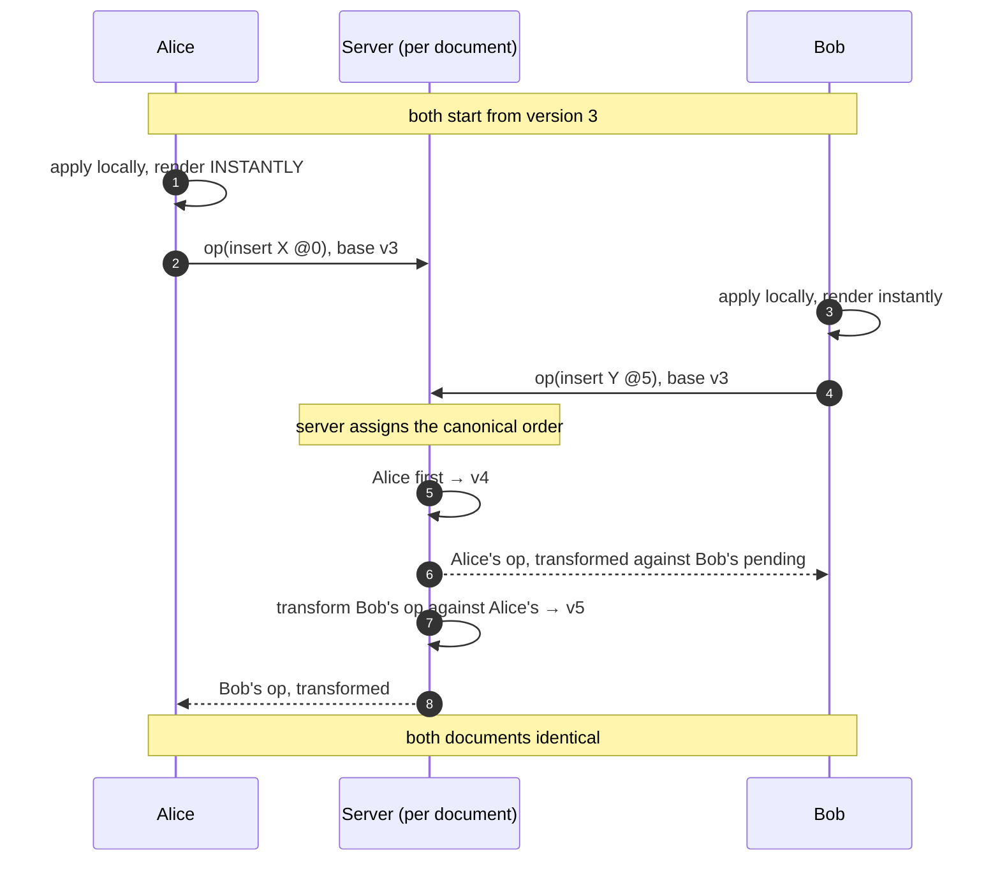
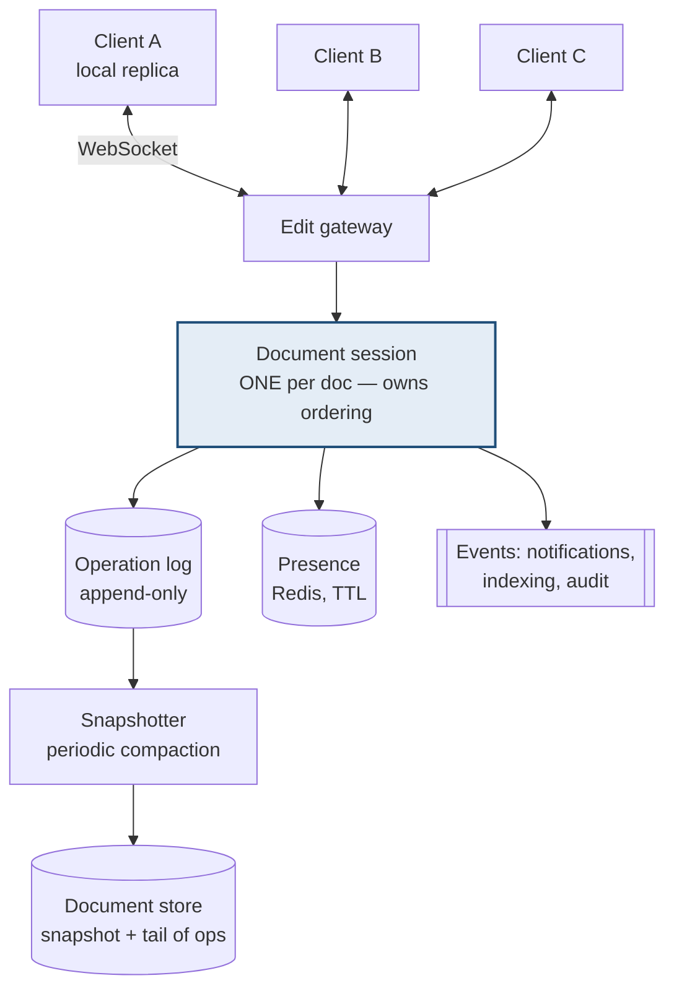

# Design a collaborative editor

> **Every other design resolves write conflicts by picking a winner. This one
> cannot.** Two people typing in the same paragraph must both keep their
> characters, in an order everyone agrees on. That single requirement rules out
> almost every technique in this handbook.

Google Docs, Notion, Figma.

---

## 1 · Scope (0–5)

```
IN SCOPE                          OUT OF SCOPE
- multiple users edit one doc     - rich rendering / layout engine
- changes appear in ~100ms        - comments, suggestions mode
- cursors and selections visible  - version history UI
- no edit is ever lost            - permissions model detail
- offline edits merge on return

NON-FUNCTIONAL
- up to ~50 concurrent editors per document
- local echo must be INSTANT -- never wait for the server to render a keystroke
- convergence: all clients end with the SAME document
- intent preservation: an edit means what the user meant
- no lost edits, ever            <- the hard invariant
```

> **Two properties, and the second is the one people miss.**
> **Convergence** — everyone ends up with the same bytes. **Intent
> preservation** — if I bolded "cat" and you deleted "the", I should still have
> bolded "cat", not something adjacent. A system can converge and still be
> wrong.

---

## 2 · Estimation (5–8)

```
DOCUMENTS   100M docs, but only ~100k concurrently EDITED at peak
CONNECTIONS ~200k WebSockets  ->  gateway sized by CONNECTIONS, as in chat

EDIT RATE   a fast typist: ~6 keystrokes/s
            100k active docs x 2 editors x 6/s = 1.2M ops/s at absolute peak
            realistically far lower -- most sessions are idle or read-only

            BUT: batching keystrokes into ~50-200ms windows cuts this by
            an order of magnitude with no perceptible latency cost

STORAGE     doc content: 100M x 50 KB = 5 TB
            operation log: this is the part that grows without bound
            -> snapshot periodically and truncate the log

CONCLUSION
  - not a throughput problem; a CORRECTNESS and LATENCY problem
  - a document is a single unit of consistency -> shard by document,
    and every edit for one document goes to ONE server
```

**"Shard by document, and route every editor of a document to the same server"
is the structural decision.** It turns a distributed consensus problem into a
single-server ordering problem, which is enormously simpler.

---

## 3 · Why the obvious approaches fail

```
LAST WRITE WINS
  Alice types at position 5, Bob types at position 5.
  One overwrites the other. AN EDIT IS LOST. Unusable.

LOCK THE DOCUMENT
  One editor at a time. That is not collaboration.

LOCK A PARAGRAPH
  Better, and it is what some wikis do -- but it blocks, and
  people edit the same paragraph constantly.

SEND THE WHOLE DOCUMENT ON EVERY CHANGE
  50 KB per keystroke, and simultaneous edits still clobber.

DIFF AND MERGE LIKE GIT
  Merge conflicts. A human cannot resolve a conflict per keystroke.
```

> **The problem is that a text position is not stable.** "Insert at index 5"
> means something different once someone else has inserted at index 2. **Every
> real solution is a way of making concurrent edits refer to the right place
> anyway** — and the two families do it in opposite directions.

---

## 4 · The two solutions

### Operational transformation (OT)

**Transform incoming operations against operations you have already applied.**

```
Document: "HELLO"

Alice:  insert("X", 0)   ->  "XHELLO"
Bob:    insert("Y", 5)   ->  "HELLOY"     (concurrently, same base)

Bob's op arrives at Alice. Applying it literally gives "XHELLOY"? No --
Bob meant "at the end", but Alice's insert shifted everything right by 1.
Position 5 in Alice's document is now inside "HELLO".

TRANSFORM Bob's op against Alice's:
    insert("Y", 5)  becomes  insert("Y", 6)

Both converge to "XHELLOY". Intent preserved.
```



| | |
|---|---|
| **Good** | Small operations; the document stays a plain string; mature — what Google Docs uses |
| **Bad** | **The transform functions are genuinely hard to get right**; requires a central server to impose order; adding an operation type means writing transforms against every existing type |

> **The honest assessment: OT is notoriously difficult to implement correctly.**
> Several published algorithms were later shown to have convergence bugs. That is
> not a reason to avoid it — it is a reason to use a well-tested library rather
> than write it in an interview, and saying so is the mature answer.

### CRDTs — conflict-free replicated data types

**Change the data structure so conflicts cannot arise.** Instead of positions,
every character gets a **unique, immutable, densely-orderable identifier**.

```
Rather than "insert at index 5", each character carries an ID that
sorts between its neighbours:

    H(1.0)  E(2.0)  L(3.0)  L(4.0)  O(5.0)

Alice inserts X before H  ->  X(0.5)
Bob    inserts Y after O  ->  Y(6.0)

Merge = union the sets, sort by ID:
    X(0.5) H(1.0) E(2.0) L(3.0) L(4.0) O(5.0) Y(6.0)

No transformation. No central authority. ORDER IS INTRINSIC to the data.
Deletes are TOMBSTONES -- marked, not removed, so a concurrent insert
next to a deleted character still knows where it belongs.
```

| | |
|---|---|
| **Good** | Merges commute — order of arrival is irrelevant; **works peer-to-peer with no server**; offline merges naturally; far easier to reason about |
| **Bad** | **Metadata overhead** — an ID per character; tombstones accumulate; historically 2–10× memory, though modern libraries (Yjs, Automerge) have largely closed this |

> **The property that makes CRDTs special is commutativity**: apply the same
> operations in any order and you get the same document. That is what removes the
> need for a central sequencer — which is why CRDTs, not OT, are what you reach
> for when offline or peer-to-peer support matters.

### Choosing

| | OT | CRDT |
|---|---|---|
| Central server | **Required** | Optional |
| Offline editing | Awkward | **Natural** |
| Memory overhead | Low | Higher |
| Implementation difficulty | **Very high** | High but more tractable |
| Used by | Google Docs | Figma, Notion, Yjs-based apps |

> **In an interview: pick CRDTs and justify it on offline support and
> commutativity, while acknowledging OT is what Docs actually uses and is more
> memory-efficient.** Naming the trade rather than declaring a winner is the
> answer.

---

## 5 · Architecture



**One session per document, and all its editors routed to it.** Consistent
hashing on document ID does the routing. This is what makes ordering a
single-server problem rather than a distributed-consensus one.

**Local-first rendering is non-negotiable:** apply the keystroke to the local
replica and paint it *immediately*, then send it. Waiting even 50 ms for a
server round trip makes typing feel broken. **The server confirms and reorders;
it never gates the render.**

---

## 6 · Persistence — log plus snapshot

```
The operation log is the source of truth, but it grows forever.

  snapshot at v1000  +  ops 1001..1250   =  current document

Periodically: materialise a new snapshot, truncate the log behind it.

Recovery = load the latest snapshot, replay the tail.
Version history = keep older snapshots and the ops between them.
```

**This is event sourcing**, and it is the right shape here: the operations *are*
the user's intent, so storing them gives version history, undo, and audit as
by-products rather than features you build separately.

---

## 7 · Presence and cursors

Same problem as [chat](design-chat.html), and the same answer.

| Concern | Approach |
|---|---|
| Who is viewing | Heartbeat into Redis with a TTL — **expiry means gone**, so you never need a reliable disconnect event |
| Cursor positions | Broadcast on the session channel; **do not persist** — worthless a second later |
| Throttling | Batch cursor updates to ~10/s; nobody perceives more |
| Cursor after a remote edit | **Must be transformed too** — an insert above you moves your cursor down, or it visibly jumps |

> **Transforming the cursor is the detail that separates a real answer.** If
> Alice inserts a line above Bob's cursor and Bob's cursor is not adjusted, it
> jumps — which feels broken even though the document is correct.

---

## 8 · Offline

**The case CRDTs win outright.**

```
1. Client edits offline against its local replica.
2. Operations queue locally, with their IDs.
3. On reconnect: send the queue, receive what was missed.
4. CRDT merge -- commutative, so arrival order does not matter.
5. Both sides converge. No conflict dialog, ever.
```

With OT this is painful: the client must transform a long backlog against
everything that happened while it was away, and the transform chain grows.

**The honest limit:** two people rewriting the same sentence offline for a week
will converge to a *valid* document that is *semantically* nonsense — both
edits interleaved. **No algorithm fixes that**; it is a product decision about
surfacing "this was edited elsewhere". Saying so is better than implying CRDTs
solve semantics.

---

## 9 · Failure and wrap

| Fails | Effect | Mitigation |
|---|---|---|
| Client loses connection | Keeps editing locally | Queue ops; merge on reconnect |
| Gateway node dies | Those clients drop | Reconnect with jittered backoff; session rebuilds from log |
| **Session server dies** | That document stalls | Reassign via consistent hashing; **rebuild state from the op log** — which is why the log is the source of truth |
| Op log write fails | Edit not durable | Ack to the client only after the log write; clients retry |
| Slow client | Falls behind | It catches up from the log; never blocks others |
| Reconnect storm | Gateway overwhelmed | Jittered backoff, as in chat |

> *"Summary: every client holds a local replica and renders keystrokes
> immediately — the server never gates the render, or typing feels broken.
> Documents are sharded so all editors of one document reach one session server,
> which turns ordering into a single-server problem.*
>
> *I'd use CRDTs: every character carries a unique, densely-orderable ID, so
> merges commute and arrival order is irrelevant. That makes offline editing
> natural and removes the need for a central sequencer. The cost is metadata per
> character and tombstones. OT is the alternative — smaller on the wire and what
> Google Docs uses — but the transform functions are notoriously hard to get
> right, and offline is awkward.*
>
> *Persistence is an append-only op log with periodic snapshots, which gives
> version history and undo as by-products, and lets a failed session server
> rebuild by replaying. Presence is heartbeat-with-TTL, and remote cursors are
> transformed alongside edits or they visibly jump.*
>
> *The limit I'd be honest about: convergence is not semantic correctness. Two
> people rewriting the same paragraph offline will merge into something valid and
> meaningless, and that is a product problem, not an algorithmic one."*

---

## 10 · Follow-ups

| Question | Answer |
|---|---|
| ⭐ "Two people type in the same place — who wins?" | Both. That is the requirement, and it is why last-write-wins is unusable here. The real problem is that a text index is not stable: "insert at 5" means something else once someone inserts at 2. OT transforms the position; CRDTs replace positions with intrinsic IDs. |
| ⭐ "OT or CRDT?" | CRDT, for offline support and because merges commute so arrival order is irrelevant — no central sequencer needed. The costs are per-character metadata and tombstones. OT is leaner on the wire and is what Docs uses, but the transforms are famously hard to get right and offline backlogs are painful. |
| ⭐ "What makes CRDTs work?" | Commutativity. Every character has a unique ID that sorts between its neighbours, so merging is a union and a sort — apply operations in any order and you get the same document. Deletes are tombstones so concurrent inserts beside a removed character still know their place. |
| "Why not just lock the paragraph?" | It blocks, and people edit the same paragraph constantly. It also fails the core requirement — collaboration means simultaneous, not taking turns. |
| ⭐ "Does the client wait for the server?" | Never for rendering. Apply locally and paint immediately, then send. Even 50 ms of round trip makes typing feel broken. The server assigns canonical order and reconciles afterwards. |
| "How do you store the document?" | An append-only operation log as the source of truth, with periodic snapshots so recovery is snapshot-plus-tail rather than replaying everything. Version history and undo fall out of that for free. |
| "How does a failed session server recover?" | Reassign the document by consistent hashing and rebuild state by replaying the op log from the last snapshot. That is the reason the log, not the materialised document, is authoritative. |
| "What about the cursor?" | Transformed along with the text. An insert above your cursor must move it down, or it jumps — the document is right but it feels broken. Cursors are broadcast, throttled, and never persisted. |
| "Two people rewrite the same sentence offline." | They converge — to a valid document that may be semantically nonsense, with both edits interleaved. No algorithm solves that. It becomes a product decision about surfacing that the text changed elsewhere. |

---

## Stop condition

You can do this design when you can:

1. explain why a text index is not a stable reference,
2. state both requirements — convergence *and* intent preservation,
3. contrast OT and CRDTs on commutativity, offline, and memory,
4. insist on local-first rendering and say why,
5. justify the op log plus snapshot as the source of truth,
6. remember to transform the cursor, and
7. admit that convergence is not semantic correctness.
