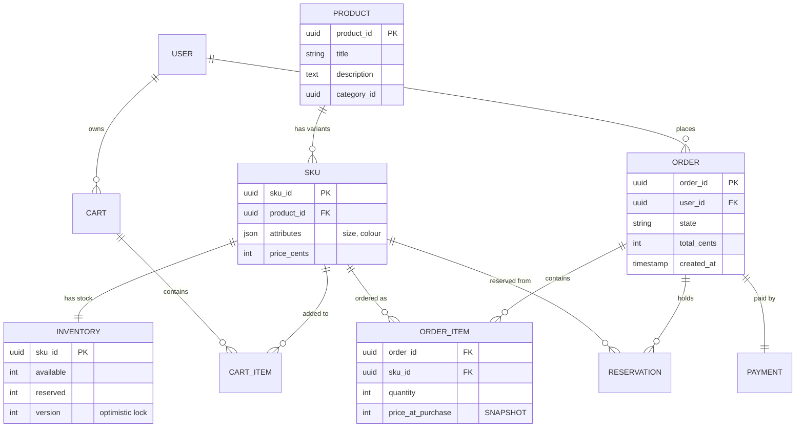
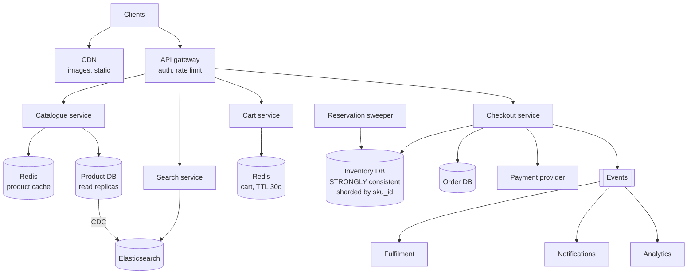
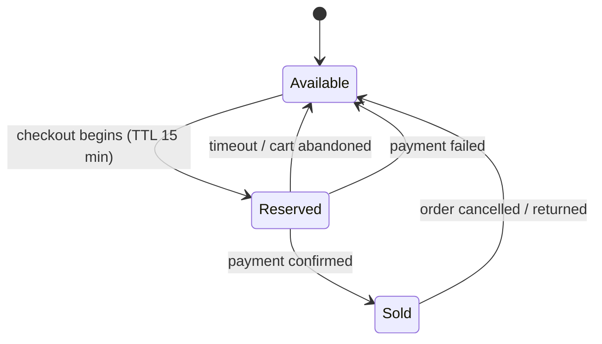
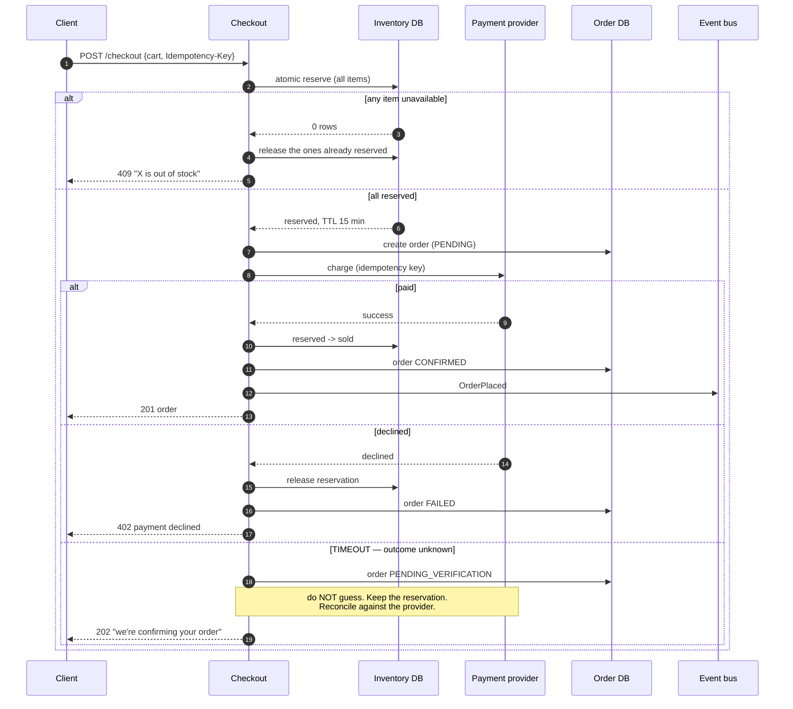

# Design an e-commerce platform

> **The breadth question.** Amazon, Flipkart, Shopify. It has more subsystems
> than any other design in this handbook, which makes **scoping the deciding
> skill** — and one genuinely hard core: not overselling inventory.

---

## 1 · Scope (0–5)

```
IN SCOPE                          OUT OF SCOPE
- browse / search the catalogue   - recommendations
- product detail page             - seller onboarding
- cart                            - logistics / delivery routing
- checkout: reserve, pay, order   - returns, refunds
- inventory correctness           - reviews, Q&A

NON-FUNCTIONAL
- 100M products, 10M DAU
- browse:   read-heavy, ~50,000 QPS peak, staleness OK
- checkout: ~500 QPS, MUST be correct
- NEVER oversell    <- the one hard invariant
- NEVER double-charge
- cart survives across devices and sessions
- flash sales: 100x normal load on a few SKUs
```

> **Open by separating the two halves**, as with
> [ticketing](design-ticketing.html): *"Browsing is read-heavy, cacheable and
> tolerant of staleness. Checkout is a small fraction of traffic that must be
> exactly right. I'll design them separately, because forcing one consistency
> model on both gives you something slow and still wrong."*

---

## 2 · Estimation (5–8)

```
BROWSE   10M DAU x 20 page views = 200M/day = ~2,300 QPS, peak ~7,000
         plus search, images, recommendations -> call it 50,000 QPS at the edge

CHECKOUT 10M DAU x 2% conversion = 200k orders/day = ~2.3/s, peak ~500/s
         during a flash sale, concentrated on a HANDFUL of SKUs

CATALOGUE 100M products x 5 KB (text + attributes) = 500 GB
          images: 100M x 5 variants x 200 KB = 100 TB  -> object storage + CDN

ORDERS   200k/day x 2 KB = 400 MB/day = ~150 GB/year. Small, but must be
         durable and queryable forever.

CONCLUSION
  - browse is a CACHING problem: 50k QPS never touches the database
  - checkout is a CORRECTNESS problem at only 500/s -- tiny volume,
    strict guarantees
  - the flash sale is the real difficulty: 100x load on ONE row
```

**The flash-sale line is the one to land.** Normal load is unremarkable; the
design exists for the moment 50,000 people want the same SKU.

---

## 3 · The data model



**Three modelling decisions worth defending:**

| Decision | Why |
|---|---|
| **Product vs SKU are separate** | "T-shirt" is a product; "T-shirt, blue, medium" is the SKU. **Stock lives on the SKU** — this split is the most common modelling mistake and it makes inventory impossible if you get it wrong |
| **`price_at_purchase` on the order item** | Prices change. An order must record what was actually charged, not join to a live price — otherwise every historical order silently rewrites itself |
| **`available` and `reserved` are separate columns** | A reservation is not a sale. Keeping them apart is what lets a hold expire without losing stock |

---

## 4 · Architecture



**Two halves, opposite properties:**

| | Browse path | Checkout path |
|---|---|---|
| QPS | ~50,000 | ~500 |
| Consistency | Eventual — a stale price or stock count is fine | **Strong** |
| Store | Cache + replicas + Elasticsearch | Transactional, sharded by SKU |
| Failure | Degrade | **Refuse** |

> **"12 left in stock" on a product page can be wrong and that is fine.** The
> truth is established at reservation time, not at render time. Users are used to
> "sorry, that just sold out" — they are not used to being charged for something
> that does not exist.

---

## 5 · The hard part — never oversell

**This is the whole question.** Everything else is caching and CRUD.

### The reservation model

**A sale is not one step.** Modelling it as three is what makes payment failure
and abandonment tractable — the same shape as
[ticketing](design-ticketing.html#4--the-reservation-model).



### The atomic decrement

```sql
-- Reserve. Atomic; no lock held across the payment call.
UPDATE inventory
   SET available = available - :qty,
       reserved  = reserved  + :qty,
       version   = version + 1
 WHERE sku_id = :sku
   AND available >= :qty;          -- the guard that prevents overselling

-- 1 row affected -> reserved.  0 rows -> insufficient stock, tell the user now.
```

> **`available >= :qty` in the WHERE clause is the entire correctness
> mechanism.** The database evaluates and updates atomically, so two concurrent
> checkouts for the last item cannot both succeed — one gets zero affected rows.
> **No application-level lock, no distributed lock, no read-then-write race.**
>
> A Redis lock here would be wrong for the same reason as in ticketing: a GC
> pause longer than the TTL means two holders. **The database constraint is the
> source of truth; anything else is an optimisation in front of it.**

### The checkout sequence



**Three details that decide this answer:**

| Detail | Why |
|---|---|
| **Reserve before charging** | Charging first and then finding no stock means refunding a customer for something you never had |
| **Release partial reservations** | A 5-item cart where item 4 fails must release items 1–3, or abandoned stock accumulates |
| **Never guess on a payment timeout** | You do not know if the charge happened. Releasing risks giving away paid stock; confirming risks shipping unpaid goods. **Hold and reconcile** — see [idempotency](idempotency.html) |

### Reservation expiry

**Lazy, not sweeper-dependent** — correctness must not rely on a cron job:

```sql
-- Expired reservations are treated as available by the reserve query itself.
UPDATE inventory SET available = available - :qty, reserved = reserved + :qty
 WHERE sku_id = :sku
   AND (available >= :qty
        OR available + (SELECT COALESCE(SUM(qty), 0) FROM reservations
                         WHERE sku_id = :sku AND expires_at < now()) >= :qty);
```

Plus a background sweeper to normalise the rows so the displayed counts stay
accurate. **The sweeper is for tidiness; the lazy check is for correctness.**

---

## 6 · The flash sale

**100× load concentrated on one row.** Row-level contention, not throughput, is
the problem — every request wants the same lock.

| Technique | Effect |
|---|---|
| **Virtual waiting room** | Admit at a controlled rate; most traffic never reaches the database |
| **Pre-declare the stock in Redis** | Decrement a counter in memory first; only survivors touch the database |
| **Sharded counters** | Split 1,000 units into 10 buckets of 100; a request picks one bucket. **10× less contention** |
| **Queue the checkouts** | Serialise per SKU; slower per request, no contention at all |
| **Reject early** | Once the Redis counter hits zero, reject at the edge |

> **Sharded counters are the neat answer and the trade-off is worth stating:**
> splitting stock into buckets removes contention but fragments availability —
> a bucket can be empty while others have stock, so a request may be told "sold
> out" while units remain. Fix by falling through to other buckets, which
> reintroduces some contention. **That tension is the real answer, not the
> technique.**

---

## 7 · The browse path

Straightforward by comparison, but say the decisions:

| Concern | Approach |
|---|---|
| Product pages | Cache-aside in Redis, TTL minutes; invalidate on update |
| Images | Object storage + CDN, content-hashed URLs — see [CDN & storage](cdn-and-storage.html) |
| Search | Elasticsearch kept in sync by **CDC**, not dual writes — see [search](search.html) |
| Listing pages | Cursor pagination, never offset — see [API design](api-design.html) |
| Stock display | From cache. Approximate, and that is fine |
| Personalisation | Fragment-cache the page; personalise a small hole in it |

**The cart lives in Redis with a long TTL, keyed by user.** It is not an order —
losing a cart is annoying, not incorrect. For guests, key by a cookie and merge
into the user's cart at login.

> **A cart holds no stock.** Only checkout reserves. Reserving on add-to-cart
> means one abandoned cart can hold inventory for hours, and at scale that
> starves real buyers.

---

## 8 · Failure and wrap

| Fails | Effect | Mitigation |
|---|---|---|
| Product cache | DB sees full browse load | Read replicas + circuit breaker; degrade to fewer fields |
| Search cluster | No search | Fall back to category browse — a degraded store still sells |
| Cart store | Carts lost | Annoying, not incorrect; users rebuild |
| **Inventory DB** | **No checkouts** | **Refuse rather than risk overselling.** Browsing continues |
| Payment provider | Cannot complete | Circuit-break, hold reservations, queue and retry |
| Sweeper | Stale reservations | Lazy expiry means correctness is unaffected |

> *"Summary: two halves. Browse is cached, replica-served and eventually
> consistent at 50,000 QPS. Checkout is 500 QPS, strongly consistent, sharded by
> SKU so contention is local and every transaction is single-shard.*
>
> *Overselling is prevented by an atomic conditional decrement — `available >=
> qty` inside the UPDATE — not by any lock. Stock moves available → reserved →
> sold, reservations expire lazily so correctness never depends on a sweeper, and
> a payment timeout holds the reservation and reconciles rather than guessing.*
>
> *The thing I'd design for hardest is the flash sale: 100× load on one row is a
> contention problem, not a throughput one, so a waiting room and a Redis
> pre-check keep most traffic away from the database entirely."*

---

## 9 · Follow-ups

| Question | Answer |
|---|---|
| ⭐ "How do you prevent overselling?" | An atomic conditional update: decrement where `available >= qty`. The database evaluates and writes in one operation, so two concurrent buyers of the last unit cannot both succeed — one gets zero affected rows. No application lock, and specifically not a distributed lock, which is not a correctness mechanism. |
| ⭐ "The payment provider times out." | Do not guess. Keep the reservation, mark the order pending verification, and reconcile against the provider by idempotency key. Releasing risks giving away stock someone paid for; confirming risks shipping unpaid goods. |
| ⭐ "50,000 people want the same item at 10am." | Contention on one row, not throughput. Waiting room at the edge, a Redis counter that rejects most requests before the database, and sharded counters to split the row — accepting that sharding can report sold-out while other buckets hold stock. |
| "Where does the cart live?" | Redis, keyed by user, long TTL. It holds no inventory — only checkout reserves. Reserving at add-to-cart lets abandoned carts starve real buyers. |
| "Product and SKU — why separate?" | A product is the concept, a SKU is the buyable variant. Stock, price and identifiers live on the SKU. Conflating them makes inventory impossible the moment sizes or colours exist. |
| "Why store the price on the order item?" | Prices change. An order is a historical record of what was charged; joining to a live price silently rewrites history and breaks every reconciliation. |
| "How does search stay in sync?" | Change data capture off the database's replication log, not dual writes — no transaction spans your database and Elasticsearch, so a dual write diverges permanently with nothing to detect it. |
| "Is the stock count on the page accurate?" | No, and it does not need to be. Truth is established at reservation. Users tolerate "just sold out"; they do not tolerate being charged for nothing. |

---

## Stop condition

You can do this design when you can:

1. split browse from checkout on their opposite requirements,
2. write the atomic conditional decrement and say why it needs no lock,
3. draw the reservation state machine and explain lazy expiry,
4. handle a payment timeout without guessing,
5. explain the flash-sale contention problem and the sharded-counter trade-off, and
6. defend the product/SKU split and the price snapshot.
