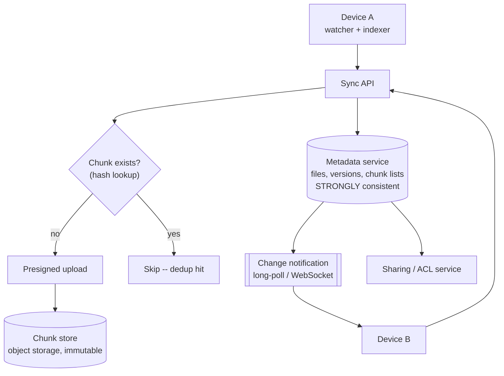

# Design a file sync service

> **Dropbox, Google Drive, OneDrive.** The distinctive parts are content-defined
> chunking, delta sync, and the fact that conflicts are unavoidable — so the
> question is how you handle them, not how you prevent them.

---

## 1 · Scope (0–5)

```
IN SCOPE                          OUT OF SCOPE
- upload / download files         - collaborative real-time editing
- sync across a user's devices    - full-text search of contents
- share with other users          - versioning UI details
- resolve concurrent edits        - offline-first mobile specifics

NON-FUNCTIONAL
- 100M users, 10 devices each possible
- files up to 10 GB
- sync latency: seconds when online
- NEVER silently lose a user's edit    <- the hard requirement
- bandwidth efficiency matters (mobile, metered)
- storage efficiency matters (dedup)
```

> **"Never silently lose an edit" is the requirement that rules out
> last-write-wins**, and stating it in scoping is what lets you reject LWW later
> with a reason rather than a preference.

---

## 2 · Estimation (5–8)

```
USERS    100M, say 50M active daily
FILES    ~100 files changed per active user per day = 5B changes/day
         = ~58,000/s ... but most are small metadata updates

STORAGE  100M users x 10 GB average = 1 EB nominal
         DEDUPLICATION is the lever:
           - shared files stored once
           - identical chunks across users (installers, media, docs)
           - typical savings: 30-50%
         -> effective maybe 500-700 PB

BANDWIDTH  naive: re-upload a 10 MB doc on every save
           delta: upload only changed chunks -> often <100 KB
           -> a 100x reduction on the common case

CONCLUSION
  - The design is about CHUNKS, not files
  - Metadata is small, hot, and must be strongly consistent
  - File bytes are large, cold, immutable -> object storage
  - Separate the two completely
```

**"Metadata and bytes have opposite properties, so they get different systems"
is the framing move here** — the same shape as browse/book in
[ticketing](design-ticketing.html) and the two halves of every media design.

---

## 3 · Chunking and content addressing

**The foundational decision.** Files are split into chunks; each chunk is
identified by the hash of its contents.

```
file "report.docx"  ->  [c1][c2][c3][c4][c5]
                         each ~4 MB, each keyed by SHA-256 of its bytes

  metadata:  report.docx = [hash1, hash2, hash3, hash4, hash5]
  storage:   hash -> bytes   (immutable, write-once)

Consequences, all of them useful:
  - DEDUPLICATION is free: identical chunks store once, globally
  - DELTA SYNC is free: upload only chunks whose hash changed
  - INTEGRITY is free: the hash verifies the bytes
  - Chunks are immutable, so they cache and replicate trivially
```

### Fixed versus content-defined chunking

**This is the detail that separates a good answer:**

```
FIXED-SIZE (every 4 MB):
  insert one byte at the START of the file
  -> every subsequent boundary shifts
  -> EVERY chunk hash changes
  -> you re-upload the entire file

CONTENT-DEFINED (Rabin fingerprint / rolling hash):
  boundaries are chosen where a rolling hash over a sliding window
  hits a pattern -- so they depend on CONTENT, not offset
  -> an insertion changes only the chunk containing it
  -> boundaries downstream re-synchronise naturally
```

> **Content-defined chunking is the right answer and the reason is the
> insertion case.** With fixed chunks, prepending a single byte to a 1 GB file
> costs a 1 GB re-upload. That is the scenario to describe — it makes the
> argument concrete rather than theoretical.

**Compress and encrypt after chunking**, in that order, so identical plaintext
chunks still deduplicate. (Client-side encryption with per-user keys defeats
cross-user dedup entirely — a genuine trade-off between privacy and storage
cost, and worth naming as such.)

---

## 4 · Architecture



**The upload flow, where dedup pays off:**

```
1. Client chunks the file locally, computes hashes
2. Client asks: "which of these hashes do you already have?"
3. Server answers -- often MOST of them
4. Client uploads only the missing chunks, via presigned URLs
5. Client commits the new file version: name -> ordered hash list
6. Metadata service bumps the version, notifies other devices
```

> **Step 2 is what makes the "upload a 4 GB file that already exists" case
> instant**, and it is a satisfying thing to say out loud. The client never sends
> bytes the system already has — from any user.

**The metadata service is the source of truth and is strongly consistent.**
File-to-chunk mappings, versions and ACLs are small, hot, and must never be
wrong. Shard by `user_id` so a user's namespace is single-shard, keeping the
common transactions local.

**Change notification** is long-poll or WebSocket per device. On reconnect, a
device asks "what changed since version N?" — a cursor, not a full resync.

---

## 5 · Conflicts

**Two devices edit the same file offline. This will happen, and the requirement
says nothing may be silently lost.**

| Strategy | Behaviour | Verdict |
|---|---|---|
| Last write wins | Newest timestamp overwrites | ✗ **Silently destroys work**, and clocks are unreliable |
| Lock the file | One editor at a time | ✗ Breaks offline editing entirely |
| **Conflicted copy** | Keep both, rename one | ✓ **What Dropbox does** |
| Operational transform / CRDT | Merge automatically | ✓ For structured docs; not for arbitrary binaries |

**Detection uses version vectors, not timestamps:**

```
Each file version records the version it was DERIVED from.

  Device A: v3 -> v4   (parent v3)
  Device B: v3 -> v4'  (parent v3)     <- both claim v3 as parent

Same parent, two children = concurrent edit, not a sequence.
No clock needed -- causality is recorded structurally.
```

> **Timestamps cannot detect this**, and that is the point worth making: device
> clocks disagree, and even correct clocks cannot distinguish "edited after" from
> "edited concurrently without knowing". A parent pointer records causality
> directly, which is why version vectors are the mechanism rather than an
> alternative to timestamps.

**On conflict: keep both.** `report.docx` and `report (Device B's conflicted copy).docx`.
It is not elegant, but it is honest — the system cannot know which edit the user
wants, so it refuses to guess and surfaces the decision. **Explaining *why* the
inelegant answer is correct is a strong move.**

---

## 6 · Deep dive material

### The client

More of the engineering than people expect:

| Component | Job |
|---|---|
| Watcher | OS filesystem events (inotify / FSEvents / ReadDirectoryChangesW) |
| Indexer | Local database of path → chunk list, mtime, size |
| Chunker | Content-defined splitting, hashing |
| Queue | Ordered, resumable, prioritised upload/download |
| Reconciler | Compare local index against server; produce a change set |

**Debounce filesystem events.** An application saving a file may generate a dozen
events in a second — write, rename, truncate, write. Syncing each one wastes
bandwidth and creates spurious versions.

### Sharing

```
ACL on the file/folder, checked by the metadata service.
Because chunks are content-addressed and immutable, sharing costs
NOTHING in storage -- both users' metadata points at the same hashes.

Inherited permissions on folders; explicit grants override.
```

**Access control lives entirely in metadata.** The chunk store is a dumb
key-value of immutable blobs, and knowing a hash is not authorisation — the
metadata service is what decides who may resolve which hashes.

### Large files and resumability

Multipart upload with per-chunk retry. Because chunks are content-addressed,
**resuming is free**: the client re-asks which hashes exist and uploads the
remainder. An interrupted 10 GB upload never restarts from zero.

### Storage tiering

Most files are never read after the first week. Lifecycle-tier cold chunks to
archive storage; keep the metadata hot so the file still *appears* instantly
even if the bytes take longer to retrieve.

---

## 7 · Failure and wrap

| Fails | Effect | Mitigation |
|---|---|---|
| Metadata service | No sync; local edits queue | Local queue; replay on recovery |
| Chunk store partially unavailable | Some downloads fail | Replication; retry |
| Client crashes mid-upload | — | Content-addressed resume; nothing lost |
| Two devices conflict | — | Version vectors detect; conflicted copy preserves both |
| Client clock wrong | — | **Irrelevant** — causality is structural, not temporal |
| Corrupted chunk | — | Hash verification catches it on read |

> *"Summary: content-defined chunking with content-addressed storage, which gives
> deduplication, delta sync, integrity and resumability from one decision.
> Metadata is small, hot and strongly consistent, sharded by user; bytes are
> large, immutable and in object storage — opposite properties, so different
> systems. Conflicts are detected with version vectors rather than timestamps,
> because clocks cannot distinguish concurrent from sequential, and resolved by
> keeping both copies since the requirement says we may never silently lose an
> edit.*
>
> *The thing I'd validate is the dedup rate — the storage estimate assumes 30–50%,
> and if client-side encryption were required that drops to nearly zero, which
> would roughly double the storage bill. That is a genuine privacy-versus-cost
> decision rather than a technical one."*

---

## 8 · Follow-ups

| Question | Answer |
|---|---|
| ⭐ "A user changes one word in a 10 MB document." | Only the affected chunk re-uploads — typically under 100 KB. That is delta sync, and it comes free from content-addressed chunking rather than being a separate mechanism. |
| ⭐ "Fixed or content-defined chunks?" | Content-defined. With fixed boundaries, inserting one byte at the start of a file shifts every subsequent boundary and changes every hash, so you re-upload the whole file. A rolling-hash boundary depends on content, so only the affected chunk changes. |
| ⭐ "Two devices edit offline. What happens?" | Both versions record the same parent version, so the server sees two children of one parent and knows the edits were concurrent. Timestamps cannot tell you that. Then keep both — a conflicted copy — because the requirement is never to silently lose an edit, and the system cannot know which one the user wants. |
| "Why not last write wins?" | It silently destroys work and the winner is decided by device clocks that disagree. For a file sync product that is a data-loss bug, not a consistency trade-off. |
| "How do you make sharing cheap?" | Content-addressed chunks mean shared files are stored once and both users' metadata points at the same hashes. Sharing is purely a metadata and ACL operation with zero storage cost. |
| "Upload a file that already exists." | Near-instant. The client sends hashes first and asks which are missing; if none are, it just commits the metadata. No bytes cross the wire. |
| "What if the client's clock is wrong?" | It does not matter — ordering comes from parent-version pointers, not time. That is precisely why version vectors are used instead of timestamps. |
| "How do you handle a 10 GB file?" | Chunked multipart with per-chunk retry, and resumption is free because the client can always re-ask which hashes exist. An interrupted transfer never restarts from zero. |

---

## Stop condition

You can do this design when you can:

1. separate metadata from bytes on their opposite properties,
2. explain content-defined chunking with the prepended-byte example,
3. list the four things content addressing gives you at once,
4. explain version vectors and why timestamps cannot detect concurrency,
5. defend conflicted copies as the correct inelegant answer, and
6. name the encryption-versus-dedup trade-off.
