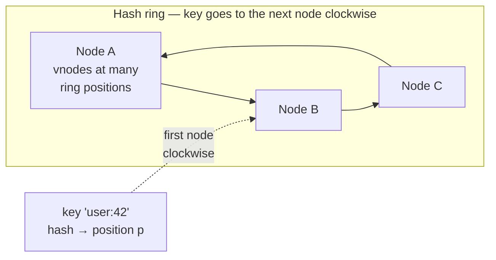
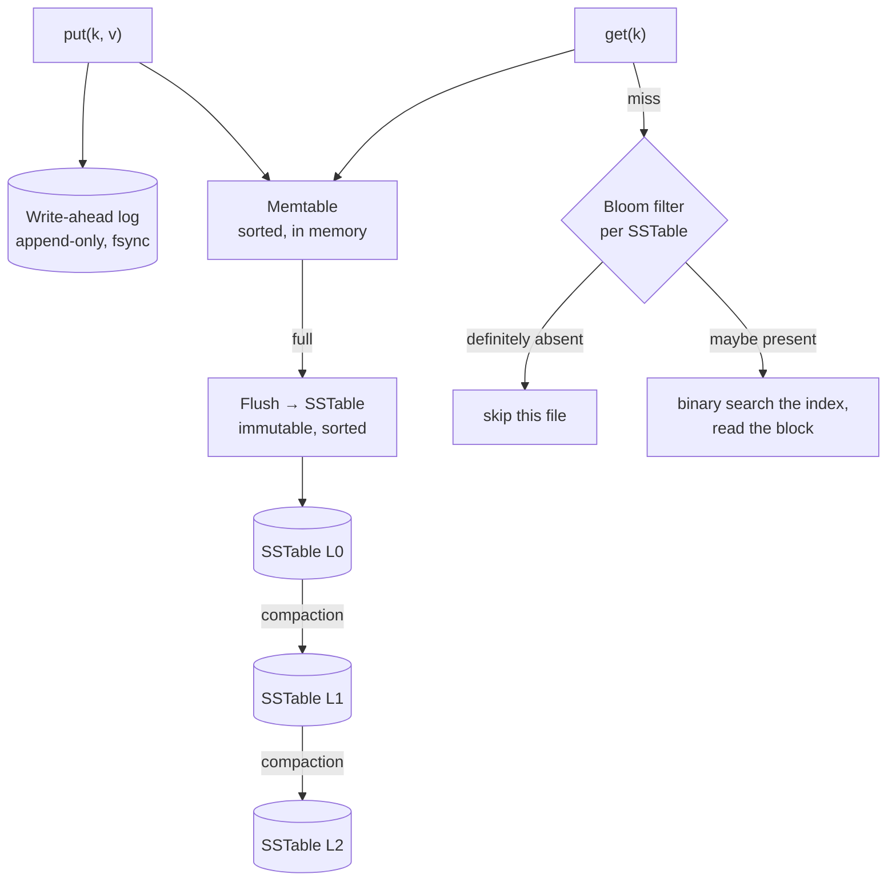
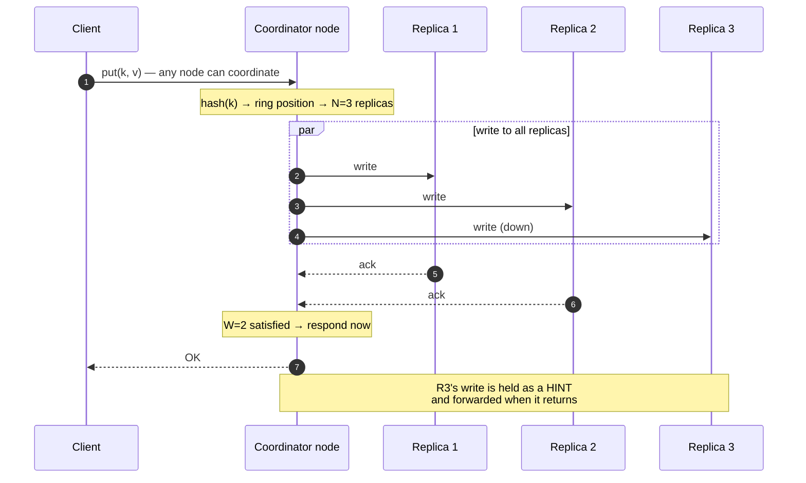

# Design a key-value store

> **Every other design has a product wrapped around the distributed systems.
> This one does not.** Redis, DynamoDB, Cassandra. There is no feature set to
> discuss, so the interview is entirely about partitioning, replication,
> consistency and failure — which is exactly why it gets asked at senior level.

---

## 1 · Scope (0–5)

```
IN SCOPE                          OUT OF SCOPE
- get(key) / put(key, value)      - range scans, secondary indexes
- delete(key)                     - transactions across keys
- partition across nodes          - SQL layer
- replicate for durability        - authentication
- survive node loss
- add/remove nodes live

NON-FUNCTIONAL
- values small: < 10 KB
- p99 read < 10 ms
- highly available -- writes accepted during partitions
- tunable consistency per operation
- horizontally scalable, no single coordinator
- data must survive N node failures
```

> **Ask one clarifying question that changes everything:** *"Is this an
> in-memory cache like Redis, or a durable store like Dynamo?"* The answer
> decides whether persistence and replication are central or optional. **Assume
> durable unless told otherwise** — it is the harder and more interesting design.

---

## 2 · Estimation (5–8)

```
SCALE    1B keys x 1 KB average = 1 TB of data
         x replication factor 3 = 3 TB stored

NODES    commodity node: 1 TB SSD, 64 GB RAM
         -> ~10 nodes minimum for capacity and headroom

THROUGHPUT  100k ops/s target
            a single node handles ~50k -> spread across the ring

MEMORY   working set: if 10% is hot, 100 GB across the cluster
         -> caching layer or generous page cache

CONCLUSION
  - data exceeds one machine -> PARTITIONING is mandatory
  - nodes will fail -> REPLICATION is mandatory
  - both must work while the cluster changes size
```

---

## 3 · Partitioning — consistent hashing

**The first decision, and `hash(key) % N` is the wrong answer.**

```
MODULO:  node = hash(key) % N
         N changes -> almost EVERY key moves -> a full data migration
         and a total cache miss in the meantime

CONSISTENT HASHING:
         hash both keys and nodes onto a ring (0 .. 2^32)
         a key belongs to the first node CLOCKWISE from it
         N changes -> only ~1/N of keys move
```



**Virtual nodes are not optional, and this is the part people omit:**

| Without vnodes | With vnodes (~150 positions per physical node) |
|---|---|
| Each node owns one arc — sizes vary wildly | Load evens out across many small arcs |
| A dead node dumps **all** its keys on its single neighbour | Its keys spread across **every** surviving node |
| Cannot weight heterogeneous hardware | A bigger machine simply gets more vnodes |

> **The cascading-failure argument is the one to make.** Without vnodes, losing a
> node doubles its neighbour's load, which can kill the neighbour, which doubles
> the next one's — the failure walks around the ring. Vnodes spread the load of a
> loss across the whole cluster, so losing one of ten nodes raises everyone else
> by about 11%.

---

## 4 · Replication and consistency

Each key is stored on the **N** nodes clockwise from its ring position.

```
N = replicas       W = write acks required       R = read replies required

W + R > N   =>  the read and write sets OVERLAP, so a read sees the
                latest write

  N=3 W=2 R=2   the standard. Survives one node down, either way.
  N=3 W=3 R=1   fast reads; writes fail if ANY replica is down.
  N=3 W=1 R=1   fastest, weakest -- may read stale.
```

**The intuition is the pigeonhole principle:** if a write touched W nodes and a
read consults R nodes and W + R > N, the two sets must share at least one node —
and that node holds the latest value.

**The honest caveat, worth volunteering:** quorums are not linearizability.
Concurrent writes, partially-failed writes, and recovery from backup all break
the guarantee at the edges. It is *stronger* consistency, not *strong*
consistency — see [CAP](cap-and-consistency.html).

### Keeping replicas honest

| Mechanism | When it runs |
|---|---|
| **Read repair** | On a read, if replicas disagree, write the newest back to the stale one — free, but only fixes keys people read |
| **Hinted handoff** | A node is down, so a peer accepts the write and holds a "hint"; it forwards it when the node returns — keeps writes available during brief outages |
| **Anti-entropy** | Background comparison using **Merkle trees**, so replicas exchange hashes rather than data and only transfer the subtrees that differ |

> **Merkle trees are the detail that lands.** Comparing a terabyte between two
> replicas by shipping the data is absurd. A tree of hashes lets them find the
> differing ranges in a handful of round trips and transfer only those — and it
> is why anti-entropy is affordable at all.

### Conflicts

Two replicas accepted different writes during a partition. Something must resolve it.

| Approach | Behaviour |
|---|---|
| **Last write wins** | Highest timestamp survives — **silently discards data**, and clock skew picks the winner |
| **Vector clocks** | Detect *concurrent* versus *sequential* writes; return both to the client |
| **CRDTs** | Structures that merge deterministically — restricts what you can model |

**Vector clocks record causality structurally**, which timestamps cannot:

```
A: {node1: 2}          B: {node2: 1}
neither dominates the other  ->  CONCURRENT, a real conflict

A: {node1: 2}          B: {node1: 3}
B dominates             ->  SEQUENTIAL, B simply wins
```

> **Say that last-write-wins loses data.** It is the default in several systems
> and it is a correctness compromise, not a neutral choice — and the "last" is
> decided by clocks that disagree.

---

## 5 · The storage engine

**The read path and write path are different, and the interview probes both.**



| Step | Purpose |
|---|---|
| **Write-ahead log** | Durability. A crash loses the memtable but the log replays it |
| **Memtable** | Absorbs writes in memory, sorted — writes are **sequential appends**, never random I/O |
| **SSTable** | Immutable sorted file. Immutability means no locking and trivial replication |
| **Compaction** | Merges files, discards overwritten values and tombstones |
| **Bloom filter per file** | Answers "definitely not here" in O(1), so a read skips most files without touching disk |

> **This is an LSM tree, and the trade is explicit:** every write is a sequential
> append instead of a random in-place update, which is why write throughput is
> high. The costs are read amplification — a key may live in several files — and
> compaction, which competes with live traffic and shows up as **p99 latency
> spikes** on an otherwise healthy cluster.
>
> **Deletes write a tombstone rather than removing data**, because the SSTables
> are immutable. The space is reclaimed only at compaction, which is why a
> delete-heavy workload can grow on disk.

---

## 6 · Membership — how nodes find each other

**No central coordinator**, or you have reintroduced a single point of failure.

**Gossip protocol:** each node periodically picks a few random peers and
exchanges its view of the cluster — who is alive, what they own, their version.

| Property | Consequence |
|---|---|
| Fully decentralised | No coordinator to lose |
| Converges in O(log N) rounds | Fast enough at cluster scale |
| Robust to message loss | Redundant paths |
| **Eventually consistent membership** | Two nodes may briefly disagree about who is alive |

**Failure detection is heartbeats plus suspicion.** A node that misses
heartbeats is marked *suspect*, not dead — because a network blip and a crash
look identical. Confirmation comes from multiple peers agreeing, which avoids
one flaky link evicting a healthy node.

> **The distinction between "unreachable from here" and "dead" is the whole
> problem**, and admitting you cannot tell them apart is the correct answer.
> That is also why membership changes are deliberately slow: acting instantly on
> a suspicion causes unnecessary data movement, and data movement during a
> network problem makes everything worse.

---

## 7 · The request path



**Any node can coordinate a request** — that is what removes the central
bottleneck. A smart client caches the ring and contacts a replica directly,
saving a hop; a naive client hits any node and gets forwarded.

---

## 8 · Failure and wrap

| Fails | Effect | Mitigation |
|---|---|---|
| One node | Its vnodes' keys served by other replicas | N=3 means two copies remain; hinted handoff buffers writes |
| Node returns after an outage | Stale data | Hints replay; read repair and anti-entropy converge it |
| **Network partition** | Both sides accept writes | Available by design; conflicts detected by vector clocks and resolved on read |
| Node permanently lost | Under-replicated | Rebuild from replicas onto a new node; vnodes make this parallel |
| Compaction backlog | p99 latency spikes | Throttle it; alert on pending compactions |
| Hot key | One partition saturated | Cannot be fixed by hashing — needs client caching or key splitting |

> *"Summary: consistent hashing with virtual nodes for partitioning — vnodes
> matter because without them a lost node dumps its entire load on one
> neighbour and the failure walks around the ring. Replication factor 3 with
> tunable quorums, W plus R greater than N when a caller needs to read its own
> writes, and I'd be explicit that this is stronger consistency rather than
> linearizability.*
>
> *Storage is an LSM tree: write-ahead log for durability, memtable, immutable
> SSTables with a Bloom filter each so reads skip most files. The cost is
> compaction competing with live traffic, which is where p99 spikes come from.*
>
> *Membership is gossip with suspicion-based failure detection, because
> 'unreachable from here' and 'dead' are indistinguishable — and the design
> deliberately reacts slowly, since moving data during a network problem makes
> things worse.*
>
> *The one thing hashing cannot solve is a hot key. That needs client-side
> caching or splitting the key, and I'd want to know the access distribution
> before assuming it is not a problem."*

---

## 9 · Follow-ups

| Question | Answer |
|---|---|
| ⭐ "Why not `hash(key) % N`?" | Changing N moves almost every key — a full migration and total cache miss. Consistent hashing moves about 1/N. |
| ⭐ "Why virtual nodes?" | Without them each node owns one arc, so load is uneven and a dead node dumps everything on its single neighbour — which can kill it, and the failure walks the ring. Vnodes spread a loss across all survivors and let you weight bigger machines. |
| ⭐ "Explain W + R > N." | If a write reached W replicas and a read consults R, and W+R exceeds N, the sets must overlap, so the read sees the latest write. N=3, W=2, R=2 is standard. It is not linearizability though — concurrent and partially-failed writes break it at the edges. |
| "How do replicas stay in sync?" | Read repair fixes what people read, hinted handoff covers brief outages, and anti-entropy compares Merkle trees so replicas exchange hashes rather than terabytes and transfer only the differing subtrees. |
| ⭐ "Two replicas took different writes." | Vector clocks tell you whether the writes were concurrent or sequential — timestamps cannot, since clocks disagree. Concurrent ones are surfaced to the client or merged with a CRDT. Last-write-wins is the easy option and it silently loses data. |
| ⭐ "Describe the write path." | Append to a write-ahead log for durability, insert into an in-memory sorted memtable, flush to an immutable SSTable when full, and compact in the background. Every write is a sequential append, which is why throughput is high; the costs are read amplification and compaction contention. |
| "How does a read avoid checking every file?" | A Bloom filter per SSTable. It never gives a false negative, so "definitely absent" is safe to trust and skips the file entirely without touching disk. |
| "How do nodes know who is alive?" | Gossip — each node exchanges its cluster view with random peers, converging in about log N rounds with no coordinator. Failure detection marks nodes suspect rather than dead, because unreachable and crashed look identical from one vantage point. |
| "What about a hot key?" | Hashing cannot help — it is one key. You need client-side caching, a read-through cache in front, or splitting the value across sub-keys and merging on read. |

---

## Stop condition

You can do this design when you can:

1. reject modulo hashing and explain vnodes via the cascading-failure argument,
2. derive W + R > N and state its honest limit,
3. name all three repair mechanisms and explain Merkle trees,
4. distinguish vector clocks from timestamps on causality,
5. describe the LSM write path and where p99 spikes come from,
6. explain gossip and why "suspect" is not "dead", and
7. say why a hot key is the one problem partitioning cannot solve.
