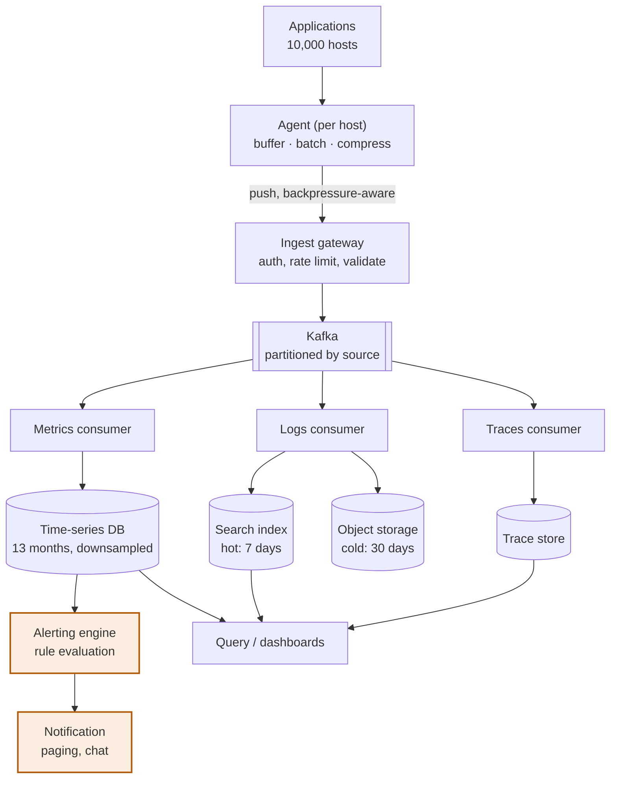
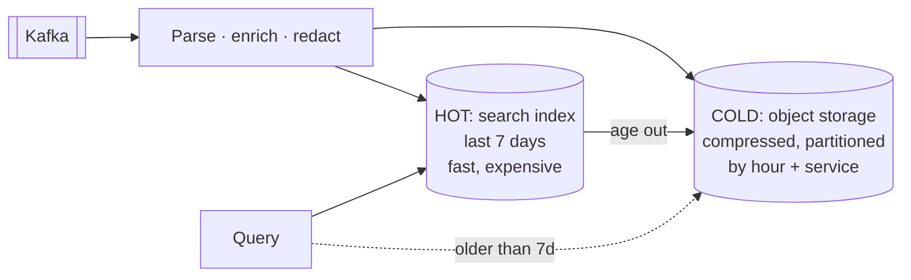
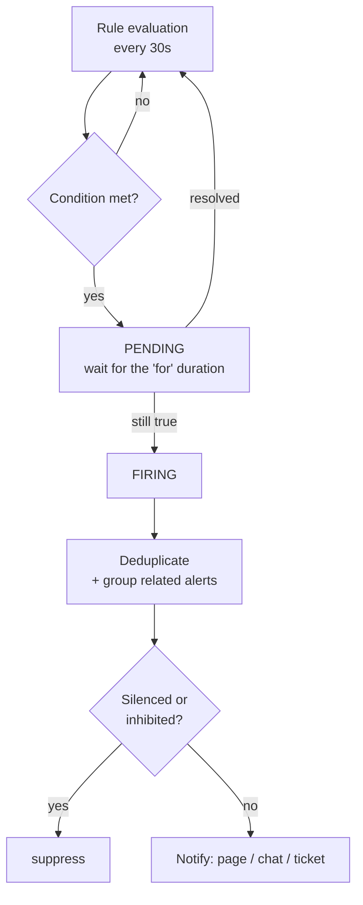

# Design a logging and monitoring system

> **The most write-heavy design in the set**, and the only one where the system
> must stay up precisely when everything else is failing. Datadog, Splunk,
> Prometheus, CloudWatch.

---

## 1 · Scope (0–5)

```
IN SCOPE                          OUT OF SCOPE
- ingest logs, metrics, traces    - APM auto-instrumentation
- store with retention tiers      - log parsing DSL
- query and dashboard             - incident management workflow
- alerting rules                  - billing

NON-FUNCTIONAL
- 10,000 hosts, 5M events/s peak
- ingest must NEVER block the applications sending data
- query: dashboards < 2s, ad-hoc search < 30s
- retention: metrics 13 months, logs 30 days, traces 7 days
- the system must survive the outage it is reporting on   <- the hard one
- some loss is acceptable for logs; NOT for alerting metrics
```

> **The requirement that makes this design different:** *"it must survive the
> outage it is reporting on."* A monitoring system that fails with the
> infrastructure it monitors is worse than useless — it fails silently at the
> exact moment you need it. **That drives isolation, independent failure
> domains, and a bias toward dropping data rather than blocking.**

---

## 2 · Estimation (5–8)

```
METRICS   10,000 hosts x 500 series each = 5M active series
          scraped every 10s -> 500,000 points/s
          a point is ~16 bytes compressed (timestamp delta + value)
          -> 500k x 16 B x 86,400 = ~700 GB/day raw
          with delta-of-delta + XOR compression: ~1-2 bytes/point
          -> ~50 GB/day        <- compression is the whole story

LOGS      10,000 hosts x 100 lines/s = 1M lines/s
          x 500 bytes = 500 MB/s = ~43 TB/day
          compressed ~10:1 -> ~4 TB/day
          x 30 days = ~120 TB                <- the dominant cost

TRACES    5M requests/s, sampled at 1% = 50,000 spans/s
          -> manageable, and sampling is why

CONCLUSION
  - metrics are small but numerous -> a purpose-built time-series store
  - logs are enormous -> object storage + an index, tiered aggressively
  - the ingest path is the bottleneck, not the query path
  - COMPRESSION and SAMPLING are not optimisations here, they are the design
```

**"Logs are 100× the volume of metrics for a fraction of the query value" is the
observation that justifies treating them completely differently.**

---

## 3 · Three signals, three shapes

**The central design decision: do not build one pipeline.**

| | Metrics | Logs | Traces |
|---|---|---|---|
| Shape | Numeric time series | Unstructured text events | Request-scoped spans |
| Volume | 500k/s | **1M/s, 100× the bytes** | 50k/s after sampling |
| Cardinality | **The killer constraint** | Irrelevant | Irrelevant |
| Retention | 13 months | 30 days | 7 days |
| Query | Aggregate over time | Search, filter | One request's waterfall |
| Store | Time-series DB | Inverted index + object storage | Trace store |
| Loss tolerance | **Low — alerts depend on it** | Moderate | High — already sampled |

> **Metrics answer "is something wrong?", traces answer "where?", logs answer
> "why?"** That workflow is why they need different stores: you query metrics
> constantly and cheaply, traces occasionally, and logs rarely but deeply.

---

## 4 · Architecture



**Kafka in the middle is the load-bearing decision**, for four reasons worth
stating:

| Buys | Why it matters here |
|---|---|
| **Decoupling** | A slow storage backend never blocks producing applications |
| **Absorbs bursts** | An incident produces a log storm — exactly when you must not drop |
| **Replay** | Fix a parsing bug and reprocess a week |
| **Fan-out** | One stream, three independent consumers |

---

## 5 · The agent — where correctness starts

**The most important component, because it is inside your customers' processes.**

| Rule | Why |
|---|---|
| **Never block the application** | A logging call that blocks turns your monitoring into an outage. Bounded in-memory buffer, non-blocking enqueue |
| **Drop, do not block, when full** | Explicitly: **shed the oldest low-priority data** and count what you dropped |
| **Batch and compress** | One request per log line at 1M lines/s is absurd |
| **Local disk buffer** | Survives a gateway outage or a network blip without losing everything |
| **Backpressure-aware** | Honour 429s from the gateway; back off with jitter |
| **Cap its own resources** | An agent that OOMs the host has caused an incident, not reported one |

> **"Drop rather than block" is the answer, and it should be stated as a
> deliberate trade-off:** losing some log lines is acceptable; adding latency to
> every customer request is not. **Emit a metric counting dropped events** — a
> silent drop is the failure mode that destroys trust in the whole system.

---

## 6 · Metrics storage and the cardinality problem

**The single most important concept on this page.**

```
A time series is identified by its name PLUS its full label set.

    http_requests{service="api", region="us-east", status="200"}

Every distinct combination is a SEPARATE series to store and index.

    service (50) x region (10) x status (20)     = 10,000 series.  Fine.

Now someone adds user_id as a label:

    x user_id (10,000,000)                        = 10^11 series.

The database falls over. This is CARDINALITY EXPLOSION, and it is the
most common way a metrics system is destroyed -- by a one-line code change.
```

| Rule | Detail |
|---|---|
| **Never label with unbounded values** | user ID, request ID, email, URL with parameters, timestamps |
| **Enforce a limit at ingest** | Reject or drop series beyond a per-tenant cap, and alert on it |
| **High-cardinality data belongs in logs or traces** | That is precisely what they are for |
| **Pre-aggregate at the agent** | Send percentiles per host, not every raw observation |

> **The right answer to "how do you handle high cardinality?" is not "scale the
> database".** It is: **that data does not belong in metrics.** Metrics are for
> aggregates over bounded dimensions; per-user or per-request detail belongs in
> traces, joined by an ID. Saying that shows you understand the model rather than
> just the plumbing.

**Storage layout:**

```
Time-partitioned blocks (e.g. 2-hour chunks), each holding:
  - a compressed column of timestamps  (delta-of-delta encoding)
  - a compressed column of values      (XOR encoding — Gorilla-style)
  - an inverted index from label -> series IDs

Compression gets ~16 bytes/point down to 1-2 bytes, because
consecutive timestamps are evenly spaced and consecutive values
usually differ only in the low bits.

DOWNSAMPLING by age:
  0-7 days      raw, 10s resolution
  7-30 days     1-minute rollups
  30 days-13mo  1-hour rollups
```

**Downsampling is what makes 13-month retention affordable**, and it is lossy
by design: nobody queries second-level detail from eight months ago, but
everybody wants the yearly trend.

---

## 7 · Logs — hot and cold



| Tier | Store | Query speed | Cost |
|---|---|---|---|
| **Hot** (7 days) | Inverted index | Seconds | High |
| **Cold** (30 days) | Object storage, partitioned by hour and service | Minutes | ~20× cheaper |
| Archive | Glacier-class | Hours | Negligible |

**Partition cold storage by time and service** so a query for one service on one
day reads a handful of objects rather than scanning everything. **Partition
pruning is what makes cold queries feasible at all.**

**Redact at ingest, not at query.** Passwords, tokens and card numbers must
never be written to storage — once they are in cold storage across thirty days
of files, removing them is an incident.

---

## 8 · Alerting

**The part that decides whether the system is loved or muted.**



| Mechanism | Prevents |
|---|---|
| **`for` duration** | Flapping — a 30-second blip does not page anyone |
| **Deduplication** | The same alert from 50 hosts becoming 50 pages |
| **Grouping** | Related alerts arriving as one notification |
| **Inhibition** | A datacentre-down alert suppressing the 200 service alerts it caused |
| **Silences** | Known maintenance |

**Alert on symptoms, not causes** — and on **error-budget burn rate** rather
than fixed thresholds. See [observability](observability.html).

> **Multi-window burn-rate alerting is the mature answer:** page when the budget
> is being consumed fast enough to matter — say 14× normal over an hour — and
> open a ticket when it is a slow burn at 2× over six hours. It catches real
> incidents quickly without paging for a blip.
>
> **And the meta-point: the alerting path must not depend on the systems it
> monitors.** If alert evaluation runs on the same cluster as everything else,
> the outage takes out the alerting too. Run it in an independent failure
> domain, and have an external dead-man's switch that fires when the monitoring
> system *stops* reporting.

---

## 9 · Failure and wrap

| Fails | Effect | Mitigation |
|---|---|---|
| Ingest gateway | Agents cannot send | Local disk buffer; backoff with jitter; multiple gateway regions |
| Kafka lag | Delayed data | Alert on consumer lag; prioritise the metrics partition over logs |
| Time-series DB | **No alerting** | Replicate; run alert evaluation in a separate failure domain |
| Search index | No log search | Metrics and alerting unaffected — that separation is the point |
| **Cardinality explosion** | DB degrades or dies | Per-tenant series caps enforced at ingest, plus an alert on the cap |
| Log storm during an incident | Ingest saturated | Kafka absorbs it; agents shed low-priority data and count the drops |
| **The whole system** | Blind | **External dead-man's switch** — an outside service alerts when heartbeats stop |

> *"Summary: three signals with genuinely different shapes, so three pipelines
> behind one ingest path. Kafka decouples ingest from storage, which matters most
> during an incident when the log volume spikes exactly as the backends struggle.*
>
> *Metrics go to a time-series store with delta-of-delta and XOR compression —
> that is what turns 700 GB a day into 50 — and downsampling by age is what makes
> thirteen months affordable. Logs are 100× the volume for a fraction of the
> query value, so they are tiered: seven days in an index, the rest in object
> storage partitioned by hour and service.*
>
> *The failure mode I would design hardest against is cardinality explosion,
> because it is caused by a one-line code change adding a user ID as a label and
> it takes the database down. Per-tenant series caps enforced at ingest, and the
> honest answer to high-cardinality data is that it belongs in traces, not
> metrics.*
>
> *And the agent never blocks the application — it drops and counts what it
> dropped. A silent drop is the thing that destroys trust in a monitoring
> system."*

---

## 10 · Follow-ups

| Question | Answer |
|---|---|
| ⭐ "5M events/s — how do you ingest that?" | Agents batch and compress locally, push to a gateway, and everything lands in Kafka partitioned by source. Kafka is what stops a slow backend blocking producers, and it absorbs the log storm that arrives exactly when things are breaking. |
| ⭐ "What is cardinality explosion?" | A series is its name plus its full label set, so every label combination is a separate series. Adding an unbounded label like user ID multiplies series by millions and kills the database — from a one-line change. Cap series per tenant at ingest and alert on it. |
| ⭐ "So where does per-user data go?" | Traces, or logs. Metrics are for aggregates over bounded dimensions; per-request detail belongs in a trace joined by ID. "Scale the database" is the wrong answer — the data is in the wrong system. |
| "Why not one store for everything?" | The three signals differ in volume by two orders of magnitude, in retention by a factor of fifty, and in query pattern entirely. One store optimises for none of them, and a log storm would then degrade alerting. |
| ⭐ "How do you store 13 months of metrics?" | Compression and downsampling. Delta-of-delta timestamps and XOR-encoded values get a point to 1–2 bytes. Then raw for a week, one-minute rollups for a month, hourly beyond — lossy on purpose, because nobody queries second-level detail from last year. |
| "Can you lose data?" | Logs, yes — some loss beats adding latency to customer requests, and the agent counts what it dropped. Metrics feeding alerts, no: those need buffering and replication, because a missing metric looks exactly like a healthy one. |
| ⭐ "How do you avoid alert fatigue?" | A `for` duration so blips do not page, deduplication and grouping so 50 hosts are one notification, inhibition so a datacentre alert suppresses the 200 it caused, and burn-rate alerting rather than fixed thresholds. Every page needs an action and a runbook, or it gets muted. |
| ⭐ "What if the monitoring system goes down?" | That is the requirement that shapes the design. Alert evaluation runs in a separate failure domain from what it watches, and an external dead-man's switch fires when our heartbeats stop — because the dangerous failure is silence, not an error. |

---

## Stop condition

You can do this design when you can:

1. justify three pipelines from the three signals' different shapes,
2. explain cardinality explosion and give the right answer, not "scale it",
3. describe metric compression and age-based downsampling,
4. defend hot/cold log tiering with the volume-versus-value argument,
5. explain why the agent drops rather than blocks — and counts drops, and
6. explain the dead-man's switch and why silence is the dangerous failure.
