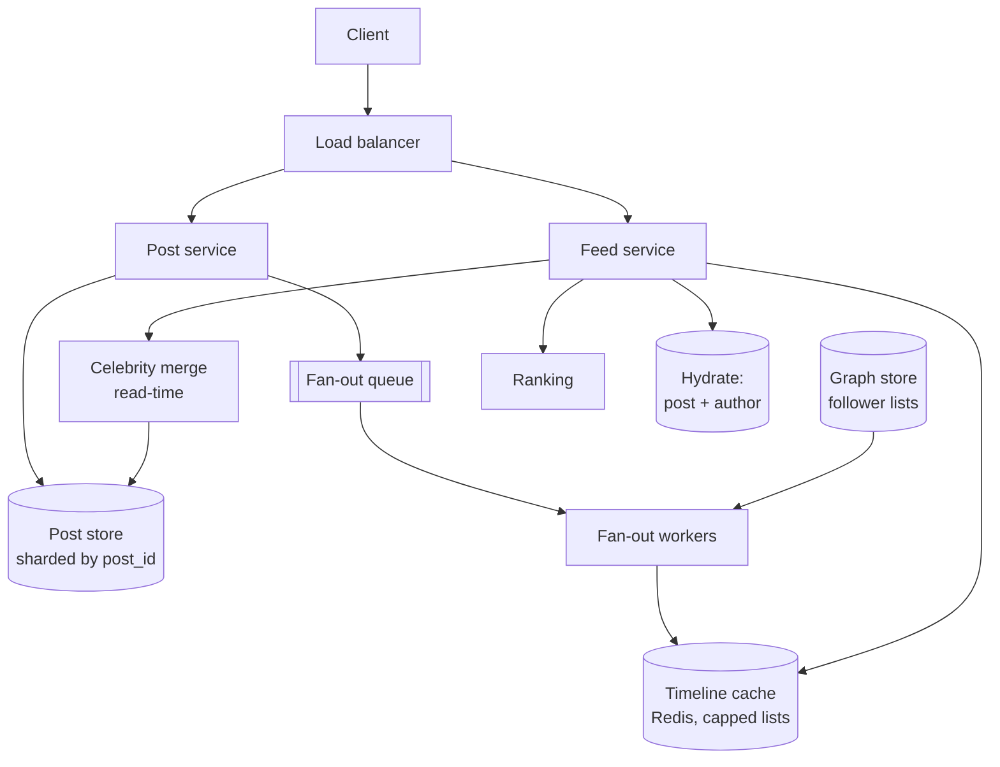

# Design a news feed

> **The most-asked system design question**, and the one where reciting the
> answer is most obvious. The entire value is in *deriving* fan-out on write
> rather than announcing it.

Twitter, Instagram, Facebook, LinkedIn — same problem.

---

## 1 · Scope (0–5)

```
IN SCOPE                          OUT OF SCOPE
- post                            - search, DMs, ads
- follow / unfollow               - stories, notifications
- home timeline (feed)            - media upload internals
                                    (assume object storage + CDN)

NON-FUNCTIONAL
- 500M DAU
- read:write ~ 100:1
- feed load p99 < 200ms
- feed may be a few seconds stale  <- unlocks everything
- availability > consistency
- an author must see their OWN post immediately
```

> **"The feed may be seconds stale, but authors must see their own post
> immediately" is the requirement pair that defines the design.** The first
> permits asynchronous fan-out; the second forces the read-your-writes carve-out
> that most candidates forget until the interviewer asks.

---

## 2 · Estimation (5–8)

```
WRITES  500M DAU x 0.2 posts/day = 100M/day = ~1,000/s, peak ~3,000/s
READS   500M x 2 feed loads/day  =   1B/day = ~12,000/s, peak ~30,000/s

FAN-OUT AMPLIFICATION  <- the number that matters
  average followers ~ 200
  1,000 posts/s x 200 = 200,000 timeline writes/s average
  peak                            ~600,000/s

STORAGE
  posts: 1e8/day x 1 KB = 100 GB/day = 36 TB/year
  timeline cache: 100M active users x 800 entries x 8B = ~640 GB

CONCLUSION
  - 30,000 feed reads/s cannot assemble from the graph on demand
  - 200,000 timeline writes/s is large but sequential and cheap
  - THE TRADE: do the work once per post, or once per read?
```

**That final line is the whole question**, and arriving at it through the
amplification number is what makes the answer a derivation.

---

## 3 · The core decision

### Fan-out on read (pull)

On feed load: get the people I follow, query their recent posts, merge, rank.

```
read:  N follows -> N queries -> merge k-way -> rank
write: one insert. done.
```

| | |
|---|---|
| **Good** | Cheap writes; no wasted work for inactive users; always fresh |
| **Bad** | **Read cost scales with follow count**; 30,000 reads/s × 200 queries = 6M queries/s |

**Fails on the numbers.** With reads 100× writes, doing the expensive work on
read is backwards.

### Fan-out on write (push)

On post: write the post ID into every follower's timeline list.

```
write: one insert + N timeline appends (async)
read:  ONE lookup of a precomputed list
```

| | |
|---|---|
| **Good** | Reads are a single cache lookup — O(1) and fast |
| **Bad** | Write amplification (200× average); wasted work for inactive followers; **celebrities are catastrophic** |

**The celebrity problem, concretely:**

```
100M followers x one post = 100 MILLION timeline writes
at 200,000 writes/s that is over 8 minutes for ONE post
```

### The hybrid — the actual answer

```
IF the author has < ~100,000 followers:
    fan out on write   (the long tail: ~99.9% of users)
ELSE:
    do NOT fan out. Mark them a "celebrity".

ON READ:
    timeline = precomputed_list
             + recent posts from the celebrities I follow (merge)
```

**Why it works:** ordinary users have few followers so fan-out is cheap;
celebrities are few so merging them at read time is cheap. **The distribution is
the reason** — follower counts are power-law, so neither pure strategy survives
but the split does.

> **State the threshold as tunable, not magic.** *"Around 100,000 followers, but
> that is a knob — it trades fan-out write volume against read-time merge cost,
> and I'd tune it on real data."*

**Also fan out lazily for inactive users.** If someone has not opened the app in
30 days, do not maintain their timeline; rebuild it on their next login. That
cuts fan-out volume substantially at the cost of one slow first load.

---

## 4 · High-level design



**Write path:**

```
1. POST /tweets -> validate, write to post store (sharded by post_id)
2. Write into the AUTHOR'S OWN timeline synchronously   <- read-your-writes
3. Publish {post_id, author_id} to the fan-out queue -> 201 returned
4. Worker: look up followers, filter celebrities/inactive,
   batch-append post_id to each follower's timeline list
```

**Step 2 is the detail worth calling out.** Everything else is async, but the
author's own view is written inline so they always see their post immediately —
satisfying the requirement set in scoping, at the cost of one extra write.

**Read path:**

```
1. LRANGE timeline:{user_id} 0 49        <- precomputed IDs, ~1ms
2. Fetch recent posts from followed celebrities (small, cached)
3. Merge by time, rank
4. Hydrate: MGET post bodies + author profiles from cache
5. Return
```

> **Store IDs in the timeline, not post bodies.** An edited or deleted post
> would otherwise need updating in millions of timelines. IDs plus hydration
> means the post is fetched fresh every time — one indirection that removes an
> entire class of consistency bug.

**Cap the list.** `LPUSH` then `LTRIM timeline:{user} 0 799` keeps it bounded —
nobody scrolls past 800, and unbounded lists are how the cache tier runs out of
memory.

---

## 5 · Deep dive material

### The timeline cache

| Decision | Choice | Why |
|---|---|---|
| Structure | Redis list or sorted set | Sorted set if you need score-based ordering |
| Size | 800 entries | Covers realistic scrolling; bounded memory |
| Who is cached | Active users only (~20%) | 640 GB rather than 3.2 TB |
| Miss | Rebuild from the post store | Slow (~1s) but rare |
| Sharding | By `user_id`, consistent hashing | Each user's timeline on one node |

### The graph store

Follower lookup is on the hot write path — a fan-out needs *the follower list of
the author*, so the edge must be indexed by `followee_id`, not just
`follower_id`. **This is exactly the "index both directions" observation from
the data-model phase**, and it is why that phase matters.

Celebrity follower lists are enormous, so pagination and batching matter; but
since celebrities are excluded from fan-out, the huge lists are mostly not read
on the write path at all — which is a nice second-order benefit of the hybrid.

### Ranking

Chronological is the honest baseline and you should offer it first. If ranked:

```
score = w1·recency + w2·affinity(viewer, author)
      + w3·engagement_rate + w4·content_type + ...
```

Practical points that show maturity: rank only the top few hundred candidates,
not the whole timeline; precompute affinity offline rather than per request; and
**keep a chronological fallback** for when the ranking service is unavailable —
a degraded feed beats no feed.

### Deletes and unfollows

**Do not scan millions of timelines to remove a post.** Filter at read time: the
hydration step drops IDs whose posts no longer exist or are no longer visible.
Same for unfollow — the stale entries age out of the capped list naturally.

> **"Filter on read rather than fix on write" is the general principle here**,
> and it generalises well: for a bounded, frequently-rewritten structure,
> lazy cleanup beats eager correction.

---

## 6 · Failure and wrap

| Fails | Effect | Mitigation |
|---|---|---|
| Fan-out workers lag | Feeds go stale | Alert on consumer lag; authors still see their own posts |
| Timeline cache node | Those users' feeds rebuild slowly | Consistent hashing; rebuild from post store |
| Ranking service | — | Fall back to chronological |
| Post store shard | Some posts unfetchable | Replicas; skip missing IDs on hydration |
| Celebrity posts | Fan-out storm | Already excluded by the hybrid |

> *"Summary: fan-out on write for the long tail so reads are a single cache
> lookup, with celebrities excluded and merged at read time — the follower
> distribution is power-law, so neither pure strategy works but the split does.
> Timelines store IDs and hydrate on read, which means edits and deletes need no
> timeline rewriting. The author's own timeline is written synchronously so they
> always see their own post.*
>
> *The number I'd want to validate is fan-out lag at peak. The design assumes
> workers keep up at 600,000 timeline writes a second; if they fall behind, feeds
> get stale and the failure is silent — so consumer lag is the metric I'd page
> on. Given more time I'd look at ranking quality, which is where the real
> product value is."*

---

## 7 · Follow-ups

| Question | Answer |
|---|---|
| ⭐ "Push or pull?" | Push for the long tail, pull for celebrities. With reads 100× writes, doing the work on read means 6M queries a second. But one celebrity post is 100M timeline writes. Follower counts are power-law, so the hybrid is not a compromise — it is the only thing that fits the distribution. |
| ⭐ "Where is the threshold?" | Around 100k followers, and tunable — it trades fan-out volume against read-time merge cost. I'd set it from real data rather than assert it. |
| "A user posts and doesn't see it." | Their own timeline is written synchronously on the write path; only other people's are async. It costs one extra write and removes the most-noticed staleness bug. |
| ⭐ "A post is deleted — do you rewrite 10M timelines?" | No. Timelines hold IDs, and hydration drops what no longer exists or is no longer visible. Filtering on read is far cheaper than correcting on write, and it also covers unfollows and blocks. |
| "How big is the timeline cache?" | Only active users need one — roughly 20% — so 100M × 800 IDs × 8 bytes ≈ 640 GB, not 3.2 TB. Inactive users get rebuilt on login. |
| "What if fan-out workers fall behind?" | Feeds go stale silently, which is why consumer lag is the alert. Scale workers, capped by partition count; prioritise active users' queues if it persists. |
| "How do you rank?" | Chronological is the baseline. If ranked, score a few hundred candidates on recency, affinity, and engagement, with affinity precomputed offline — and keep chronological as the fallback when ranking is down. |

---

## Stop condition

You can do this design when you can:

1. derive the 200,000-writes/s amplification number,
2. reject both pure strategies on the numbers,
3. explain why power-law follower counts force the hybrid,
4. justify storing IDs and hydrating,
5. handle deletes with read-time filtering, and
6. name consumer lag as the thing to page on.
