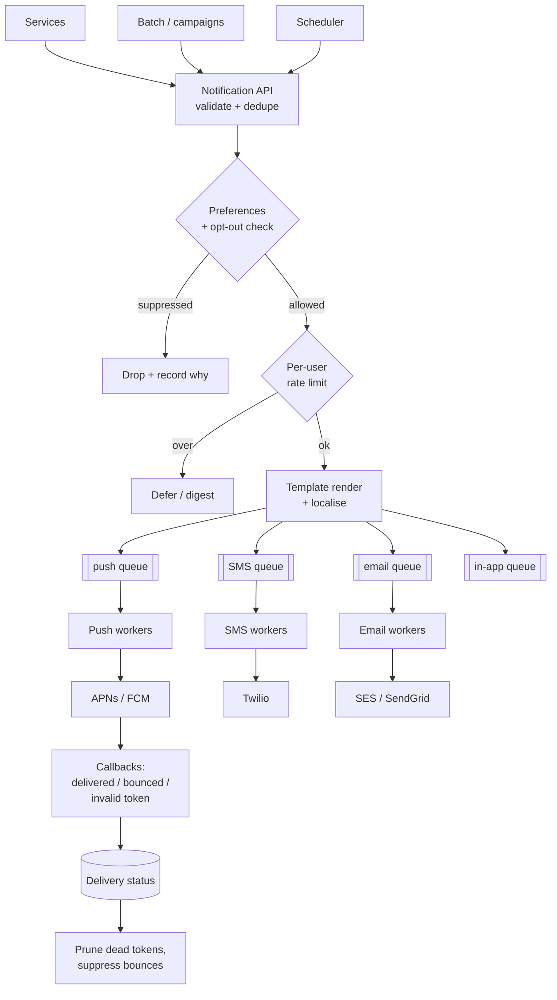

# Design a notification system

> **The design that is mostly about other people's systems.** Push, SMS and
> email all go through third parties with their own rate limits, failure modes
> and latencies. The interesting engineering is isolation, retries, and not
> annoying users.

---

## 1 · Scope (0–5)

```
IN SCOPE                          OUT OF SCOPE
- push (iOS/Android), SMS,        - in-app notification feed UI
  email, in-app                   - marketing campaign management
- templates + localisation        - analytics dashboards
- user preferences / opt-out
- scheduling + rate limiting
- delivery tracking

NON-FUNCTIONAL
- 100M users, ~10M notifications/day, spikes to 50M
- transactional (OTP, password reset): p99 < 5s, MUST arrive
- promotional: minutes are fine, best effort
- NEVER send a duplicate the user can perceive
- respect opt-out ABSOLUTELY (legal: GDPR, TCPA, CAN-SPAM)
```

> **The two-tier split — transactional versus promotional — is the framing move
> here**, the same shape as the browse/book split in
> [ticketing](design-ticketing.html). They have different latency targets,
> different retry policies, and different consequences for failure. Designing one
> pipeline for both means either over-engineering the promotional path or
> under-serving the OTP.

---

## 2 · Estimation (5–8)

```
VOLUME  10M/day = ~120/s average.  Spike 50M in an hour = ~14,000/s

  That is low. Throughput is NOT the problem.

FAN-OUT SPIKE  one broadcast to 100M users
  at 14,000/s that is ~2 hours to drain
  -> a broadcast must be a BATCH JOB feeding the queue, not a request

PROVIDER LIMITS   <- the real constraint
  APNs / FCM:  high, but per-connection and per-topic limited
  SMS:         often 100-1,000/s per short code -- ORDERS lower
  Email:       reputation-dependent; sudden volume = spam folder

CONCLUSION
  - The bottleneck is PROVIDER rate limits, not our compute
  - Each channel needs its own queue, workers and rate limiter
  - Broadcasts must be decoupled from the delivery pipeline
```

**"Our throughput is fine; the providers are the constraint" is the observation
that shapes the design**, and it is why per-channel isolation rather than one
worker pool is the right structure.

---

## 3 · Architecture



**A separate queue and worker pool per channel is the central decision**, and
the reason is bulkheading: SMS provider degradation must not delay push
notifications. One shared pool means the slowest provider sets everyone's
latency — the exact failure mode from
[failure & resilience](failure-and-resilience.html).

---

## 4 · The pieces that matter

### Preferences and opt-out

**Check before doing any work**, and treat suppression as absolute.

```
Evaluate in order, most specific wins:
  1. Global opt-out          -> stop. Legal obligation.
  2. Channel opt-out         ("no SMS")
  3. Category opt-out        ("no marketing", but keep security alerts)
  4. Quiet hours             (user's timezone -> defer, don't drop)
  5. Frequency cap           (e.g. max 5 promotional/day)
```

> **Transactional notifications must bypass most of this**, and saying so shows
> product judgement: a password-reset code or a fraud alert goes out regardless
> of marketing preferences and quiet hours. Conflating the two either spams
> people or blocks their security codes — both are real failures.

**A suppression list is append-mostly and must be authoritative.** Cache it, but
fail closed: if you cannot verify a user is opted in, do not send. This is the
one place in the handbook where fail-closed is correct — the cost of a wrongly
sent message is legal, and the cost of a missed promotional message is nothing.

### Deduplication

Users perceive duplicates immediately, and the causes are mundane:

| Cause | Fix |
|---|---|
| At-least-once queue delivery | Idempotency key per notification |
| Producer retries | Client-supplied `dedupe_key` |
| Multiple triggers for one event | Dedupe window on `(user, category, entity)` |
| Multiple devices | Intentional — but coordinate so tapping one clears the rest |

```
dedupe_key = hash(user_id, template_id, entity_id, time_bucket)
SETNX dedupe:{key} with a TTL of the dedupe window
```

**Same mechanism as [idempotency](idempotency.html)** — the atomic claim is what
makes it correct.

### Templates

Store templates versioned, render at send time with a strict, sandboxed engine.

Two details worth mentioning: **localisation** falls back through
`fr-CA → fr → en`; and **the render must be validated before enqueuing** — a
template error discovered in the worker becomes millions of dead-lettered
messages instead of one failed request.

### Retries per channel

**The retry policy differs by channel, and saying that is a good detail:**

| Channel | Retry | Why |
|---|---|---|
| Push | 3× with backoff | Cheap; invalid token is permanent — do not retry, prune it |
| SMS | 2×, then give up | Costs money per attempt |
| Email | Retry over hours | Soft bounces are transient; **hard bounces never retry** — retrying them destroys sender reputation |
| In-app | None needed | It is a database row |

**Classify failures before retrying.** A `400 invalid token` and a `503 provider
overloaded` need opposite responses; retrying the first forever is how you end
up with a permanently full dead-letter queue.

---

## 5 · Deep dive material

### Handling a broadcast

```
"Send to all 100M users" must NOT be one request.

1. Campaign created -> stored, validated, template pre-rendered
2. Batch job pages the audience (by user_id range) in chunks
3. Each chunk -> preference filter -> per-channel queues
4. Workers drain at provider-safe rates
5. Progress and failures tracked per campaign; PAUSABLE

Feeding 100M messages into a queue at once starves every transactional
notification behind them -- which is why the queues are also PRIORITISED.
```

> **Priority queues per channel are the fix**, and it is the concrete
> consequence of the two-tier split: an OTP must never queue behind a marketing
> blast. Either separate high/low queues per channel, or a priority field with
> weighted draining.

### Device token management

Push tokens expire and rotate constantly. **Providers tell you** — APNs and FCM
return invalid-token errors and feedback. Prune immediately; sending to dead
tokens wastes quota and degrades your standing with the provider.

### Delivery tracking

```
queued -> sent -> delivered -> opened
                \-> bounced / failed
```

Only some channels report the later states, and honestly: push gives you "sent
to APNs", not "the user saw it". **Do not claim guarantees the channel cannot
provide** — say what each one actually reports.

---

## 6 · Failure and wrap

| Fails | Effect | Mitigation |
|---|---|---|
| One provider down | That channel stalls | Circuit-break; **separate queues mean other channels are unaffected**; secondary provider for critical SMS/email |
| Provider rate-limits us | 429s | Per-channel rate limiter tuned below their cap; backoff |
| Template bug | Bad content at scale | Validate at enqueue; canary a small percentage first |
| Preference service down | Risk of sending to opted-out users | **Fail closed** — do not send |
| Queue backs up | Delayed notifications | Priority queues protect transactional; alert on lag per channel |
| Duplicate send | User annoyance, possible legal | Idempotency key with a dedupe window |

> *"Summary: one API, preference and dedupe checks up front, then per-channel
> queues and worker pools so a degraded SMS provider cannot delay push. Priority
> queues within each channel so an OTP never sits behind a marketing broadcast,
> which is the failure people actually experience. Retry policy is per channel
> and per failure class — hard email bounces are never retried because that
> damages sender reputation, and invalid push tokens are pruned rather than
> retried.*
>
> *The constraint here is not our throughput, it is provider rate limits, so our
> own limiters sit below their caps. And preferences fail closed: not sending a
> promotional message costs nothing, and sending to someone who opted out is a
> legal problem — that is the one place in this system where I'd rather drop the
> message than risk it."*

---

## 7 · Follow-ups

| Question | Answer |
|---|---|
| ⭐ "Push, SMS and email in one pipeline?" | One API and preference layer, then separate queues and worker pools per channel. Sharing a pool means a degraded SMS provider adds latency to push — the classic missing-bulkhead failure. |
| ⭐ "How do you avoid duplicates?" | A dedupe key over user, template, entity and a time bucket, claimed atomically with SETNX and a TTL. Queues are at-least-once, so duplicates are guaranteed to occur without it — and users notice immediately. |
| ⭐ "One OTP versus a 100M broadcast." | Different tiers. Broadcasts are batch jobs paging the audience into the queues; transactional messages go into a high-priority queue drained first. Without that separation, a campaign delays every password reset behind it. |
| "A provider goes down." | Circuit-break it so we fail fast instead of holding workers, keep the queue so nothing is lost, and for critical channels fail over to a secondary provider. The other channels are unaffected because they have their own pools. |
| "How do you handle retries?" | By channel and by failure class. Transient 5xx backs off and retries; a permanent error like an invalid token or a hard email bounce is never retried — it is recorded and suppressed. Retrying hard bounces damages sender reputation. |
| "How do you respect opt-outs?" | Check before doing any work, most-specific rule first, and fail closed if the preference service is unavailable. Transactional messages bypass marketing preferences and quiet hours — a security code is not marketing. |
| "How do you know it was delivered?" | Only as far as the channel reports. Push tells you it reached APNs, not that the user saw it. Email gives bounces and opens; SMS gives carrier receipts. I'd track a state machine per notification and be honest about where the guarantee ends. |

---

## Stop condition

You can do this design when you can:

1. open with the transactional/promotional split,
2. identify provider limits rather than throughput as the constraint,
3. justify per-channel queues as bulkheads,
4. give the preference evaluation order and the fail-closed argument,
5. differentiate retry policy by channel and failure class, and
6. explain why broadcasts must be batch jobs feeding prioritised queues.
