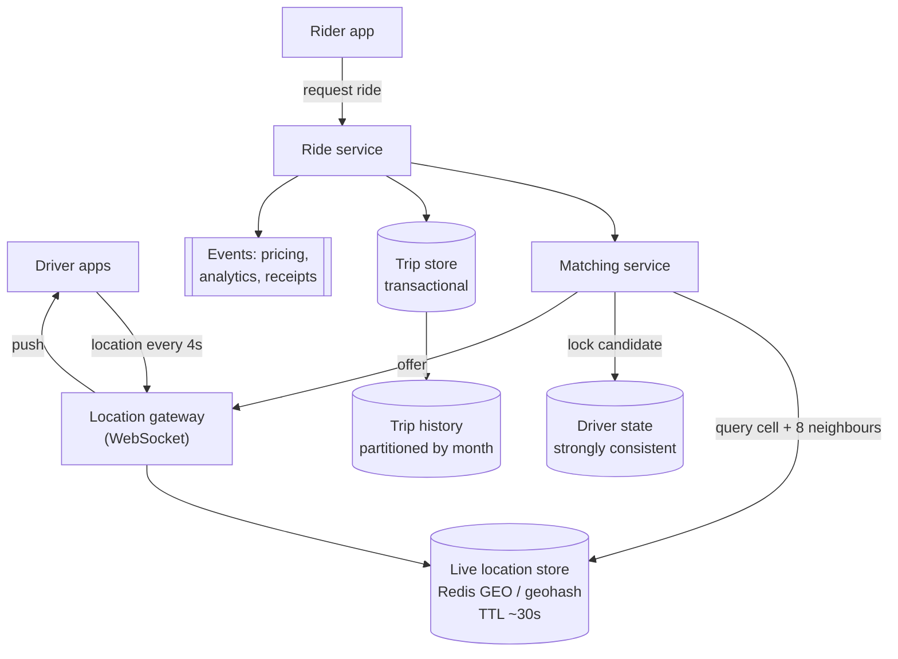
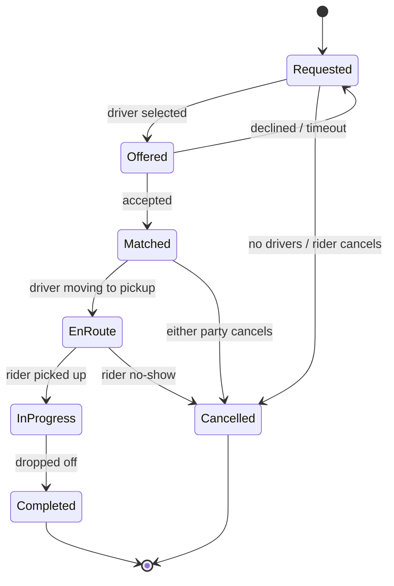

# Design a ride-sharing service

> **The shape nothing else in this handbook covers: geospatial.** Uber, Lyft,
> DoorDash, Swiggy. The interesting parts are the spatial index, the write
> volume from constant location updates, and a state machine with two parties
> who can both abandon it.

---

## 1 · Scope (0–5)

```
IN SCOPE                          OUT OF SCOPE
- driver publishes location       - payments (assume a provider)
- rider requests a ride           - maps, routing, ETA modelling
- match rider to nearby driver    - pricing / surge algorithm
- track the trip to completion    - ratings, support

NON-FUNCTIONAL
- 10M drivers, 1M concurrent trips
- driver location updates every 4s
- matching latency < 5s (a rider waiting is a rider leaving)
- a driver must NEVER be matched to two rides
- location data is high-volume and short-lived
- availability > consistency for LOCATION
- consistency > availability for the MATCH
```

> **The requirement pair that shapes everything:** location is high-volume,
> approximate and disposable; the match is low-volume and must be exactly
> correct. **Two subsystems with opposite properties** — the same split as
> browse/book in [ticketing](design-ticketing.html).

---

## 2 · Estimation (5–8)

```
LOCATION WRITES   <- the number that surprises people
  10M drivers, but say 1M online at peak
  1 update / 4 seconds  ->  250,000 writes/s

  That is 25x the write volume of the news feed design, for data
  that is worthless 8 seconds later.

RIDE REQUESTS
  1M concurrent trips, average 20 min  ->  ~800 requests/s. Small.

MATCHING READS
  each request queries "drivers near me"
  800/s x a spatial lookup -- must be an INDEX, not a scan

STORAGE
  live locations: 1M x ~100 B = 100 MB   -- fits in memory easily
  trip history:  ~4M trips/day x 1 KB = 4 GB/day = 1.5 TB/year

CONCLUSION
  - 250k writes/s of DISPOSABLE data -> in-memory store, never a
    relational database. No durability requirement at all.
  - trips are few and must be durable -> ordinary transactional DB
  - the whole design hinges on the SPATIAL INDEX
```

**"A quarter of a million writes a second of data that is worthless in eight
seconds" is the observation to land.** It immediately rules out the obvious
design and justifies everything that follows.

---

## 3 · The spatial index — the core problem

**The question is: given a point, find nearby drivers, fast.**

### Why the obvious approaches fail

```
SCAN EVERY DRIVER, compute distance          O(n) per request. No.

TWO B-TREE INDEXES on (lat) and (lng)        The database can use only ONE
                                             efficiently; the other becomes a
                                             filter over a huge candidate set.
                                             A box around Manhattan still
                                             matches a strip across the world
                                             on one axis.
```

**Two dimensions cannot be indexed by one ordered key** — unless you map two
dimensions down to one while preserving locality. That is exactly what the
following do.

### Geohash

**Recursively subdivide the world into a grid and encode the cell as a string.**

```
Each character narrows the box:
  "9"        ~ 5000 km
  "9q"       ~ 1250 km
  "9q8"      ~  156 km
  "9q8y"     ~   39 km
  "9q8yy"    ~    5 km
  "9q8yyk"   ~    1 km     <- typical matching precision
  "9q8yykr"  ~  150 m

The property that makes it work:
  SHARED PREFIX  =>  SPATIALLY CLOSE

So "find drivers near me" becomes a PREFIX SCAN -- and every ordinary
index, including a plain sorted set, can do a prefix scan.
```

> **The edge case you must raise before being asked:** two points either side of
> a cell boundary can be metres apart with completely different geohashes.
> **Always query the cell plus its eight neighbours**, then filter by true
> distance. Failing to mention this is the standard way to lose the follow-up.

### S2 and H3

| | Geohash | S2 (Google) | H3 (Uber) |
|---|---|---|---|
| Cell shape | Rectangle | Square on a projected cube | **Hexagon** |
| Distortion near poles | **Severe** | Minimal | Minimal |
| Neighbour distance | Varies by direction | Varies | **Uniform — all 6 equal** |
| Ease | Trivial, just strings | Library | Library |

> **Hexagons are why Uber built H3.** With squares, a diagonal neighbour's
> centre is 1.41× further than an edge neighbour's, so "adjacent" means two
> different distances. Every hexagon neighbour is equidistant, which makes
> movement, coverage and surge modelling far cleaner. **Naming that reason is
> the strong version of this answer**; naming H3 without it is trivia.

**In an interview: propose geohash, explain the boundary problem, and mention
H3 as the production refinement.**

---

## 4 · Architecture



**Two stores, opposite properties — say this explicitly:**

| | Live locations | Trips & driver state |
|---|---|---|
| Volume | 250k writes/s | ~800/s |
| Durability | **None needed** | Full |
| TTL | ~30 seconds | Forever |
| Store | Redis with geo indexing | Transactional database |
| Consistency | Eventual, approximate | **Strong** |

> **Losing the entire location store is survivable**: every driver re-publishes
> within four seconds. Losing the trip store is not. Designing them as one system
> would force the strict requirements of the second onto the volume of the first.

---

## 5 · The matching loop

**Where the correctness requirement lives.**

```
1. Rider requests. Compute their geohash cell.
2. Query cell + 8 neighbours -> candidate drivers.
3. Filter: available, correct vehicle class, true distance within radius.
4. Rank: ETA (not straight-line distance), rating, acceptance rate.
5. Offer to the best candidate:
      conditional update -- set state to OFFERED
      WHERE driver_state = 'AVAILABLE'
   0 rows affected -> someone else got them. Try the next candidate.
6. Driver has ~15s to accept.
      accepted -> state MATCHED, trip created
      declined / timeout -> release, offer to the next
7. No candidates -> widen the radius, retry, then give up honestly.
```

> **Step 5 is the whole correctness story, and it is
> [optimistic concurrency](design-ticketing.html#3--the-core-problem--no-double-booking),
> not a lock.** A driver near three simultaneous requests must be offered to
> exactly one. A conditional update on driver state is atomic in the database;
> two requests race and one gets zero affected rows and moves on. **A Redis lock
> would not be safe here** — a GC pause longer than the TTL means two riders hold
> the same driver.

**Offer one at a time, not broadcast to five.** Broadcasting means four drivers
accept and lose, which is a terrible driver experience and burns trust. Sequential
offers with a short timeout cost a few seconds and are worth it.

**Rank by ETA, not distance.** A driver 500 m away across a river is further in
time than one 2 km away on the same road. Straight-line distance is the
*candidate filter*; ETA is the *ranking*.

---

## 6 · Deep dive material

### Absorbing 250k location writes

| Decision | Why |
|---|---|
| **WebSocket, not HTTP** | A new TCP+TLS handshake every 4 seconds per driver is absurd |
| **Write to memory only** | The data has a 30-second lifespan; durability is meaningless |
| **TTL on every entry** | A driver that stops publishing disappears automatically — no explicit offline event needed, which is good because you will not get one |
| **Adaptive frequency** | A stationary or off-shift driver does not need 4-second updates. Cuts volume substantially |
| **Shard by geohash prefix** | Geographically local queries stay on one node; the load naturally follows population |
| **Batch to the analytics pipeline** | Historical traces go to a stream, not the live store |

> **The TTL trick is the elegant part**, the same mechanism as presence in
> [chat](design-chat.html): you never need a reliable "driver went offline"
> event, because you will not get one when a phone loses signal. Expiry does the
> work.

### The trip state machine

**Both parties can abandon at almost any point**, which is what makes this more
than a CRUD flow.



**Every transition writes to the transactional store**, and the driver's state
must move with it — releasing them on cancellation is what prevents drivers
being stranded in `OFFERED` forever. **Add a sweeper for states that outlive
their expected duration**, exactly as with holds in ticketing.

### Sharding

**Shard by geography, not by user.** A ride is inherently local: the rider,
driver and match all sit in one region, so every matching transaction stays
single-shard and no distributed transaction is ever needed.

The cost, and it is real: **load is wildly uneven.** Manhattan at 18:00 dwarfs a
rural cell. Use finer cells in dense areas and coarser ones elsewhere rather
than a uniform grid.

### Surge (if it comes back into scope)

Supply and demand per cell over a short window, computed in a stream. **Keep it
out of the matching path** — surge is a pricing input, computed asynchronously,
and matching must not wait for it.

---

## 7 · Failure and wrap

| Fails | Effect | Mitigation |
|---|---|---|
| Location store node | Those drivers invisible ~4s | They re-publish; consistent hashing limits scope |
| **Entire location tier** | No matching possible | It rebuilds in seconds as drivers publish — the fastest recovery in the system |
| Matching service | No new rides; **trips in progress continue** | Stateless, horizontally scaled |
| Trip store | Cannot start or complete rides | Replicas; refuse rather than risk double-matching |
| Driver app loses signal mid-trip | Location gaps | Buffer locally, upload on reconnect |
| Driver never accepts | Rider waits | 15s timeout, next candidate, widen radius, then say so honestly |

> *"Summary: two subsystems with opposite requirements. Locations are 250,000
> writes a second of data worthless within seconds — in-memory, geo-indexed,
> TTL'd, no durability, and losing the whole tier self-heals in four seconds.
> Trips and driver state are low-volume and must be exactly right, so they are
> transactional and sharded by geography, which keeps every match single-shard.*
>
> *Matching is a geohash prefix query over the cell and its eight neighbours —
> the neighbours matter because two points either side of a boundary are metres
> apart with different hashes — then an optimistic conditional update on driver
> state so a driver near three requests is offered to exactly one. Not a
> distributed lock; that is not a correctness mechanism.*
>
> *The assumption I would validate first is matching latency at peak in the
> densest cell, because that is where the index, the load skew and the rider's
> patience all fail at once."*

---

## 8 · Follow-ups

| Question | Answer |
|---|---|
| ⭐ "How do you find nearby drivers?" | A spatial index. Two B-tree indexes on lat and lng do not work — the database uses one efficiently and the other becomes a filter over a huge set. Geohash maps 2D to a 1D string where a shared prefix means spatial proximity, so proximity search becomes a prefix scan. |
| ⭐ "What is the problem with geohash?" | Boundaries. Two points metres apart on opposite sides of a cell have entirely different hashes, so you must query the cell plus its eight neighbours and then filter by true distance. |
| ⭐ "Why hexagons?" | With square cells a diagonal neighbour is 1.41× further than an edge neighbour, so "adjacent" means two different distances. Every hexagon neighbour is equidistant, which makes movement, coverage and surge modelling cleaner. That is why Uber built H3. |
| ⭐ "250k location writes per second?" | To memory, never a relational database. The data lives about eight seconds, so durability is meaningless. Redis with geo indexing, sharded by geohash prefix, TTL on every entry — and adaptive update frequency, since a stationary driver does not need 4-second precision. |
| ⭐ "Two riders request the same driver simultaneously." | Optimistic concurrency: a conditional update setting the driver to OFFERED where their state is still AVAILABLE. One request affects a row, the other affects zero and moves to the next candidate. Not a distributed lock — a GC pause past the TTL would give two riders the same driver. |
| "Broadcast the request to several drivers?" | No. Four drivers accepting and losing is a bad experience that erodes trust. Sequential offers with a 15-second timeout, widening the radius if nobody accepts. |
| "How do you rank candidates?" | By ETA, not straight-line distance — a driver across a river is close in metres and far in minutes. Distance filters candidates; ETA ranks them. Then rating and acceptance rate. |
| "How do you know a driver went offline?" | You do not get told, so do not rely on being told. Every location entry carries a TTL; if they stop publishing, they expire out of the index automatically. |
| "How do you shard?" | By geography. A ride is local, so rider, driver and match are in one region and every matching transaction is single-shard. The cost is skew — dense cities dwarf rural areas — so use variable cell sizes rather than a uniform grid. |

---

## Stop condition

You can do this design when you can:

1. open by splitting location from trips on their opposite requirements,
2. derive 250k writes/s and say why that rules out a database,
3. explain why two single-column indexes fail for 2D search,
4. describe geohash **and** raise the boundary problem unprompted,
5. give the hexagon argument rather than just naming H3,
6. use a conditional update for matching and say why a lock is unsafe, and
7. explain the TTL trick for driver liveness.
