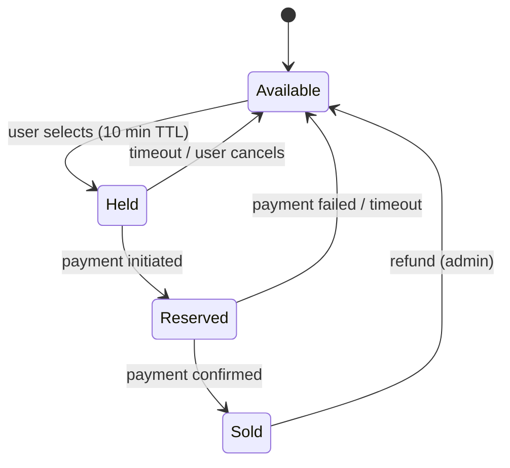
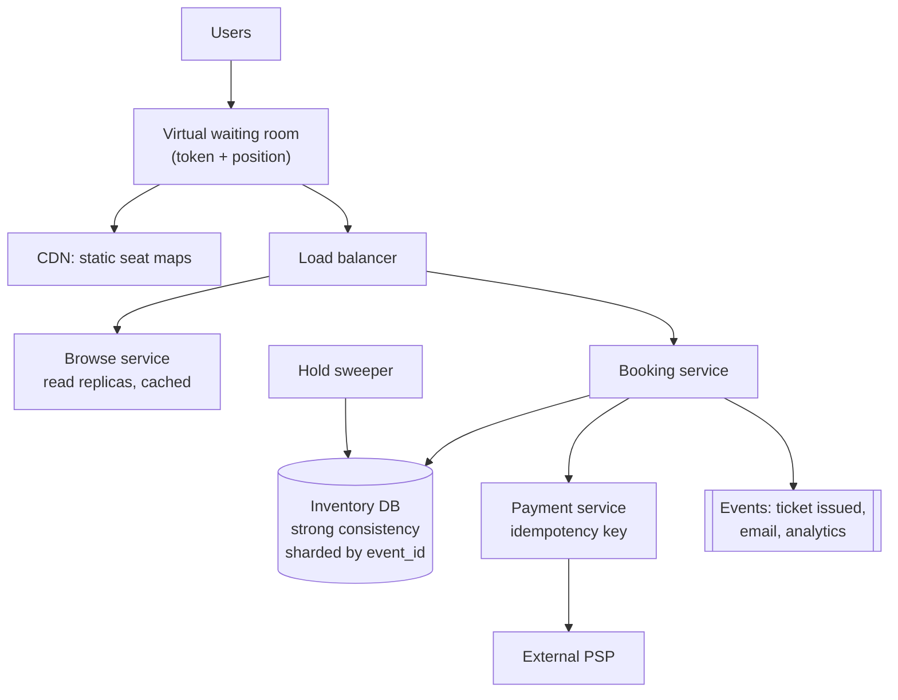

# Design a ticket booking system

> **Every other design in this handbook trades consistency for availability.
> This one does the opposite**, and that inversion is the point of the question.
> Ticketmaster, airline seats, event booking — the same problem.

---

## 1 · Scope (0–5)

```
IN SCOPE                          OUT OF SCOPE
- browse events, view seat map    - dynamic pricing
- hold a seat while paying        - resale / transfer
- purchase (payment)              - recommendations
- prevent double-booking

NON-FUNCTIONAL
- 10M users; a hot on-sale is 1M users for 50k seats
- browsing: eventual consistency fine, must stay UP
- booking: STRONG consistency, non-negotiable
- a seat must NEVER be sold twice   <- the one hard invariant
- payment must never double-charge
- queue/waiting-room acceptable during a spike
```

> **The framing sentence:** *"This system has two halves with opposite
> requirements. Browsing is read-heavy and can be stale and highly available.
> Booking is a small fraction of traffic that requires strong consistency. I'll
> design them separately, because forcing one model on both is how you get
> something that is both slow and wrong."*
>
> **Saying that at minute five sets up the entire round**, and it is the
> observation the question exists to elicit.

---

## 2 · Estimation (5–8)

```
NORMAL       10M users, ~1M browse sessions/day  -> ~30 QPS. Trivial.

ON-SALE SPIKE  <- the real problem
  1M users arrive within 60 seconds for 50,000 seats
  = ~17,000 requests/s of browsing and seat-map polling
  and 20:1 more demand than supply

CONCLUSION
  - Steady state needs almost nothing
  - The design is entirely about the SPIKE and about CORRECTNESS
  - 95% of arrivals cannot get a seat: fail them FAST and FAIRLY
    rather than letting them all contend on the database
```

**The 20:1 ratio is the number to act on.** Most requests must be rejected or
queued cheaply, far from the database. That is what makes a virtual waiting room
an architectural component rather than a nicety.

---

## 3 · The core problem — no double booking

**Three approaches. Walk all three; the comparison is the answer.**

### A. Pessimistic locking — ✓ correct, limited

```sql
BEGIN;
SELECT * FROM seats
 WHERE event_id = ? AND seat_id = ? AND status = 'available'
 FOR UPDATE;                    -- row lock held until commit

UPDATE seats SET status = 'held', held_by = ?, hold_expires = now() + interval '10 min'
 WHERE seat_id = ?;
COMMIT;
```

Correct and simple. **The cost is that locks are held for the duration**, and if
the transaction spans a payment call it holds a database lock for seconds — which
is how you exhaust the connection pool during an on-sale.

### B. Optimistic concurrency — ✓ the right default

```sql
UPDATE seats
   SET status = 'held', held_by = ?, version = version + 1
 WHERE seat_id = ? AND status = 'available' AND version = ?;

-- affected rows = 1 -> you got it
-- affected rows = 0 -> someone else did. Return "seat taken."
```

**No lock is held. The conditional update is atomic by itself**, and the
database's row-level guarantee does the work. Under contention you get failures
rather than waits, which for seat selection is exactly right — the user should
be told immediately to pick another seat.

> **Optimistic is the better answer here and the reason is worth stating:** with
> 20 people contending for one seat, pessimistic locking makes 19 of them *wait*
> and then fail. Optimistic makes 19 of them fail *instantly*, which is both
> cheaper and a better experience.

### C. Distributed lock (Redis) — ✗ as the primary mechanism

`SET seat:123 <token> NX PX 600000` is fast, but **a distributed lock is not a
correctness mechanism** — this is the trap in the question. Redlock's safety
depends on assumptions about clocks and pauses that do not hold; a GC pause
longer than the TTL means two clients believe they hold the same lock.

**Use it as an optimisation in front, never as the guarantee.** The database
constraint is the source of truth. If you want the lock to be safe, you need
fencing tokens — which brings you back to the database checking a version, i.e.
option B.

---

## 4 · The reservation model

**Booking is not one step. Modelling it as a state machine is what makes payment
failures and abandonment tractable.**



**The hold TTL is the crucial mechanism**, and it needs saying explicitly: users
abandon checkout constantly. Without an expiry, a hold is a permanent leak and
the event silently sells out to nobody.

**Do not rely on a sweeper job alone.** Two layers:

1. **Lazy expiry on read** — a hold whose `hold_expires < now()` is treated as
   available by the conditional update itself:
   ```sql
   UPDATE seats SET status='held', held_by=?, hold_expires=now()+interval '10 min'
    WHERE seat_id=? AND (status='available'
                         OR (status='held' AND hold_expires < now()));
   ```
2. **A background sweeper** to normalise rows for correct inventory counts.

The lazy check means correctness never depends on the sweeper running.

---

## 5 · High-level design



**Two paths, two consistency models:**

| Path | Store | Consistency | Scale |
|---|---|---|---|
| Browse / seat map | Read replicas + cache + CDN | Eventual — "12 seats left" may be stale | Horizontal |
| Book | Primary, single leader per event | Strong — conditional update | **Shard by `event_id`** |

> **Sharding by `event_id` is the key structural decision**, and it deserves a
> sentence: all contention for a given event lands on one shard, so a hot event
> cannot slow down unrelated events, and every booking transaction stays
> single-shard. No distributed transaction is needed anywhere — which is why the
> strong-consistency requirement is affordable at all.

---

## 6 · The on-sale spike

**A virtual waiting room is the architecture, not a nicety.**

```
1. All traffic hits the waiting room first (edge / CDN-level).
2. Each user gets a signed token with a queue position.
3. Admit at a controlled rate -- say 1,000 users/minute -- into the
   real application.
4. Everyone else sees a position and an estimated wait, served from
   the CDN. The backend never sees them.
```

| Buys you | How |
|---|---|
| **Protects the backend** | It only ever sees the load it can handle |
| **Fairness** | First-come ordering rather than fastest-network-wins |
| **Bot resistance** | Token issuance is a natural place to challenge |
| **A better failure** | "You are number 40,000" beats a timeout |

**Supporting measures:** serve seat maps from the CDN (they are static per
event), rate limit per user *and* per IP, and shed anonymous traffic first.

> **This is the design where "reject early and cheaply" is the whole strategy.**
> With 20 people per seat, the goal is to keep 95% of requests as far from the
> database as possible.

---

## 7 · Payment

**Reuses [idempotency](idempotency.html) directly** — and connecting the two is
good.

```
1. Seat -> Reserved (conditional update; still not Sold)
2. Charge the PSP with a client-supplied idempotency key
3. On success -> Sold, issue ticket
4. On failure -> back to Available
5. On TIMEOUT/unknown -> do NOT guess.
   Leave Reserved, and reconcile against the PSP.
```

**Step 5 is the interesting one**, and it is where candidates usually hand-wave:
if the payment call times out, you do not know whether the charge happened. You
cannot safely release the seat (you may have taken their money) or confirm it
(you may not have). **So you hold the reservation and reconcile** — query the PSP
by idempotency key, or match against their settlement file.

**Never hold a database lock across a payment call.** External calls take
seconds and can hang; a transaction that spans one will exhaust the pool exactly
when load is highest.

---

## 8 · Failure and wrap

| Fails | Effect | Mitigation |
|---|---|---|
| Payment provider down | Cannot complete purchases | Circuit-break; hold reservations; queue and retry; tell users honestly |
| Booking DB primary fails | Bookings stop; **browsing continues** | Correct behaviour — refuse rather than risk double-selling |
| Sweeper fails | Holds linger | Lazy expiry means correctness is unaffected; only counts drift |
| Waiting room bypassed | Backend overwhelmed | Signed tokens; reject unauthenticated entry at the edge |
| Two users, same seat | — | One conditional update wins; the loser is told instantly |

> *"Summary: two halves. Browsing is cached, replica-served, eventually
> consistent and scales horizontally. Booking is strongly consistent, sharded by
> event ID so all contention for one event is single-shard and no distributed
> transaction is ever needed. Seat acquisition is an optimistic conditional
> update, not a distributed lock — a Redis lock is not a correctness mechanism
> under GC pauses and clock skew, and here correctness is the requirement.
> Holds expire lazily on read so we never depend on a sweeper.*
>
> *For the on-sale, a virtual waiting room admits at a controlled rate, because
> with twenty people per seat the job is to reject most requests cheaply and
> fairly rather than let them contend. And on payment: if the provider call times
> out I hold the reservation and reconcile rather than guessing — guessing either
> way is either double-charging or giving away a seat we were paid for."*

---

## 9 · Follow-ups

| Question | Answer |
|---|---|
| ⭐ "How do you stop a seat being sold twice?" | A conditional update — set to held *where* status is still available and the version matches — and check the affected row count. It is atomic in the database, holds no lock, and under contention the losers fail instantly instead of waiting. |
| ⭐ "Why not a Redis distributed lock?" | Because it is not a correctness mechanism. A GC pause or clock skew longer than the TTL means two holders. It is fine as an optimisation to reduce contention, but the database constraint has to be the source of truth. |
| ⭐ "Optimistic or pessimistic?" | Optimistic here. With twenty users per seat, pessimistic makes nineteen of them wait and then fail; optimistic fails them immediately so they can pick another seat. Pessimistic is right when contention is low and retries are expensive — the reverse of this. |
| "The user abandons checkout." | The hold has a TTL and expires. I check expiry inside the conditional update itself so correctness never depends on the sweeper job running, and the sweeper only normalises rows for accurate counts. |
| ⭐ "1M users hit at 10am for 50k seats." | Virtual waiting room at the edge: signed token, queue position, admit at a controlled rate, serve everyone else from the CDN. Twenty to one demand means the design goal is rejecting most traffic cheaply and fairly — the backend should never see it. |
| "Payment times out — did it succeed?" | Unknown, so do not guess. Keep the seat reserved and reconcile with the provider by idempotency key. Releasing risks giving away a paid seat; confirming risks issuing an unpaid ticket. |
| "Why shard by event?" | It puts all contention for one event on one shard, keeps every booking transaction single-shard so no distributed transaction is needed, and isolates a hot event from every other event. |
| "Can browsing show stale availability?" | Yes, and that is fine — "12 left" being briefly wrong costs nothing. The truth is established at the conditional update, so a user may be told a seat went while they were choosing. That is a UI problem, not a correctness one. |

---

## Stop condition

You can do this design when you can:

1. open by splitting browse and book into opposite consistency models,
2. compare all three concurrency approaches and pick optimistic with a reason,
3. explain why a distributed lock is not a correctness mechanism,
4. give the reservation state machine and lazy hold expiry,
5. justify sharding by event ID, and
6. say what you do when the payment call times out.
