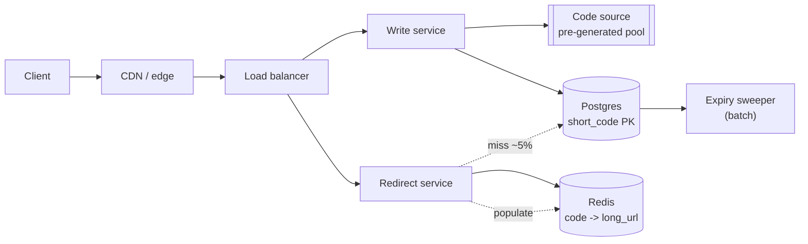

# Design a URL shortener

> **The classic warm-up.** It looks trivial and has one genuinely interesting
> sub-problem — unique short-code generation — plus a read path that is a pure
> caching exercise. Do this one first.

**Attempt it yourself for twenty minutes before reading on.**

---

## 1 · Scope (0–5)

> *Public service like bit.ly. 100M new URLs a month, reads about 100× writes.
> Custom aliases yes, optional TTL. Analytics out of scope.*

```
IN SCOPE                          OUT OF SCOPE
- shorten(long_url) -> short      - click analytics
- redirect(short) -> long         - user accounts
- custom alias                    - link preview / safety scanning
- optional expiry

NON-FUNCTIONAL
- ~40 writes/s, ~4,000 reads/s (peak ~12,000)
- redirect p99 < 100ms
- availability > consistency: a redirect must work
- codes must never collide
- links are effectively immutable once created
```

**Two observations that shape everything**, and stating them here rather than at
minute 30 is the difference:

1. **This is a read-heavy key-value lookup.** 100:1 means the redirect path is
   the design; the write path is almost incidental.
2. **The data is immutable.** A short code never changes its target. That makes
   caching trivial — no invalidation problem at all — and it is worth saying out
   loud because it removes the hardest part of caching.

---

## 2 · Estimation (5–8)

```
WRITES   1e8/month / 30 / 86,400  ~= 40/s      (round: 40)
READS    40 x 100                  = 4,000/s   peak ~12,000/s

STORAGE  per row: short_code 7B + long_url ~100B + metadata ~50B ~= 500B
         with index overhead, call it 1 KB
         1e8/month x 1 KB = 100 GB/month = 1.2 TB/year
         x 3 replication = ~3.6 TB/year

KEYSPACE base62, 7 characters = 62^7 = 3.5 trillion
         at 100M/month that is ~2,900 years. 7 is enough.

CACHE    Zipfian access: the top 20% of links serve ~80% of redirects.
         hot set ~ 20M links x 150B = 3 GB.  Fits in RAM on one node,
         so cache EVERYTHING hot and the DB barely sees reads.

CONCLUSION
  - 40 writes/s is nothing. ONE Postgres primary is fine. Do not shard.
  - 12,000 reads/s must not hit the DB -> Redis in front, ~95%+ hit rate
    because the data is immutable and access is skewed.
  - 3.6 TB/year is fine for years on a single well-provisioned node.
```

> **"40 writes a second is nothing — I am not going to shard this" is a
> deliberate anti-over-engineering move**, and interviewers score it. Reaching
> for Cassandra here is a finding.

---

## 3 · API (8–13)

```
POST /v1/urls
  { "long_url": "https://...", "custom_alias": "promo", "ttl_days": 30 }
  -> 201 { "short_url": "https://sho.rt/abc1234", "expires_at": "..." }
  -> 409 if the custom alias is taken

GET /{short_code}
  -> 301 or 302, Location: <long_url>
  -> 404 if unknown or expired
```

**301 versus 302 is a real question and a favourite follow-up:**

| | 301 Permanent | 302 Found |
|---|---|---|
| Browser caches it | **Yes, aggressively** | No |
| Subsequent clicks hit your server | No | Yes |
| Server load | Much lower | Higher |
| You can change the target later | **No — clients cached it** | Yes |
| You can count clicks | **No** | Yes |

> **302 is the right default for a link shortener**, and the reason is
> commercial rather than technical: a 301 is cached by the browser, so you never
> see the click again — which destroys analytics and removes your ability to
> disable a link that turns out to be malicious. You are trading server load for
> control, and control is what the product is for.

**Schema:**

```sql
CREATE TABLE urls (
    short_code   VARCHAR(10) PRIMARY KEY,   -- the ONLY lookup key
    long_url     TEXT        NOT NULL,
    created_at   TIMESTAMPTZ NOT NULL DEFAULT now(),
    expires_at   TIMESTAMPTZ,
    creator_id   BIGINT
);
CREATE INDEX ON urls (expires_at) WHERE expires_at IS NOT NULL;
```

Every read is a primary-key lookup — which is why this scales so well.

---

## 4 · Code generation — the actual problem

Four approaches. **Walking through why the first two fail is the substance of
this question.**

### A. Hash the URL and truncate — ✗

```
short = base62(md5(long_url))[:7]
```

**Collisions.** By the birthday bound, with a 62⁷ keyspace you expect the first
collision after roughly √(3.5 × 10¹²) ≈ 1.9 million URLs — not billions. You
would need collision detection on every write (a read before every insert), and
a resolution strategy (append a salt and rehash, loop). That is a read plus a
retry loop on the write path, forever.

It also makes the same URL always produce the same code, which sounds like a
feature until you realise two users cannot have separate expiry or analytics on
the same link.

### B. Random and check — ✗

Generate 7 random characters, check if taken, retry. Fine while the keyspace is
sparse; the check is a database round trip on every write, and it degrades as
the space fills.

### C. Counter + base62 — ✓ with a caveat

```
id = next value from a counter
short_code = base62(id)

  1        -> "1"
  125      -> "25"
  1e9      -> "15FTGg"
```

**No collisions, ever, by construction.** No check needed.

The caveat, and this is the interesting bit: **codes are sequential and
therefore enumerable.** Anyone can walk `abc1`, `abc2`, … and scrape every link
in the system — a real privacy problem, since shortened URLs often contain
otherwise-unguessable document links.

Two fixes worth naming:

- **Multiply by a large odd number mod 62⁷** — a bijection, so still collision-free,
  but the sequence appears scrambled. (Not cryptographic; it obscures rather than
  secures.)
- **Feistel network / format-preserving encryption** on the counter — a keyed
  bijection, genuinely unguessable without the key. This is the correct answer.

**Where does the counter live?** A single database sequence is a write-path
dependency and a bottleneck. Better: **each application server claims a range**
(say 10,000 IDs) from a coordination service and hands them out locally.
Coordination happens once per 10,000 writes rather than once per write, and a
server crash just wastes a block.

### D. Pre-generate and hand out — ✓ and often best

A background job generates unused random codes into a `available_codes` table.
The write path pops one.

| | |
|---|---|
| **Good** | Non-sequential, non-enumerable, no collision check on the hot path, no counter service |
| **Bad** | A table to maintain and monitor; must not run dry |

> **Say the trade-off rather than picking dogmatically:** *"Counter with a Feistel
> permutation if I want zero extra infrastructure; pre-generation if I want the
> simplest possible write path and don't mind a background job. Both give
> collision-free, non-enumerable codes — I'd pick pre-generation here because the
> write path becomes a single pop and there is no shared counter to be a
> bottleneck."*

**Custom aliases go through a different path**: insert into the same table with
a unique constraint, and let the constraint violation produce the 409. Do not
`SELECT` to check first — that races.

---

## 5 · High-level design (13–25)



**Read path, which is 99% of the traffic:**

```
GET /abc1234
  1. Redis GET url:abc1234
     hit  (~95%) -> 302, ~1ms
  2. miss -> SELECT FROM urls WHERE short_code = 'abc1234'
     found -> SETEX into Redis, 302
     absent -> cache a NEGATIVE marker (60s TTL), 404
```

**Caching the negative is important here** and worth calling out: 404s are a
large share of traffic on a public shortener — expired links, typos, and
scanners walking the keyspace. Without negative caching every one of those is a
database query, which is exactly the cache-penetration failure mode.

---

## 6 · Deep dive material

### Why this barely needs to scale

At 40 writes/s and a 95% cache hit rate, the database sees ~600 reads/s and 40
writes/s. **One Postgres primary with two read replicas handles this for years.**
Being able to say "this does not need to be distributed, and here is the
arithmetic" is a better answer than a distributed design.

**If asked to scale it 100×** (4,000 writes/s, 1.2M reads/s):

| Then | Because |
|---|---|
| Shard by `short_code` hash | Every access is by primary key, so sharding is trivial — there are no joins and no range scans |
| Redis Cluster, consistent hashing | The hot set outgrows one node |
| Serve redirects from the CDN edge | 302s are tiny and highly cacheable; put the hot map at the edge |
| Multi-region read replicas | Redirect latency is dominated by geography |

> **This is the design where sharding is genuinely easy**, and saying why —
> pure key-value access, no joins, no cross-key transactions, immutable rows —
> shows you understand what usually makes sharding hard.

### Expiry

Do not scan for expired rows on the read path. **Check `expires_at` on read and
treat expired as 404, plus a nightly batch job to delete.** Redis TTLs handle the
cache side automatically.

### Analytics (if it comes back into scope)

Do not increment a counter in the request path — that is a hot-row write on
popular links. **Fire an event to Kafka and aggregate asynchronously.** If exact
counts are not required, sample.

### Abuse

Shorteners are used to disguise malicious URLs. Worth one sentence: check
submissions against a reputation service asynchronously, and make disabling a
link possible — **which is another reason for 302 over 301**, tying back to the
earlier decision.

---

## 7 · Failure and wrap (40–45)

| Fails | Effect | Mitigation |
|---|---|---|
| Redis node | ~1/N of hot keys cold | Consistent hashing; DB sized for the miss burst |
| Whole cache tier | DB sees ~12,000 reads/s | Read replicas + circuit breaker; degraded but alive |
| DB primary | Writes stop; **reads still work from cache** | Acceptable — redirects are the product |
| Code pool empty | Writes fail | Alert on pool depth; generator runs well ahead |

> *"To summarise: pre-generated non-sequential codes so the write path is a
> single pop with no collision check, Postgres with the short code as primary
> key, and a Redis cache that carries essentially all read traffic because the
> data is immutable — there is no invalidation problem at all. 302 rather than
> 301 so we keep control of the link and can disable it.*
>
> *The assumption the design leans on hardest is the cache hit rate. It should be
> very high given immutable data and Zipfian access, but if it were 70% the
> database would see four times what I sized for — so I'd validate that early,
> and negative-cache 404s, because scanners walking the keyspace would otherwise
> all become database queries."*

---

## 8 · Follow-ups you should expect

| Question | Answer |
|---|---|
| ⭐ "Why not hash the URL?" | Collisions. The birthday bound puts the first one at roughly 1.9M URLs in a 62⁷ space, so every write needs a read to check plus a retry loop — and identical URLs would be forced to share a code, so they cannot have separate expiry. |
| ⭐ "Your codes are sequential — is that a problem?" | Yes, they are enumerable and shortened links often point at otherwise-unguessable documents. Fix with a keyed bijection over the counter — a Feistel permutation — or pre-generate random codes. Both keep collision-freedom. |
| "301 or 302?" | 302. A 301 is cached by browsers, so you never see the click again — no analytics, and no ability to disable a link that turns out to be malicious. You pay server load for control. |
| "How do custom aliases avoid races?" | A unique constraint on the primary key and let the insert fail into a 409. Checking with a SELECT first is a race. |
| ⭐ "How would you scale reads 100×?" | Edge-cache the redirect — a 302 is tiny and highly cacheable — then Redis Cluster, then shard the database by code hash. Sharding is unusually easy here: pure key lookups, no joins, no cross-key transactions, immutable rows. |
| "How do you handle 404 traffic?" | Negative-cache with a short TTL. On a public shortener, expired links, typos and keyspace scanners are a big share of requests, and without it every one is a database query — textbook cache penetration. |
| "Does this need to be distributed?" | At the stated scale, no — 40 writes a second and a 95% hit rate leaves the database nearly idle. I'd run one primary with replicas and shard only when the numbers say to. |

---

## Stop condition

You can do this design when you can:

1. derive the estimates and conclude "one primary is enough",
2. reject hashing with the birthday-bound argument,
3. explain the enumerability problem and both fixes,
4. justify 302 over 301 on product grounds,
5. explain negative caching for the 404 path, and
6. say why sharding would be easy here if it were ever needed.
