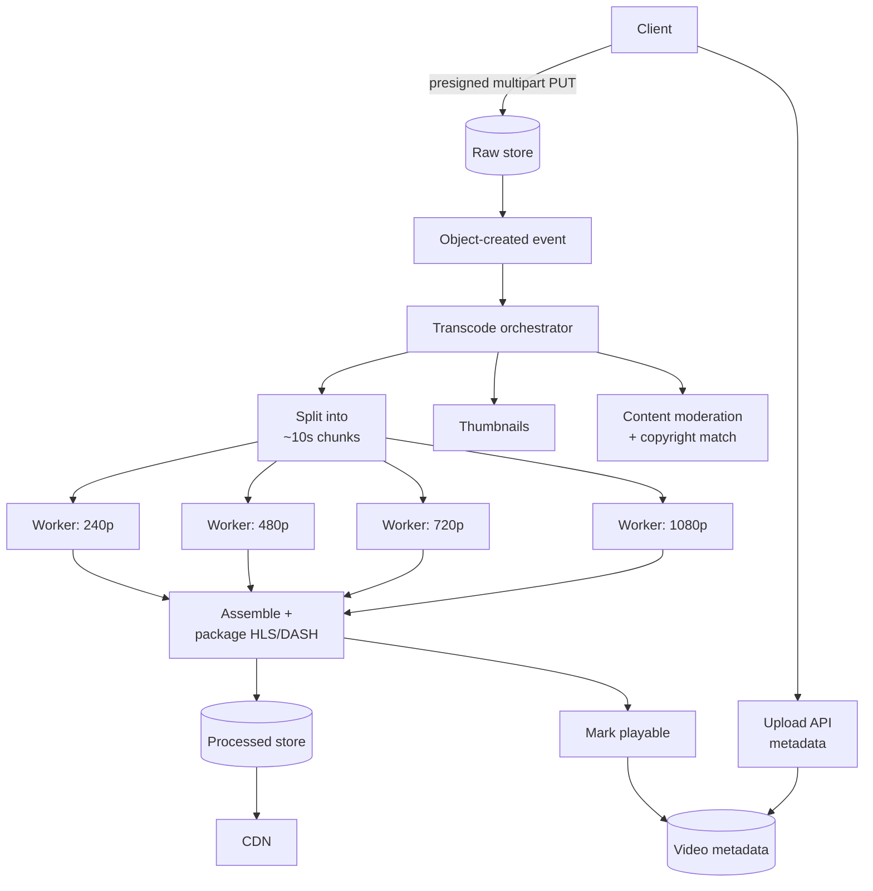

# Design a video platform

> **The design where bandwidth and cost dominate, not QPS.** YouTube, Netflix,
> Twitch. The interesting parts are the transcoding pipeline and the fact that
> the CDN is not an optimisation — it is the product's delivery mechanism.

---

## 1 · Scope (0–5)

```
IN SCOPE                          OUT OF SCOPE
- upload a video                  - recommendations
- transcode to multiple qualities - comments, social graph
- stream with adaptive bitrate    - monetisation
- browse / watch                  - DRM internals (mention it)

NON-FUNCTIONAL
- 100M DAU, 5M uploads/day, 1B views/day
- playback start < 2s; NO rebuffering  <- the quality bar users judge
- upload may take minutes to process (async is fine)
- watch is read-heavy and globally distributed
- cost matters enormously          <- state this explicitly
```

> **Say "cost is a first-class requirement" during scoping.** In most designs it
> is implicit; here egress can be the largest line item in the company, and
> naming it early justifies decisions you will make later.

---

## 2 · Estimation (5–8)

```
UPLOADS  5M/day = ~60/s.  Trivially small.

STORAGE  5M/day x 10 min avg x 50 MB/min  = 2.5 PB/day of SOURCE
         transcoding to ~6 renditions adds roughly 1.5x
         -> ~6 PB/day ingested+derived, ~2 EB/year
         -> tiering and lifecycle policies are mandatory

TRANSCODE COMPUTE
  ~1x realtime per rendition per core (roughly)
  5M videos x 10 min x 6 renditions = 300M minutes/day of encoding
  / 1,440 min/day = ~208,000 cores running flat out
  -> massive, bursty, interruptible -> SPOT/preemptible instances

BANDWIDTH   <- the number that decides the architecture
  1B views/day x 5 min avg watched x 3 Mbps
  = 1e9 x 300s x 3 Mbit = 9e11 Mbit/day = ~112 PB/day
  average egress ~= 10 Tbps, peak far higher

CONCLUSION
  - 60 uploads/s is nothing; the write path is easy
  - Transcoding is the compute cost -> parallelise by CHUNK, use spot
  - 10 Tbps of egress cannot come from origin. The CDN IS the architecture.
  - Storage is measured in exabytes -> lifecycle tiering is not optional
```

**The 10 Tbps figure is the one to land on.** No origin serves that; therefore
everything about delivery is CDN-shaped, and saying so converts a component into
a conclusion.

---

## 3 · The upload and transcode pipeline



**The chunk-level parallelism is the key insight and worth deriving:**

```
A 60-minute video transcoded serially = ~60 minutes per rendition.
Split into 10-second chunks -> 360 independent units.
360 chunks x 6 renditions = 2,160 tasks, all parallel.

Wall-clock drops from an hour to minutes, bounded only by fleet size.

This works because video codecs use closed GOPs -- split on keyframe
boundaries and each chunk is independently decodable. Splitting
anywhere else produces corrupt output.
```

> **"Split on keyframe boundaries" is the detail that makes this a real answer
> rather than a hand-wave.** It is why the chunking is possible at all, and very
> few candidates say it.

**Two more properties worth naming:** transcoding is **idempotent** (rerunning a
chunk produces the same output, so retries are free), and it is **interruptible**
(a lost spot instance costs one chunk). Together they are why this workload can
run at 70–90% discount on preemptible capacity — a genuine cost argument.

**Publish progressively.** Make 480p available as soon as it finishes rather than
waiting for 4K. Users can watch while the rest encodes.

---

## 4 · Playback and adaptive bitrate

**HLS or DASH: the video is a manifest plus segments.**

```
master.m3u8
  ├─ 240p/index.m3u8  -> seg0.ts, seg1.ts, ...   (400 kbps)
  ├─ 480p/index.m3u8  -> ...                     (1 Mbps)
  ├─ 720p/index.m3u8  -> ...                     (3 Mbps)
  └─ 1080p/index.m3u8 -> ...                     (6 Mbps)

The CLIENT measures its own throughput and buffer level and chooses
which rendition to request for the NEXT segment. Quality adapts
mid-playback with no server involvement.
```

**Why this design wins, and it is worth stating:** every segment is a plain,
immutable HTTP GET. That means ordinary CDN caching works, no special streaming
protocol or stateful server is needed, and it traverses firewalls like any web
request. The intelligence sits in the client, where the network information
actually is.

| Decision | Choice | Why |
|---|---|---|
| Segment length | 2–10 s | Shorter = faster adaptation and lower live latency; more requests and overhead |
| Start rendition | Low, then ramp | **Start time is what users judge**; ramp up once buffered |
| Buffer target | 30 s VOD | Absorbs network variation |
| Codec | H.264 baseline + AV1/HEVC | Compatibility plus 30–50% bandwidth saving on capable devices |

> **Optimise for start time over initial quality.** A 2-second start at 480p that
> ramps to 1080p beats a 6-second start at 1080p on every engagement metric.
> Saying that shows you understand the product measure, not just the technique.

---

## 5 · The CDN

**At 10 Tbps, this is the whole delivery design.**

| Aspect | Approach |
|---|---|
| Strategy | Pull for the long tail; **push for predictable launches** |
| Popularity | ~1% of videos are ~90% of views — cache the head aggressively |
| Long tail | Regional mid-tier cache in front of origin; a cold view is acceptable |
| Cache key | Segment URL — immutable, so cache forever |
| Multi-CDN | Two providers for redundancy and negotiating leverage |
| ISP caches | Netflix's Open Connect model: appliances inside ISP networks |

**Push versus pull matters here more than anywhere else**: a new episode of a
popular series is watched by millions within minutes of release. Pull means every
edge misses simultaneously and stampedes the origin. Pre-positioning it is the
one case where push is clearly correct.

**Private content** uses signed segment URLs verified at the edge, with short
expiries — the same mechanism as
[CDN & object storage](cdn-and-storage.html), and short per-segment expiries
limit the value of a leaked link to seconds.

---

## 6 · Live streaming — the different constraints

Worth being able to contrast, because it is a common follow-up.

| | VOD | Live |
|---|---|---|
| Source | Uploaded file | Continuous ingest (RTMP/SRT) |
| Transcode | Batch, parallel by chunk | **Real-time — cannot fall behind** |
| Latency | Irrelevant | 2–30 s typical; sub-second is hard |
| Buffer | 30 s | 2–6 s (small buffer = more rebuffering risk) |
| Failure | Retry the chunk | **The moment is gone** |
| CDN | Immutable segments | Short TTLs; the manifest changes constantly |

**The trade-off to state:** low latency and playback stability are directly
opposed. A small buffer means a network hiccup becomes a visible stall. Sports
and auctions pay that cost; a concert stream should not.

---

## 7 · Failure and wrap

| Fails | Effect | Mitigation |
|---|---|---|
| Transcode worker | One chunk lost | Idempotent retry; spot loss is expected, not exceptional |
| Orchestrator | Jobs stall | Durable job state; resume from completed chunks |
| CDN edge | Regional degradation | Multi-CDN failover |
| Origin overloaded | Cold views fail | Mid-tier shield cache absorbs the fan-in |
| Storage region lost | Videos unavailable | Cross-region replication for popular content only — replicating exabytes uniformly is not affordable |

> *"Summary: uploads go straight to object storage via presigned multipart, then
> an event kicks off a transcode DAG that splits the video on keyframe boundaries
> into ten-second chunks and encodes them in parallel — which turns an hour of
> serial work into minutes and, because chunks are idempotent and interruptible,
> lets the whole fleet run on spot capacity. Playback is HLS with client-side
> adaptive bitrate, so every segment is an immutable HTTP GET that any CDN can
> cache with no streaming-specific infrastructure.*
>
> *The dominant constraint is not QPS, it is roughly 10 Tbps of egress, which is
> why the CDN is the architecture rather than an add-on, and why I'd push
> pre-position popular releases rather than let every edge miss at once. The
> thing I'd validate first is start-time latency — users judge the product on
> that more than on peak quality."*

---

## 8 · Follow-ups

| Question | Answer |
|---|---|
| ⭐ "Why transcode into multiple qualities?" | Devices and networks differ by orders of magnitude, and the client picks per segment based on measured throughput. Serving one high bitrate means either rebuffering on weak connections or wasting bandwidth on strong ones. |
| ⭐ "How do you transcode a 4-hour video quickly?" | Split it on keyframe boundaries into ~10-second chunks and encode them in parallel — a 60-minute serial job becomes minutes, bounded by fleet size. Splitting elsewhere corrupts output because codecs need closed GOPs. Chunks are idempotent and interruptible, so this runs cheaply on preemptible instances. |
| ⭐ "How does adaptive bitrate work?" | The manifest lists renditions; the client measures throughput and buffer occupancy and requests the next segment at an appropriate quality. The server does nothing special — every segment is an immutable HTTP GET, which is exactly why ordinary CDN caching works. |
| "What dominates cost?" | Egress, by a wide margin, then transcode compute, then storage. That ordering is why the CDN, codec choice, and serving the right rendition matter more than anything on the origin side. |
| "How would you cut bandwidth?" | Better codecs — AV1 or HEVC save 30–50% on capable devices — plus per-title encoding, which tunes the bitrate ladder to the content rather than using one fixed ladder. Animation needs far less bitrate than a sports broadcast. |
| ⭐ "How is live different?" | Transcoding must keep real time, the buffer shrinks to a few seconds so a hiccup becomes a visible stall, and a failed segment cannot be retried because the moment has passed. Low latency and stability are directly opposed, so the target depends on the content. |
| "What about the long tail?" | Most videos are watched almost never, so they should not occupy edge cache. Pull-through with a regional shield cache in front of origin, and accept a slower first play for cold content. |

---

## Stop condition

You can do this design when you can:

1. identify egress rather than QPS as the binding constraint,
2. derive chunk-parallel transcoding *and* say why keyframe boundaries matter,
3. connect idempotent + interruptible to spot instances as a cost argument,
4. explain adaptive bitrate and why it needs no special server,
5. justify push CDN for a predictable launch, and
6. contrast live's constraints with VOD's.
