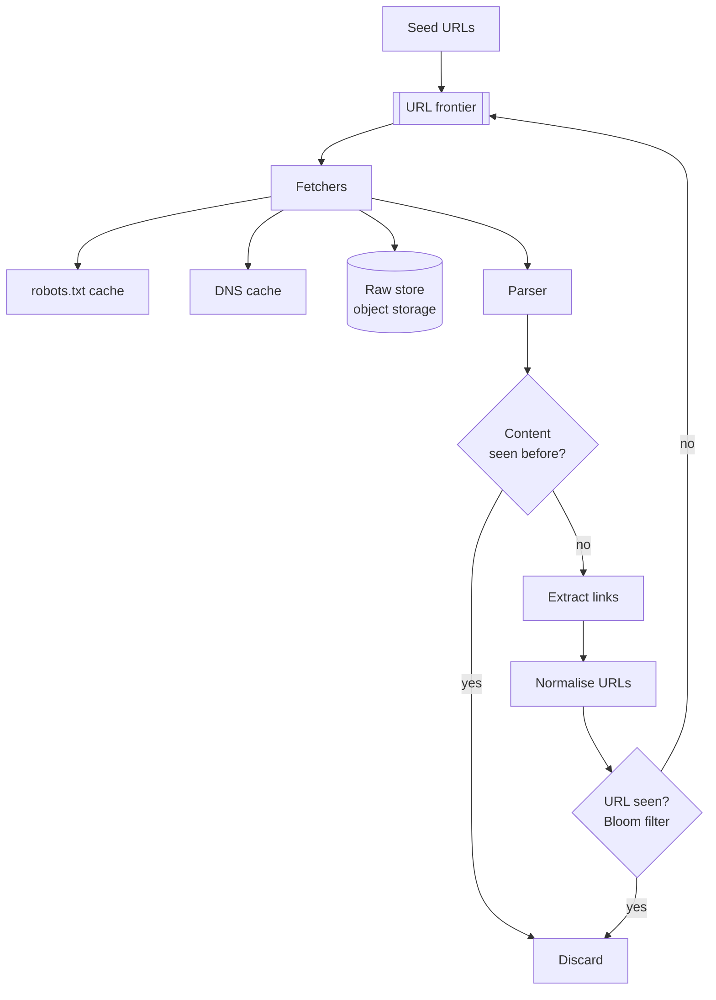

# Design a web crawler

> **The interesting constraint is not scale, it is politeness.** A crawler that
> maximises throughput by hammering one host is a denial-of-service tool. The
> design is mostly about the queue structure that makes politeness and
> parallelism coexist.

---

## 1 · Scope (0–5)

```
IN SCOPE                          OUT OF SCOPE
- fetch pages from seed URLs      - indexing / ranking (that's search)
- extract and follow links        - JavaScript rendering (mention it)
- deduplicate URLs and content    - image/video crawling
- respect robots.txt + politeness
- recrawl for freshness

NON-FUNCTIONAL
- 1B pages/month
- polite: <= 1 request/second/host by default; honour crawl-delay
- must not re-crawl identical content wastefully
- must survive restarts without losing the frontier
- must not get trapped
```

---

## 2 · Estimation (5–8)

```
RATE     1e9/month / 30 / 86,400 = ~400 pages/s, peak ~1,200/s

BANDWIDTH  400/s x 500 KB (average page + assets) = 200 MB/s = 1.6 Gbps

STORAGE  raw HTML: 1e9 x 100 KB compressed ~= 100 TB/month
         URL metadata: 1e9 x 200 B = 200 GB/month

URL SET  10B known URLs x 100 B = 1 TB  -- too big to keep in RAM as a set
         -> Bloom filter: 10B URLs at ~10 bits each = ~12 GB. Fits.

POLITENESS MATH   <- the number that shapes the design
  400 pages/s at 1 request/s/host means at least 400 DISTINCT hosts
  in flight at all times. Fetchers cannot simply pull from one queue.

CONCLUSION
  - The frontier must be organised BY HOST, not as a flat queue
  - Bloom filter for URL dedup; exact store behind it if needed
  - Raw HTML to object storage, metadata to a database
```

> **The politeness arithmetic is the derivation that matters.** It is what turns
> "a queue of URLs" into the two-level frontier below, and arriving at it from
> the numbers is much stronger than presenting the structure as known.

---

## 3 · The architecture



---

## 4 · The frontier — the core of the design

Two levels: one for **priority**, one for **politeness**.

```
FRONT QUEUES -- priority
  f1  high priority (news, frequently-changing)
  f2  medium
  f3  low
      a selector picks from these with a bias toward high priority

BACK QUEUES -- politeness.  INVARIANT: one host maps to exactly one queue,
                            and each queue is served by one worker.
  b1: [ example.com urls... ]     <- worker 1, >= 1s between fetches
  b2: [ wikipedia.org urls... ]   <- worker 2
  ...
  bN: (N >= number of concurrent fetchers)

  Each back queue has a next-allowed-fetch TIME. A worker sleeps until
  then. Because a host lives in exactly ONE queue served by ONE worker,
  the rate limit per host is enforced structurally -- no locking, no
  shared counters.
```

> **"One host, one queue, one worker" is the whole trick**, and it is worth
> stating as an invariant. It converts a distributed rate-limiting problem into a
> data-structure property. Without it, every fetcher would need to coordinate on
> a shared per-host counter — the slow, contended alternative.

**The frontier must be durable.** A crash that loses it means recrawling
everything. Persist it — Kafka partitioned by host hash, or a database-backed
queue — and shard by `hash(host)` so a host stays with one crawler node.

---

## 5 · Deduplication

### URL deduplication — Bloom filter

Ten billion URLs cannot sit in memory as a hash set (~1 TB). A Bloom filter at
~10 bits per element is ~12 GB with roughly a 1% false-positive rate.

**The error direction is what makes it safe**, and this is the point to make:

```
False POSITIVE: says "seen" when it was not  -> we skip a page. Acceptable.
False NEGATIVE: impossible.                  -> we NEVER refetch endlessly.

A Bloom filter can only over-report membership, so the failure mode is
"miss a page", never "loop forever".
```

**Normalise before checking**, or dedup does nothing: lowercase the host, strip
default ports and fragments, sort or drop tracking query parameters, resolve
`.` and `..`. `HTTP://Example.com:80/a/../b?utm_source=x#frag` and
`http://example.com/b` are the same page.

### Content deduplication — simhash

Different URLs frequently serve identical or near-identical content — mirrors,
print versions, session IDs in the path.

| Method | Catches |
|---|---|
| MD5/SHA of the body | Byte-identical duplicates only |
| **Simhash** | **Near-duplicates** — same article, different ads |

**Simhash produces similar fingerprints for similar documents**, so a small
Hamming distance (typically ≤ 3 bits in 64) means near-duplicate. That is what
you want, because byte-identical is rare on the real web — a timestamp or a
rotating advert defeats an exact hash.

---

## 6 · Traps and hazards

**Volunteering this list demonstrates you have thought about the adversarial
web, which is most of what a real crawler deals with.**

| Hazard | Example | Defence |
|---|---|---|
| **Infinite space** | Calendars: `?date=2099-01-01` forever | Depth limit; per-host page cap; URL-pattern detection |
| **Spider trap** | Dynamically generated infinite links | Same, plus similarity detection on URLs |
| **Redirect loop** | A → B → A | Cap redirect hops (5) |
| **Huge files** | A 4 GB "page" | `Content-Length` check; hard byte cap; stream and abort |
| **Slow-loris server** | Responds one byte per minute | Aggressive read timeout |
| **Soft 404** | 200 status, "not found" body | Content heuristics |
| **Session IDs in URLs** | Infinite unique URLs, same page | Normalisation; content dedup catches the rest |
| **DNS latency** | 100 ms+ per lookup, on every fetch | Local DNS cache — a large win at 400 fetches/s |

**robots.txt**: fetch, cache per host (respect its own TTL), honour `Disallow`
and `Crawl-delay`. **Cache it**, or you double your request volume to every host
— which is itself impolite.

---

## 7 · Freshness

Recrawling everything uniformly is wasteful — most pages never change.

| Strategy | How |
|---|---|
| **Adaptive** | Track observed change rate per URL; crawl proportionally |
| **Conditional GET** | `If-Modified-Since` / `If-None-Match` → 304 costs almost nothing |
| **Sitemaps** | `lastmod` tells you what changed, free |
| **Priority by importance** | A news homepage hourly; an archived PDF yearly |

> **Conditional GET is the highest-value, lowest-effort item**, and mentioning it
> shows practical awareness: a 304 response is a few hundred bytes instead of
> 500 KB. For a recrawl-heavy workload it cuts bandwidth by an order of
> magnitude for a one-line change.

---

## 8 · Failure and wrap

| Fails | Effect | Mitigation |
|---|---|---|
| Fetcher dies | Its back queues stall | Reassign host ranges; frontier is durable |
| Frontier lost | Total restart | Persist it; that is why it is not in memory |
| Bloom filter lost | Re-crawling | Snapshot periodically; rebuild is tolerable |
| A host goes down | Wasted retries | Exponential backoff per host; drop after N |
| We are too aggressive | Blocked / legal complaint | Conservative default rate, honour `Crawl-delay`, identify in User-Agent, publish contact info |

> *"Summary: a two-level frontier — front queues for priority, back queues for
> politeness with the invariant that one host maps to one queue served by one
> worker, which makes per-host rate limiting structural rather than
> coordinated. Bloom filter for URL dedup because its only error is over-
> reporting, so we may skip a page but can never loop. Simhash for content
> dedup, because byte-identical duplicates are rare on the real web.*
>
> *The thing I'd be most careful about is politeness, not throughput — being
> blocked is the real failure mode, so conservative defaults, honour crawl-delay,
> identify ourselves, and back off hard on errors. And I'd add conditional GETs
> before anything else on the recrawl path; it is close to free and cuts recrawl
> bandwidth by an order of magnitude."*

---

## 9 · Follow-ups

| Question | Answer |
|---|---|
| ⭐ "How do you stay polite while crawling fast?" | Two-level frontier. Priority queues feed politeness queues, and each host maps to exactly one back queue served by one worker with a next-allowed-fetch time. Rate limiting becomes a structural property instead of a shared counter every fetcher contends on. And at 400 pages a second with one request per host per second, you need at least 400 distinct hosts in flight — which is why a flat queue cannot work. |
| ⭐ "How do you know if a URL was already crawled?" | Bloom filter over normalised URLs — 10B URLs at 10 bits each is about 12 GB, versus a terabyte for an exact set. Its only error is claiming to have seen something it hasn't, so we may skip a page but can never loop forever. Normalisation matters more than the filter: without it the same page arrives under a dozen URLs. |
| ⭐ "Two URLs, same content." | Simhash fingerprints and a Hamming-distance threshold. An exact hash only catches byte-identical pages, and on the real web a rotating advert or a timestamp defeats that — near-duplicate detection is what you actually need. |
| "How do you avoid infinite crawls?" | Depth limits, per-host page caps, redirect-hop caps, and pattern detection for parameterised traps like calendars. Content dedup catches much of the rest, since traps usually serve near-identical pages. |
| "How do you keep the index fresh?" | Adaptive recrawl based on observed change rate, plus conditional GETs so unchanged pages cost a 304 instead of a full fetch, plus sitemaps where published. Uniform recrawling wastes most of its bandwidth. |
| "What about JavaScript-rendered pages?" | A headless browser pool, which is roughly 10–50× the cost per page — so it is a separate, prioritised pipeline for pages that need it, decided by heuristics, not the default path. |
| "How do you distribute it?" | Shard the frontier by host hash so a host always lands on the same crawler node — that preserves the politeness invariant across machines. The Bloom filter shards the same way. |

---

## Stop condition

You can do this design when you can:

1. derive the "400 distinct hosts in flight" politeness constraint,
2. describe the two-level frontier and its one-host-one-queue invariant,
3. justify the Bloom filter by its one-sided error,
4. explain why simhash beats an exact hash,
5. name five traps and their defences, and
6. give conditional GET as the cheapest freshness win.
