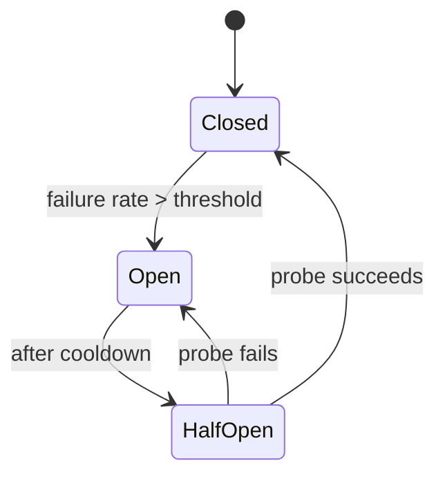

# Failure and resilience

> **Phase 6 of the round, and the one most candidates never reach.** Volunteering
> a failure analysis when the clock is at forty minutes is one of the cheapest
> ways to separate yourself, because the field is thin.

---

## 1 · What actually fails

| Failure | Frequency | Usually handled by |
|---|---|---|
| Single machine dies | Constantly | Redundancy + health checks |
| Disk fails | Often | Replication |
| Process crashes / OOM | Often | Restart + health checks |
| **A dependency gets slow** | Often | **This is the dangerous one** |
| Network partition | Occasionally | Quorum, or accept unavailability |
| Deploy introduces a bug | Regularly | Canary, fast rollback |
| Whole AZ lost | Rarely | Multi-AZ |
| Whole region lost | Very rarely | Multi-region, if justified |

> **Slow is worse than down, and this is the single most useful thing on the
> page.** A dead dependency fails fast and you shed the work. A dependency at
> 10 seconds instead of 50 milliseconds holds every caller's thread, exhausts
> connection pools, and propagates upward until the whole system is unavailable
> — while every component reports itself healthy. Saying this unprompted is
> strong senior signal.

---

## 2 · Timeouts

**Every network call needs a timeout, and the default in most libraries is
infinite.** That is the root cause of an enormous share of real outages.

| Rule | Detail |
|---|---|
| **Set one everywhere** | Connect, read, and total-request separately |
| **Base it on p99, not average** | A timeout below p99 fails healthy requests |
| **Budget downward** | If you owe an answer in 1s, your dependency gets less |
| **Deadline propagation** | Pass the remaining budget down the call chain |

**Deadline propagation is the detail worth naming.** Without it, a service near
the end of a chain happily spends 5 seconds on work the caller abandoned 3
seconds ago — burning capacity on a result nobody will read. gRPC does this
natively; in HTTP you pass a deadline header and each hop enforces it.

```
client 1000ms
  -> API gateway: 950ms remaining
       -> service A: 900ms remaining
            -> database: 850ms budget, so the query timeout is 850ms

Each hop subtracts its own overhead and passes the rest down.
```

---

## 3 · Retries — and how they cause outages

Retries are necessary and dangerous. **A naive retry policy converts a
degradation into an outage.**

```
Service is at 90% capacity. A small blip causes 10% of requests to fail.
Those 10% retry -- immediately, 3 times each.

  offered load = 100% + (10% x 3) = 130%
  -> more failures -> more retries -> 200% -> collapse

The system cannot recover even after the original blip ends, because the
retry load is now self-sustaining. This is a METASTABLE FAILURE.
```

**The four things a safe retry policy needs:**

| Mechanism | Purpose |
|---|---|
| **Exponential backoff** | Space attempts out: `base × 2^n` |
| **Jitter** | Break synchronisation; without it retries arrive in waves |
| **A cap** | 3 attempts, not "until it works" |
| **Retry budget** | Cap retries at ~10% of total traffic across the client |

**Retry budgets are the mechanism most candidates have never heard of**, and
they are the real fix: per-request caps still allow the aggregate amplification
above. A budget makes the *client as a whole* refuse to retry beyond a fraction
of its normal load, which bounds the amplification no matter how many requests
are failing.

**Only retry idempotent operations, or ones with an idempotency key.** Otherwise
the retry is a correctness bug rather than a resilience feature.

---

## 4 · Circuit breakers

Stop calling a dependency that is clearly broken.



| State | Behaviour |
|---|---|
| **Closed** | Normal; count failures |
| **Open** | Fail immediately without calling; return a fallback |
| **Half-open** | Let a few probes through to test recovery |

**Two things a circuit breaker buys**, and the second is the one candidates
miss:

1. **The caller stops wasting resources** on calls that will fail — no threads
   parked on a 10-second timeout.
2. **The failing service gets breathing room.** A service overloaded into failure
   cannot recover while still receiving full load. The breaker sheds that load
   and lets it come back.

**Pair it with a fallback**, or you have only converted a slow failure into a
fast one. Cached data, a default value, a degraded response — say what the
fallback is.

---

## 5 · Bulkheads

Isolate resources so one failure cannot consume everything.

```
WITHOUT bulkheads -- one shared pool of 100 threads:
  the recommendations service (nice-to-have) gets slow
  -> all 100 threads block on it
  -> checkout requests cannot get a thread
  -> THE WHOLE SITE IS DOWN because recommendations was slow

WITH bulkheads -- separate pools:
  recommendations: 20 threads   <- these block, and that is all
  checkout:        50 threads   <- unaffected
  everything else: 30 threads
```

**Bulkheads are how you make criticality real.** A non-critical dependency
should not be able to take down a critical path, and a shared thread pool means
it can. Applies to thread pools, connection pools, and separate service
deployments per tenant tier.

---

## 6 · Graceful degradation

**Rank features by criticality during scoping, then shed in that order.** This
is where you show product judgement, which few candidates do.

| Tier | Example (e-commerce) | Under stress |
|---|---|---|
| **Critical** | Browse, add to cart, checkout | Never shed |
| **Important** | Search, order history | Degrade — cached, slower |
| **Nice-to-have** | Recommendations, reviews | Drop entirely |

> *"If the recommendation service is unavailable, the product page renders
> without that section rather than erroring. If search is degraded I serve
> category browsing. Checkout is the last thing to go — and if it does, I would
> rather queue the order and confirm asynchronously than reject it."*

**Load shedding at the edge** completes the picture: when saturated, reject the
lowest-priority traffic *immediately and cheaply* rather than accepting
everything and being slow for everyone. Fast rejection of 10% beats timeouts for
100%.

---

## 7 · Availability maths

Worth being able to do out loud.

| SLA | Downtime/year | Downtime/month |
|---|---|---|
| 99% | 3.65 days | 7.2 hours |
| 99.9% | 8.8 hours | 43 minutes |
| 99.99% | 53 minutes | 4.3 minutes |
| 99.999% | 5.3 minutes | 26 seconds |

**Dependencies in series multiply:**

```
Three services in series, each 99.9%:
  0.999^3 = 0.997  ->  99.7%, about 26 hours/year

Adding dependencies REDUCES availability. This is the argument against
gratuitous microservices, and it is a quantitative one.
```

**Redundancy in parallel:**

```
Two independent replicas, each 99%:
  1 - (0.01)^2 = 99.99%
```

> **The word doing the work is "independent", and the caveat is the interesting
> part.** Two instances in the same rack share a switch; two AZs share a region's
> control plane; two services share a deploy pipeline that can push the same bad
> config to both. **Correlated failure is why real availability falls short of
> the arithmetic** — and saying that is much better than quoting the formula.

---

## 8 · What to say in the round

Walk the diagram, kill each box:

> *"App servers are stateless behind health checks, so losing one is invisible.
> The cache is the interesting one — losing a node costs 1/N of the entries with
> consistent hashing, but if we lost the tier entirely the database sees roughly
> 20× its normal read load, which it is not sized for, so there is a circuit
> breaker and load shedding in front rather than pretending it would hold.*
>
> *The database leader failover costs about 30 seconds of write unavailability
> and a cold cache after. Every outbound call has a timeout derived from p99 and
> a deadline propagated from the edge, retries are capped with jitter and a
> client-wide retry budget so we cannot amplify a blip into an outage, and
> recommendations live in their own thread pool so they cannot starve checkout.*
>
> *What I'd want to verify in production is the cache-miss assumption — the whole
> read path depends on a 95% hit rate, and I would run a game day where we kill a
> cache node and watch what actually happens."*

**Ending on "here is what I would test" is a strong close** — it says you know
the difference between a design that should work and one that has been shown to.

---

## 9 · Interview questions

| Question | What to say |
|---|---|
| ⭐ "What happens when a dependency gets slow?" | Worse than it being down. Callers hold threads, pools exhaust, and it propagates upward while every component still reports healthy. Timeouts based on p99, a circuit breaker to fail fast with a fallback, and bulkheads so it can only consume its own pool. |
| ⭐ "Are retries always good?" | No — they are a common cause of outages. Failures trigger retries, retries add load, load causes failures; the system stays collapsed after the trigger is gone. Backoff with jitter, a hard cap, and a client-wide retry budget of about 10% of traffic. And only retry idempotent operations. |
| ⭐ "Explain a circuit breaker." | Track the failure rate; above a threshold, open and fail fast without calling. After a cooldown, half-open and probe. It protects the caller from wasted resources *and* gives the failing service room to recover, which it cannot do under full load. |
| "How do you set a timeout?" | From the dependency's p99, not its average, and within a budget propagated from the edge — each hop passes down the remaining deadline so nobody works on a request the caller has already abandoned. |
| ⭐ "What's your availability?" | Depends on the chain: three services in series at 99.9% each gives 99.7%, so each dependency I add costs availability. Redundancy multiplies the other way, but only if failures are independent — shared racks, shared control planes and shared deploy pipelines are why real numbers fall short of the arithmetic. |
| "What do you drop under load?" | Whatever we ranked lowest during scoping. Recommendations and reviews go first, search degrades to cached results, checkout is last. Shedding at the edge cheaply beats accepting everything and timing out for everyone. |
| "How do you know the design survives failure?" | Test it — game days and fault injection. A failover path that has never been exercised does not work; that is the default state, not the exception. |

---

## Stop condition

You know this block when you can:

1. explain why slow is worse than down,
2. describe the retry-amplification spiral and name retry budgets,
3. give both benefits of a circuit breaker,
4. explain bulkheads with the shared-thread-pool example,
5. compute series and parallel availability, and
6. name correlated failure as the reason the arithmetic overstates reality.
