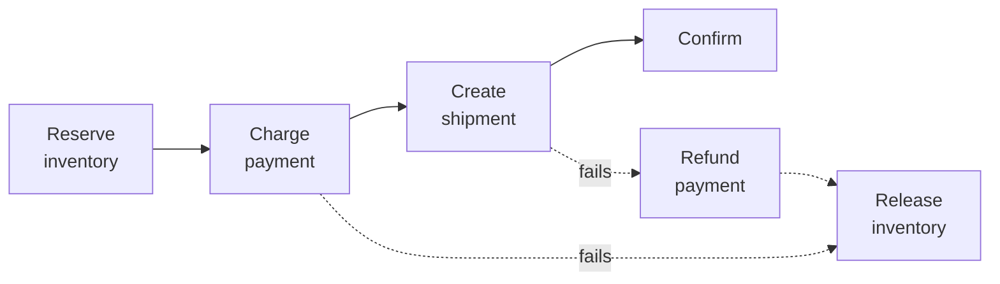

# Idempotency and exactly-once

> **Every distributed system retries, and every retry is a potential duplicate.**
> Idempotency is the property that makes duplicates harmless — which is why it is
> the answer to a surprising number of interview questions.

---

## 1 · The problem, precisely

```
Client                    Server
  |---- POST /charge ------->|
  |                          |  charge succeeds, $100 taken
  |    X response lost X     |
  |                          |
  |  timeout. retry?         |
  |                          |
  If it retries  -> possible DOUBLE CHARGE
  If it doesn't  -> possible LOST ORDER

The client CANNOT distinguish "request never arrived" from
"request succeeded but the response was lost."
```

**This is the two generals problem**, and it is provably unsolvable: no finite
exchange of messages over an unreliable channel gives both parties certainty.
You cannot make the client's decision safe by trying harder.

> **So you change the problem.** Instead of making the client's retry decision
> correct, you make retrying *safe*. That is idempotency, and framing it that way
> — "the uncertainty is unavoidable, so I remove the consequence" — is the answer
> that reads as senior.

---

## 2 · Which operations are already idempotent

| Operation | Idempotent? | Why |
|---|---|---|
| `GET /users/1` | ✓ | Reads change nothing |
| `PUT /users/1 {name: "A"}` | ✓ | Setting to a value is repeatable |
| `DELETE /users/1` | ✓ | Already deleted stays deleted |
| `POST /orders` | ✗ | **Creates a new one each time** |
| `balance = balance - 10` | ✗ | Applies again |
| `SET status = 'paid'` | ✓ | Assignment, not increment |
| `INSERT ... ON CONFLICT DO NOTHING` | ✓ | The conflict absorbs the duplicate |

**Absolute versus relative is the pattern.** `SET x = 5` is idempotent; `x += 1`
is not. Where you can express the operation absolutely, do — it removes the
problem instead of managing it.

**HTTP method semantics are worth stating correctly:** `GET`, `PUT`, `DELETE`
and `HEAD` are defined as idempotent; `POST` and `PATCH` are not. This is why
an L7 load balancer will retry a failed `GET` automatically but not a `POST` —
a small detail that connects two parts of the design.

---

## 3 · Idempotency keys

The general mechanism for operations that are not naturally idempotent.

```http
POST /v1/charges
Idempotency-Key: 8f14e45f-ea1c-4a4b-9f3e-2c0d7b1a9e55
Content-Type: application/json

{ "amount": 10000, "currency": "usd", "source": "card_xyz" }
```

**The client generates the key** — one per logical operation, reused across
every retry of that operation. Server-generated keys cannot work, because
obtaining one is itself a request that can fail.

### The implementation, and the part people get wrong

```sql
CREATE TABLE idempotency_keys (
    key            TEXT PRIMARY KEY,
    request_hash   TEXT NOT NULL,
    state          TEXT NOT NULL,     -- in_progress | completed
    response_code  INT,
    response_body  JSONB,
    created_at     TIMESTAMPTZ NOT NULL DEFAULT now(),
    expires_at     TIMESTAMPTZ NOT NULL
);
```

```python
def charge(key, request):
    # Claim the key atomically. The PRIMARY KEY constraint is the lock --
    # a SELECT-then-INSERT would race and let two concurrent retries both
    # proceed, which is the exact bug idempotency keys exist to prevent.
    claimed = db.execute("""
        INSERT INTO idempotency_keys (key, request_hash, state, expires_at)
        VALUES (?, ?, 'in_progress', now() + interval '24 hours')
        ON CONFLICT (key) DO NOTHING
        RETURNING key
    """, key, hash_of(request))

    if not claimed:
        existing = db.fetch_one("SELECT * FROM idempotency_keys WHERE key = ?", key)

        # Same key, different payload -- the client has a bug. Refuse
        # rather than silently returning an unrelated result.
        if existing.request_hash != hash_of(request):
            raise Conflict("idempotency key reused with a different request")

        if existing.state == 'in_progress':
            raise Conflict("request in progress, retry shortly")   # 409

        return existing.response_code, existing.response_body      # replay

    # First time through. The state change and the recorded response must
    # commit together, or a crash between them loses the idempotency.
    with db.transaction():
        result = perform_charge(request)
        db.execute("""UPDATE idempotency_keys
                      SET state='completed', response_code=?, response_body=?
                      WHERE key=?""", 200, result, key)
    return 200, result
```

**Four details that distinguish a real answer:**

| Detail | Why |
|---|---|
| **Atomic claim** (`ON CONFLICT`) | `SELECT` then `INSERT` races; two concurrent retries both proceed |
| **Store the request hash** | Same key with a different body is a client bug — return 409, not the wrong result |
| **Store the *response*** | A retry must return the same result, not just avoid a second charge |
| **Expire the keys** | Otherwise the table grows forever; 24 hours is typical |

> **"Store the response, not just a flag" is the detail that matters most.** The
> client retried because it did not get an answer — it still needs one. A system
> that prevents the double charge but returns "already processed" has not
> actually solved the client's problem.

---

## 4 · Idempotency for consumers

Queue consumers get the same problem from at-least-once delivery.

| Approach | How | Note |
|---|---|---|
| **Dedupe table** | Unique constraint on `message_id` | Simple, durable, needs cleanup |
| **Natural key** | `INSERT ... ON CONFLICT DO NOTHING` on the business key | Best where it applies — no extra state |
| **Idempotent by design** | `SET state='shipped'` rather than `state = next(state)` | Best of all |
| **Version check** | Apply only if `version = expected` | Also handles reordering |

> **A dedupe table is not free and the caveat is worth stating**: it must be
> written in the *same transaction* as the effect, or a crash between them
> reintroduces the duplicate. If the effect is in another system entirely — a
> third-party payment API — you cannot have that transaction, which is exactly
> why you pass *them* an idempotency key too and let them dedupe.

---

## 5 · Distributed transactions and sagas

**When an operation spans services, two-phase commit is usually the wrong
answer** and knowing why is a good signal: 2PC blocks. If the coordinator dies
after prepare, participants hold locks indefinitely, and availability becomes
the product of every participant's availability.

**The saga pattern instead:** a sequence of local transactions, each with a
compensating action.



| | Choreography | Orchestration |
|---|---|---|
| **How** | Services react to each other's events | A coordinator drives each step |
| **Good** | No central component; loosely coupled | The flow is explicit and debuggable |
| **Bad** | The flow exists nowhere; hard to trace | The coordinator is a component to run |

**Say the honest cost:** a saga is not atomic. There are windows where inventory
is reserved but payment has not completed, and a compensating action is not a
rollback — a refund is a *new fact*, visible to the user, not an erasure. For a
booking flow that is usually acceptable; for a ledger it may not be.

**Every saga step must be idempotent**, because the coordinator retries.

---

## 6 · The double-charge question

You will be asked some version of this. The complete answer:

> *"Three layers. First, the client sends an idempotency key with the charge and
> reuses it on every retry, so a lost response cannot become a second charge.
> Second, I claim that key atomically with a unique constraint and store the
> response, so retries replay the original result rather than re-executing —
> and a mismatched request hash on the same key returns 409 rather than the wrong
> answer. Third, I pass an idempotency key to the payment provider as well,
> because my dedupe table and their charge cannot be in one transaction — so
> they have to dedupe on their side too.*
>
> *If it still happens — and at scale it will, through some path I did not
> anticipate — reconciliation catches it: a job compares our ledger to the
> provider's daily settlement and refunds duplicates. Detection plus
> compensation is the backstop, because prevention alone is never complete."*

**The last paragraph is what separates it.** Acknowledging that prevention is
incomplete and designing the detection path is exactly the reasoning senior
engineers apply to money.

---

## 7 · Interview questions

| Question | What to say |
|---|---|
| ⭐ "The client times out and retries a payment." | It cannot tell a lost request from a lost response — that is the two generals problem and it is unsolvable. So I make retrying safe instead: a client-generated idempotency key, claimed atomically with a unique constraint, with the response stored so retries replay it. |
| ⭐ "How do you implement an idempotency key?" | Unique key column, claimed with `INSERT ... ON CONFLICT DO NOTHING` — a select-then-insert races. Store the request hash to detect key reuse with a different body, store the response so retries get the real answer, and expire rows after about a day. |
| ⭐ "Exactly-once processing across services?" | Not achievable as delivery. At-least-once plus idempotent handlers gives the same observable outcome. Across services, a saga of local transactions with compensating actions, each step idempotent — not two-phase commit, which blocks and multiplies unavailability. |
| "How do you make a counter increment idempotent?" | You cannot make `+= 1` idempotent directly, so change the representation: record the event with a unique ID and derive the count, or track applied message IDs. Where accuracy can be relaxed — view counts — accept the drift and say so. |
| "What if the dedupe write and the effect are in different systems?" | Then no transaction covers both, and you cannot fully prevent duplication locally. Push the key down to the external system so it dedupes too, and add reconciliation to detect what slips through. |
| "Choreography or orchestration?" | Orchestration when the flow is complex or needs auditing — the sequence is explicit and debuggable. Choreography when the steps are genuinely independent reactions. The failure mode of choreography is that the business process exists in no single place. |
| "Is a saga atomic?" | No, and that is the trade. There are visible intermediate states, and compensation is a new fact rather than an erasure — a refund appears on the statement. Acceptable for bookings; for a ledger I would keep the money movement inside one transactional boundary. |

---

## Stop condition

You know this block when you can:

1. state the two generals problem and why it reframes the solution,
2. write the idempotency-key implementation including the atomic claim,
3. say why storing the response matters as much as preventing the duplicate,
4. explain sagas versus 2PC and the honest cost of compensation, and
5. give the three-layer double-charge answer with reconciliation as the backstop.
