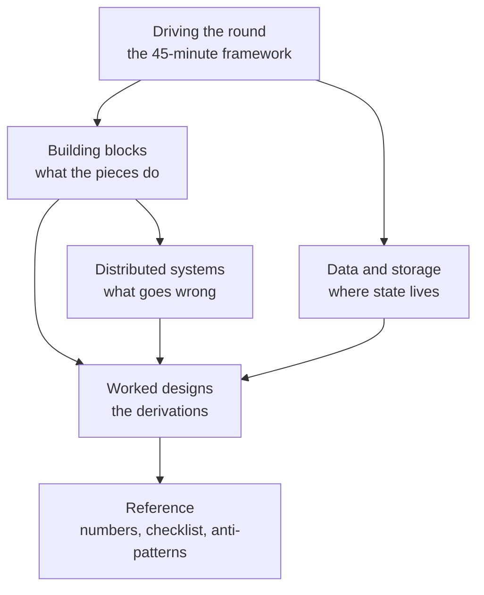

# System Design Handbook

> The coding round asks *can you produce a correct algorithm*. The system design
> round asks something different and rarely stated: **can I put you in a room
> with an ambiguous problem and trust the result?**

That is why the round has no answer key, why two candidates can produce the same
architecture and get different scores, and why reading a hundred design
write-ups does not by itself make you good at it.

---

## 1 · What is actually being scored

Interviewers at large companies score a rubric. The wording varies; the
dimensions do not.

| Dimension | What a strong candidate does | What a weak one does |
|---|---|---|
| **Scoping** | Turns a vague prompt into a bounded problem, out loud, before designing | Starts drawing boxes in minute two |
| **Structure** | Drives the hour; the interviewer never has to ask "what next?" | Waits to be prompted at each step |
| **Justification** | Every choice has a *because*, tied to a requirement | Names technologies with no reason |
| **Trade-offs** | Volunteers the cost of their own decision | Presents one option as obviously right |
| **Depth** | Can go three levels down on at least one component | Stays at the box-and-arrow level everywhere |
| **Failure thinking** | Asks what breaks and how it is detected | Designs only the happy path |
| **Communication** | The interviewer can follow the diagram without help | Diagram becomes unreadable by minute 30 |

**Note what is absent: correctness.** There is no single right architecture, and
producing the one from a popular write-up scores nothing on its own. The
reasoning is the artefact.

> **The single biggest differentiator**, and the one most candidates miss:
> *volunteering the weakness of your own design before the interviewer finds
> it.* "This gives me strong consistency but the leader is now a write
> bottleneck at about 10k QPS — if we exceed that I'd shard by user ID" reads as
> senior. Defending a choice as flawless reads as junior, regardless of whether
> the choice was good.

---

## 2 · Why most preparation fails

Three failure modes, in descending order of how common they are:

**Memorising architectures.** You read the standard news-feed design, reproduce
it, and get asked "why fan-out on write rather than read?" — and have nothing,
because you learned the *conclusion* without the *derivation*. The follow-up is
always where the score is decided.

**Building blocks without a framework.** You know what a message queue is and
what consistent hashing does, but with 45 minutes and a blank whiteboard you
freeze, because knowing components is not the same as knowing the order to
introduce them in.

**Never speaking it aloud.** Design is a talking round. Reading is a silent
activity. The gap between "I understand this" and "I can explain this while
drawing and being interrupted" is enormous, and only rehearsal closes it.

---

## 3 · How this handbook is organised

| Section | What it gives you |
|---|---|
| **Driving the round** | The repeatable structure: scope → estimate → API → high level → deep dive → failure. Learn this first; it is the thing you use in every question. |
| **Building blocks** | Load balancing, caching, queues, CDNs, rate limiting, search. Not encyclopaedic — the parts that come up and the reasons to choose between them. |
| **Data & storage** | Databases, sharding, replication. Where most deep-dive follow-ups live. |
| **Distributed systems** | Consistency, idempotency, failure and recovery, observability. The senior-signal material. |
| **Worked designs** | Full derivations, not conclusions. Every choice traced back to a requirement. |
| **Reference** | Numbers to know, a pre-interview checklist, anti-patterns, question bank. |

---

## 4 · The reading order

**If you have four weeks:**

1. **Driving the round** — all of it, first. It is short and it is the spine.
2. **Building blocks** and **Data & storage** — one page a day.
3. **Worked designs** — one per sitting, and *design it yourself before reading*.
4. **Distributed systems** — after the designs, when the problems it solves have become concrete.
5. **Reference** — the week of.

**If you have one week:** the framework, numbers to know, and four designs done
properly with your own attempt first. Four derived beats twelve read.

**If you have two days:** the framework, the checklist, the anti-patterns, and
rehearse one design out loud twice.

---

## 5 · The one rule

> **Design it yourself before you read the answer.** Twenty minutes on a blank
> page, out loud, with a timer. Then read, and mark the specific places you
> differed and why.

A design you read is a design you recognise. A design you derived is one you can
defend under follow-ups — and follow-ups are the round.

---

## 6 · Related handbooks

| Handbook | Round it prepares |
|---|---|
| [DSA Handbook](https://SAGARCHRY0777.github.io/dsa-handbook/) | The coding round — patterns, ladders, worked solutions |
| [LLM Handbook](https://SAGARCHRY0777.github.io/llm-handbook/) | ML/LLM systems — RAG, evaluation, serving, agents |
| This one | The system design round |

Start with [the framework](the-framework.html).
