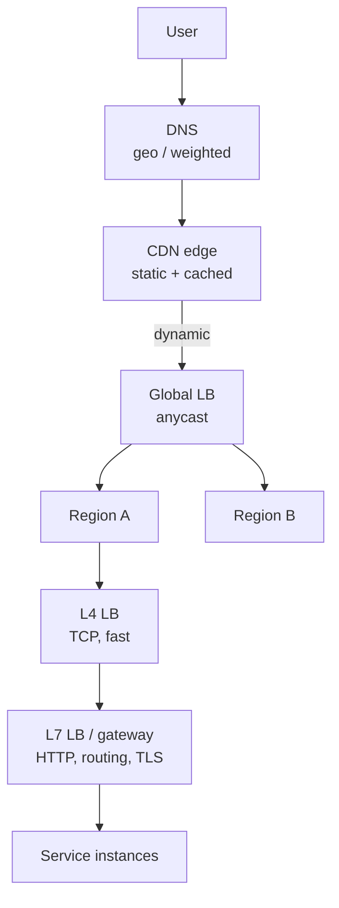

# Load balancing and the edge

> **Almost every design starts with the same arrow: client → load balancer →
> servers.** It is worth knowing what happens inside that box, because "and then
> a load balancer" with nothing behind it is the most common shallow answer in
> the round.

---

## 1 · The layers a request passes



**Load balancing happens at four levels, not one**, and saying so is a quick way
to show depth:

| Level | Mechanism | Balances | Cost of change |
|---|---|---|---|
| **DNS** | Multiple A records, geo or weighted routing | Users → regions | Minutes to hours (TTL) |
| **Anycast** | Same IP announced from many sites | Packets → nearest PoP | Seconds |
| **L4** | TCP/UDP, connection-level | Connections → machines | Immediate |
| **L7** | HTTP-aware proxy | Requests → services | Immediate |

> **DNS is a poor failover mechanism** and this is worth knowing: clients and
> resolvers cache records past the TTL, so a dead region keeps receiving traffic
> for minutes. That is why serious deployments use anycast or a health-checked
> global LB for failover and treat DNS as coarse routing only.

---

## 2 · L4 versus L7

The distinction the interviewer is checking for:

| | L4 (transport) | L7 (application) |
|---|---|---|
| **Sees** | IP + port | Method, path, headers, cookies, body |
| **Can route on** | Connection tuple only | `/api/*` vs `/static/*`, tenant header, version |
| **TLS** | Passes through | Usually terminates |
| **Throughput** | Millions of connections/node | Lower — it parses every request |
| **Retries** | No — it does not know what a request is | Yes, safely, on idempotent methods |
| **Examples** | AWS NLB, IPVS, Maglev | AWS ALB, Envoy, NGINX, HAProxy |

**The practical answer is usually both:** L4 at the front for raw throughput and
DDoS absorption, L7 behind it for routing, TLS, retries, and observability.

> **The single most useful thing L7 buys you is the retry.** An L4 balancer sees
> a broken connection and can only drop it. An L7 balancer knows the request was
> a `GET`, knows it never reached the application, and can retry it on another
> instance — the failure never reaches the user. That is why "L7 for anything
> user-facing" is a defensible default.

---

## 3 · The algorithms

| Algorithm | How | Use when | Fails when |
|---|---|---|---|
| **Round robin** | Next in rotation | Uniform requests, uniform servers | Request costs vary widely |
| **Weighted RR** | Rotation, biased by capacity | Heterogeneous hardware | Same as above |
| **Least connections** | Fewest in-flight | Variable request duration | Slow-start after a node returns |
| **Least response time** | Lowest latency × connections | Latency-sensitive | Noisy on low traffic |
| **Consistent hashing** | Hash key → ring position | Cache affinity, sharded state | Hot keys still concentrate |
| **Power of two choices** | Sample 2 at random, pick the less loaded | Large fleets | — |

**Two are worth being able to justify:**

**Power of two choices.** Sample two servers at random, send to whichever has
fewer connections. It is nearly as good as querying every server and vastly
cheaper — and it avoids the herd problem where every balancer independently
decides the same idle server is best and floods it. Naming this is a strong
signal.

**Consistent hashing.** The one to reach for when the backend holds state.

```
Plain hash:  server = hash(key) % N
             N changes -> EVERY key moves. A cache tier restart becomes
             a total cache miss and the database falls over.

Consistent:  servers and keys both hashed onto a ring; a key belongs to
             the next server clockwise.
             N changes -> only ~1/N of keys move.

Virtual nodes: each physical server occupies ~150 points on the ring
             rather than one, so load is even and removing a node spreads
             its keys across all survivors rather than dumping them on
             its single neighbour.
```

**Virtual nodes are the part people omit**, and without them consistent hashing
has badly uneven load and a cascading-failure mode when a node dies.

---

## 4 · Health checks

A balancer is only as good as its idea of "healthy".

| Kind | Checks | Catches |
|---|---|---|
| **Passive** | Watches real traffic for errors/timeouts | Fast, free, no synthetic load |
| **Active shallow** | `GET /healthz` → 200 | Process is alive |
| **Active deep** | Endpoint verifies DB, cache, dependencies | Alive but non-functional |

> **Deep health checks have a well-known failure mode**: if the shared database
> is briefly slow, *every* instance reports unhealthy at once and the balancer
> removes the entire fleet — turning a degradation into an outage. The standard
> mitigation is a **minimum healthy fraction**: never remove more than, say, 50%
> of a pool, and fail open when everything looks unhealthy. Mentioning this is
> genuine senior signal.

Two more things a good answer includes:

- **Slow start.** A returning instance has cold caches and empty connection
  pools. Ramp its share over ~30 seconds instead of sending it a full slice
  immediately.
- **Connection draining.** On removal, stop new requests but let in-flight ones
  finish for a grace period. Otherwise every deploy is a burst of 502s.

---

## 5 · Sticky sessions

Route a user consistently to one server — via cookie or source-IP hash.

**Usually the wrong answer, and knowing why matters:**

| Cost | Detail |
|---|---|
| Uneven load | Long-lived sessions concentrate |
| Bad failover | That server dies and the session is gone |
| Blocks deploys | You cannot drain a node without dropping sessions |
| Blocks autoscaling | New capacity gets no existing traffic |

> **Prefer stateless services with session state in a shared store** — Redis, or
> a signed token the client carries. Then any instance can serve any request,
> and every problem above disappears.

**Legitimate exceptions**, and being able to name them is better than a blanket
rule: WebSockets and other long-lived connections are inherently sticky; and
local caches with a high hit rate can justify affinity — but use consistent
hashing so a lost node costs 1/N, not everything.

---

## 6 · Making the balancer not be the SPOF

An obvious follow-up: *"what if the load balancer fails?"*

| Approach | How |
|---|---|
| **Active-passive pair** | Two nodes share a virtual IP; the standby takes it over on failure |
| **Active-active** | Several nodes, all live, DNS or anycast in front |
| **Anycast** | Same IP announced from many sites; BGP withdraws a dead one |
| **Client-side balancing** | Clients get the instance list and choose — no middlebox at all |

**Client-side load balancing is worth knowing** because it is how large internal
service meshes work: the client library holds the endpoint list from a service
registry and picks with power-of-two-choices. It removes a network hop and a
failure domain, at the cost of putting policy in every client.

---

## 7 · What to say in the round

At the high-level stage, one sentence beyond the box:

> *"L7 in front of the app tier — I want path-based routing, TLS termination,
> and automatic retries on idempotent requests. Least-connections, since request
> cost varies. The instances are stateless so any of them can serve any request,
> which keeps deploys and autoscaling simple."*

That is four justified decisions in twenty seconds, and it pre-empts the
follow-up.

If pushed deeper, the three places to go: **consistent hashing with virtual
nodes** when the backend is stateful, **the deep-health-check cascade** and
minimum healthy fraction, and **why sticky sessions are a smell**.

---

## 8 · Interview questions

| Question | What to say |
|---|---|
| ⭐ "L4 or L7?" | Both, usually — L4 at the edge for throughput and DDoS absorption, L7 behind it because only it can route on path, terminate TLS, and retry a failed idempotent request on another instance. |
| ⭐ "Why consistent hashing?" | With `hash % N`, changing N moves every key — a cache tier resize becomes a full cache miss and the database takes the load. Consistent hashing moves ~1/N. Add virtual nodes, or load is uneven and a dead node dumps all its keys on one neighbour. |
| "What if the LB dies?" | It must not be a single instance: active-passive with a floating VIP, active-active behind anycast, or client-side balancing with a service registry, which removes the middlebox entirely. |
| ⭐ "Are sticky sessions OK?" | Rarely. They cause uneven load, lose state on failover, and block draining and autoscaling. Put session state in Redis or a signed token instead. The real exceptions are long-lived connections and high-value local caches — and there I'd use consistent hashing so losing a node costs 1/N. |
| "How do you avoid overloading a recovering server?" | Slow start — ramp its traffic share over ~30s, because it has cold caches and empty pools. And connection draining on the way out so deploys do not throw 502s. |
| "Health checks — shallow or deep?" | Deep is better at catching alive-but-broken, but it can take out the whole fleet when a shared dependency is slow. Cap removals at a minimum healthy fraction and fail open. |

---

## Stop condition

You know this block when you can:

1. name the four levels balancing happens at,
2. give the L4/L7 split and the retry argument,
3. explain consistent hashing *including virtual nodes*,
4. describe the deep-health-check cascade and its mitigation, and
5. argue both for and against sticky sessions.
