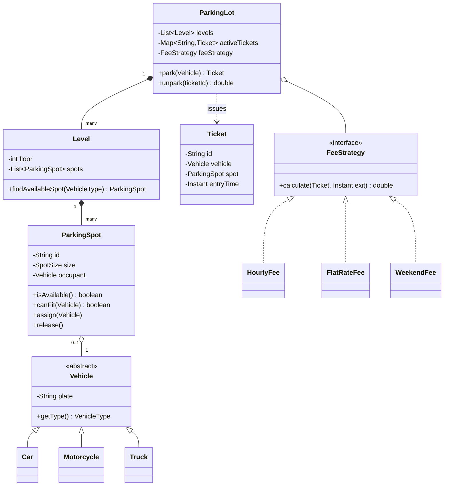

# Low-level design

> **This is a different round from everything else in this handbook.** HLD asks
> how services fit together; **LLD asks how classes fit together.** Same
> vocabulary, different altitude — and confusing them is the fastest way to fail
> either.

Common at Indian product companies (Flipkart, Swiggy, Zomato, Uber India,
Atlassian, PhonePe) as a "machine coding" round: 60–90 minutes to produce
working, extensible code.

---

## 1 · What this round actually asks

| | HLD | **LLD** |
|---|---|---|
| Unit | Services, databases, queues | **Classes, interfaces, methods** |
| Concern | Scale, latency, failure | **Extensibility, correctness, readability** |
| Output | Boxes and arrows | **Class diagram + working code** |
| "Scale" means | 10M users | Adding a feature without rewriting |
| Wrong move | Class diagrams | **Talking about sharding** |

> **Do not mention sharding, load balancers or CAP in an LLD round.** It reads as
> pattern-matching rather than listening. The scaling question here is *"a new
> requirement arrives — how much code changes?"*

**What is scored:**

| Dimension | Means |
|---|---|
| **Requirement handling** | Did you clarify before coding? |
| **Class modelling** | Do the objects match the domain? |
| **Extensibility** | Can a new type be added without editing existing classes? |
| **Correctness** | Does it actually run? |
| **Code quality** | Naming, cohesion, no god class |
| **Concurrency** | If shared state exists, is it safe? |

---

## 2 · SOLID — the parts that earn their place

**Two of the five do most of the work in an interview.**

### S — Single responsibility

> A class should have one reason to change.

`Order` holding order data **and** computing tax **and** sending email is three
reasons. Split it.

**The tell:** you cannot name the class without "and", or without a vague word
like `Manager` or `Helper`.

### O — Open/closed ⭐

> Open for extension, closed for modification.

**The one that is actually tested**, because it is what "extensible" means.

```
BAD -- adding a payment type edits this method forever:

    if type == CARD:      ...
    elif type == UPI:     ...
    elif type == WALLET:  ...      <- every new type edits this file

GOOD -- adding a payment type adds a file and edits nothing:

    interface PaymentMethod { pay(amount) }
    class CardPayment implements PaymentMethod { ... }
    class UpiPayment  implements PaymentMethod { ... }
```

> **The interviewer will ask "now add cryptocurrency payments".** If your answer
> is "add a class", you passed. If it is "add an `elif`", you did not. **They are
> testing this specific thing, and the follow-up is almost always a new type.**

### L — Liskov substitution

> A subtype must work anywhere its parent does.

The classic violation: `Square extends Rectangle`. Setting width on a Rectangle
should not change its height, but for a Square it must — so code that works with
Rectangles breaks with Squares. **Prefer composition when the "is-a" relation
does not survive substitution.**

### I — Interface segregation

> Do not force a class to implement methods it does not need.

A `Bird` interface with `fly()` breaks penguins. Split into `Flyable` and
`Swimmable`.

### D — Dependency inversion ⭐

> Depend on abstractions, not concretions.

```
BAD:   class OrderService { private MySqlDatabase db = new MySqlDatabase(); }
GOOD:  class OrderService { OrderService(OrderRepository repo) { ... } }
```

**This is what makes code testable** — you inject a fake repository. Saying
*"I'll inject it so this is unit-testable"* is a strong, cheap signal.

---

## 3 · The patterns that actually appear

**Five carry almost every LLD interview.** Knowing twenty-three is not the point.

| Pattern | Use when | Appears in |
|---|---|---|
| **Strategy** ⭐ | Several interchangeable algorithms | Payment methods, pricing, parking-fee rules, ranking |
| **Factory** ⭐ | Object creation depends on input | Creating vehicles, notifications, shapes |
| **Observer** ⭐ | Many things react to one event | Notifications, display boards, event feeds |
| **Singleton** | Exactly one instance | Config, ID generator — **and say it hurts testability** |
| **State** | Behaviour changes with an object's state | Order lifecycle, vending machine, elevator |

**Two more worth recognising:** **Decorator** (add behaviour without subclassing
— toppings on a pizza, add-ons on a ride) and **Builder** (many optional
constructor parameters).

> **Do not force a pattern in.** Announcing "I'll use the Abstract Factory
> pattern" for something needing one class is a negative signal. **Use the
> pattern, name it when asked why.** The strongest form is: *"I'm putting fee
> calculation behind an interface so a new rate type is a new class rather than
> an edit — that's Strategy."*

---

## 4 · The process

**60–90 minutes. Do not start typing at minute one.**

```
1. CLARIFY            5-10 min   scope aggressively. Say what is OUT.
2. IDENTIFY ENTITIES  5 min      the nouns. Their relationships.
3. CLASS DIAGRAM      10 min     interfaces, classes, key methods.
                                 SHOW IT before writing code.
4. CODE THE CORE      30-40 min  the main flow, working, in memory.
5. DEMO               5 min      a main() that exercises it.
6. EXTENSIONS         5 min      "how would you add X?" -- answer in classes.
```

**Scope out loud, and hard.** In-memory storage, no persistence, no UI, no auth,
single JVM. **Nobody expects a database.** Saying so explicitly buys you the time
to make the class design good.

> **Show the class diagram before coding.** It takes three minutes and it is the
> only chance to correct a wrong model cheaply. Coding first means discovering
> the flaw at minute 50.

---

## 5 · Worked example — parking lot

**The most-asked LLD problem.** Multiple vehicle types, multiple spot sizes,
pricing, and a "now add X" follow-up guaranteed.

### Clarify

```
IN SCOPE                        OUT OF SCOPE
- park / unpark a vehicle       - persistence, UI, payments gateway
- multiple vehicle sizes        - reservations, multi-floor routing
- multiple spot sizes           - number-plate recognition
- fee calculation on exit
- find an available spot

ASSUMPTIONS (state them)
- in-memory, single process
- one entrance/exit initially -- multiple later
- fee: hourly, but the RULE must be swappable
```

### Class diagram



**Three decisions to defend:**

| Decision | Why |
|---|---|
| **`FeeStrategy` is an interface** | "Add weekend pricing" becomes a new class, not an edit. This is the follow-up they will ask |
| **`canFit` lives on the spot** | The spot knows its own size. Putting size logic in `ParkingLot` makes it a god class |
| **`Ticket` is a separate entity** | It carries entry time and the spot — without it, unpark needs a scan |

### The core code

```java
public interface FeeStrategy {
    double calculate(Ticket ticket, Instant exitTime);
}

public class HourlyFee implements FeeStrategy {
    private final Map<VehicleType, Double> ratePerHour;

    public HourlyFee(Map<VehicleType, Double> ratePerHour) {
        this.ratePerHour = ratePerHour;
    }

    @Override
    public double calculate(Ticket ticket, Instant exitTime) {
        long hours = Math.max(1,                       // minimum one hour
            Duration.between(ticket.getEntryTime(), exitTime).toHours());
        return hours * ratePerHour.get(ticket.getVehicle().getType());
    }
}

public class ParkingLot {
    private final List<Level> levels;
    private final Map<String, Ticket> activeTickets = new ConcurrentHashMap<>();
    private final FeeStrategy feeStrategy;          // INJECTED -- swappable

    public ParkingLot(List<Level> levels, FeeStrategy feeStrategy) {
        this.levels = levels;
        this.feeStrategy = feeStrategy;
    }

    // synchronized so two vehicles cannot be assigned the same spot.
    // See section 6 -- a lot-wide lock is the honest first answer, and
    // the honest follow-up is that it does not scale to many entrances.
    public synchronized Ticket park(Vehicle vehicle) {
        for (Level level : levels) {
            ParkingSpot spot = level.findAvailableSpot(vehicle.getType());
            if (spot != null) {
                spot.assign(vehicle);
                Ticket ticket = new Ticket(vehicle, spot, Instant.now());
                activeTickets.put(ticket.getId(), ticket);
                return ticket;
            }
        }
        throw new NoSpotAvailableException(vehicle.getType());
    }

    public synchronized double unpark(String ticketId) {
        Ticket ticket = activeTickets.remove(ticketId);
        if (ticket == null) throw new InvalidTicketException(ticketId);
        ticket.getSpot().release();
        return feeStrategy.calculate(ticket, Instant.now());
    }
}
```

```python
from abc import ABC, abstractmethod
from datetime import datetime, timedelta

class FeeStrategy(ABC):
    @abstractmethod
    def calculate(self, ticket, exit_time) -> float: ...

class HourlyFee(FeeStrategy):
    def __init__(self, rate_per_hour: dict):
        self.rate_per_hour = rate_per_hour

    def calculate(self, ticket, exit_time) -> float:
        elapsed = exit_time - ticket.entry_time
        hours = max(1, int(elapsed.total_seconds() // 3600))   # minimum 1
        return hours * self.rate_per_hour[ticket.vehicle.type]

class ParkingLot:
    def __init__(self, levels, fee_strategy: FeeStrategy):
        self.levels = levels
        self.fee_strategy = fee_strategy      # injected, swappable
        self.active = {}
        self._lock = threading.Lock()

    def park(self, vehicle):
        with self._lock:
            for level in self.levels:
                spot = level.find_available_spot(vehicle.type)
                if spot:
                    spot.assign(vehicle)
                    ticket = Ticket(vehicle, spot, datetime.now())
                    self.active[ticket.id] = ticket
                    return ticket
            raise NoSpotAvailable(vehicle.type)
```

### The extensions they will ask

| "Now add…" | Your answer |
|---|---|
| **Weekend pricing** | A new `FeeStrategy` implementation. **No existing class changes** |
| Electric vehicles with charging | New `VehicleType` + `SpotSize`; `canFit` already handles it |
| Multiple entrances | See §6 — the lot-wide lock becomes the bottleneck |
| A display board of free spots | **Observer** — the board subscribes to spot state changes |
| Monthly passes | Another `FeeStrategy`, or a `Customer` with a pass checked before pricing |

> **"Add weekend pricing" is the question the whole design exists to answer.**
> If `FeeStrategy` is an interface, the answer is one sentence and you are done.
> That is what open/closed buys.

---

## 6 · Concurrency — the part most candidates skip

**If two threads can touch shared state, say so.** Volunteering it is a strong
signal because most candidates ignore it entirely.

```
THE RACE:  two vehicles arrive at once
  thread A: findAvailableSpot() -> spot 42
  thread B: findAvailableSpot() -> spot 42     <- same spot
  thread A: assign()
  thread B: assign()                            <- OVERWRITES A
```

| Approach | Trade-off |
|---|---|
| **`synchronized` on the lot** | Correct, simple. **Serialises every entrance** — fine for one gate, a bottleneck for ten |
| Lock per level | Better parallelism, more care needed |
| **Atomic compare-and-set on the spot** | `spot.tryAssign(vehicle)` using an atomic reference — no global lock, retry on failure |
| Concurrent queue of free spots | Poll is atomic; loses "nearest spot" ordering |

> **Give the simple answer first, then the honest limit:** *"I'll synchronise on
> the lot — correct and simple. It serialises entry, which is fine for one gate.
> With several entrances I'd move to a compare-and-set on the spot itself so
> only contending vehicles retry, rather than a lot-wide lock."*
>
> That is the same optimistic-concurrency idea as
> [ticketing](design-ticketing.html) and [e-commerce](design-ecommerce.html),
> one altitude down.

---

## 7 · The problem list

| Problem | Really tests |
|---|---|
| **Parking lot** ⭐ | Strategy, entity modelling, concurrency |
| **Elevator system** ⭐ | State pattern, scheduling algorithm |
| **BookMyShow / ticket booking** ⭐ | Concurrency — seat locking |
| Splitwise | Expense splitting, graph settlement |
| Vending machine | State pattern, textbook |
| Snake & ladder / chess | Board modelling, move validation |
| Library management | CRUD plus rules — often too easy |
| **Rate limiter** ⭐ | Algorithm + thread safety |
| Logging framework | Chain of responsibility, levels |
| Notification service | Observer, Strategy |
| Cache with LRU eviction | HashMap + doubly linked list |
| Food delivery / cab booking | Matching, state machine |
| Tic-tac-toe | Extensibility to N×N and other win rules |

**If you prepare three: parking lot, elevator, BookMyShow.** They cover
Strategy, State and concurrency respectively.

---

## 8 · Failure modes

| Mistake | Cost |
|---|---|
| **Coding before showing a class model** | Discover the flaw at minute 50 |
| A god class doing everything | Fails cohesion outright |
| `if/elif` chains over types | **Fails the extension question** |
| Forcing patterns in | Reads as buzzword matching |
| Discussing sharding or CAP | Wrong round |
| Ignoring concurrency entirely | Missed, easy signal |
| Not running the code | "Machine coding" means it must run |
| Over-scoping | Half-finished beats complete-and-shallow, but not by much |
| Interfaces for things with one implementation | Abstraction with no purpose is noise |

---

## 9 · Interview questions

| Question | What to say |
|---|---|
| ⭐ "Now add a new payment/fee type." | A new class implementing the existing interface. No existing file changes — that is open/closed, and it is why the behaviour sits behind an interface rather than in a conditional. |
| ⭐ "Why an interface here?" | Because this is the axis the requirements will move along. I would not put an interface on something with one implementation and no reason to vary — that is abstraction without purpose. |
| ⭐ "Two people act at once." | A real race: both read the same free resource and both claim it. Simplest correct fix is synchronising the operation; better is a compare-and-set on the resource itself, so only genuinely contending threads retry instead of serialising everyone. |
| "Which pattern is this?" | Name it after describing the behaviour, not before. Strategy for interchangeable algorithms, State when behaviour depends on lifecycle stage, Observer for many reactions to one event. |
| "Singleton for the config?" | It works, but it hides a global dependency and makes tests hard to isolate. I would inject it instead and let the container own the single instance. |
| "How would you test this?" | Dependencies are injected, so I can pass a fake repository and a fixed clock. A fee calculation that calls `Instant.now()` internally is untestable — passing the exit time in is the fix. |
| "How does this scale to 10M users?" | That is a different round. Here scale means adding a requirement without editing existing classes — happy to talk distribution if you want it. |

---

## Stop condition

You are ready for this round when you can:

1. state how LLD differs from HLD and stay at the right altitude,
2. explain open/closed with the `if/elif` versus interface contrast,
3. name the five patterns that actually appear and resist forcing others,
4. draw the parking-lot class diagram from memory,
5. answer "add weekend pricing" in one sentence,
6. raise the concurrency race unprompted and give both fixes, and
7. say why you inject dependencies — testability, concretely.
