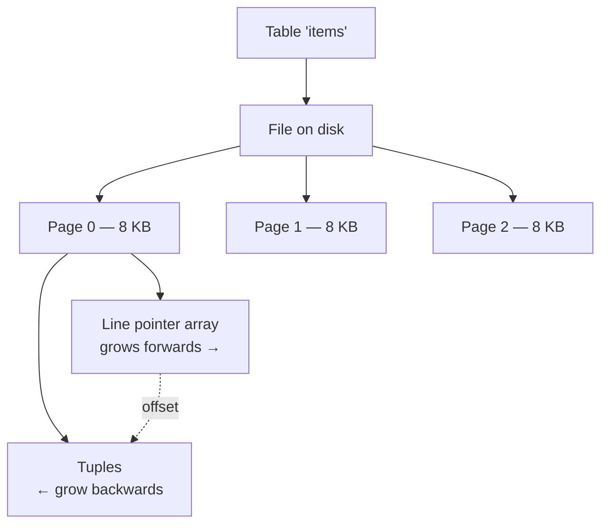
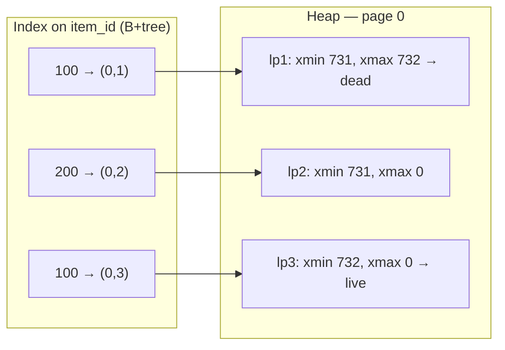

# Postgres internals

> **One fact explains most of Postgres's behaviour: an `UPDATE` never modifies a
> row in place.** It writes a new row version and marks the old one dead. Bloat,
> vacuum, long-transaction problems, index write amplification and the isolation
> levels all follow from that.

> **Source and method.** The structure of this page follows
> [Hussein Nasser's](https://www.youtube.com/@hnasr) walkthrough of Postgres
> internals — pages, tables, tuples, heap. **Every claim below was then executed
> against a live PostgreSQL 16 container**, and the outputs are real, not
> illustrative. Where the whiteboard and the running database differ, the
> database wins — see §3.

---

## 1 · The physical layout

```
A TABLE is a FILE on disk.
A FILE is an array of fixed-size PAGES.
A PAGE is 8 KB by default -- set at compile time.
A PAGE holds TUPLES -- row versions, not rows.
The whole structure is called the HEAP.
```



**Verified:**

```
postgres=# SHOW block_size;
 8192
```

**Why 8 KB matters:** it is the unit of I/O. Postgres never reads part of a
page — a single-row lookup pulls the whole 8 KB into shared buffers. It is also
why a row cannot exceed a page: values too large are moved out to a **TOAST**
table (The Oversized-Attribute Storage Technique) and replaced by a pointer.

**A page is filled from both ends.** Line pointers grow forward from the header;
tuple data grows backward from the end. They meet in the middle, and that is
when the page is full. The indirection matters: a tuple can be moved *within* a
page without changing its line pointer, so nothing outside the page needs
updating.

---

## 2 · ctid — the physical address

**Every tuple has a `ctid`: `(page number, line pointer)`.**

```
postgres=# CREATE TABLE items (item_id int PRIMARY KEY, price numeric);
postgres=# INSERT INTO items VALUES (100, 10), (200, 5);
postgres=# SELECT ctid, xmin, xmax, item_id, price FROM items ORDER BY ctid;

 ctid  | xmin | xmax | item_id | price
-------+------+------+---------+-------
 (0,1) |  731 |    0 |     100 |    10
 (0,2) |  731 |    0 |     200 |     5
```

**This is why Postgres reads are fast regardless of table size.** Given
`(0,1)`, it computes the file offset arithmetically — page 0 starts at byte 0,
page 1 at 8192, page *n* at *n* × 8192 — reads that one 8 KB page, and finds
the tuple by its line pointer. **A 7 GB table and a 7 MB table cost the same
single page read.**

> ⚠️ **Line pointers are 1-indexed, not 0-indexed.** The first tuple on a page is
> `(0,1)`, not `(0,0)`. Diagrams frequently show `(0,0)`; the running database
> disagrees, and `(0,0)` is in fact an invalid ctid.

---

## 3 · xmin and xmax — how MVCC works

**Two hidden system columns on every tuple:**

| Column | Meaning |
|---|---|
| **`xmin`** | The transaction ID that **created** this tuple |
| **`xmax`** | The transaction ID that **deleted or superseded** it — `0` means still live |

A tuple is visible to your transaction roughly when `xmin` is committed and in
your snapshot, **and** `xmax` is either 0 or not visible to you. That single
rule produces every isolation behaviour below.

### INSERT — one new tuple

`xmin` = your transaction, `xmax` = 0. Shown above.

### UPDATE — a new tuple, and the old one marked

```
postgres=# UPDATE items SET price = 20 WHERE item_id = 100;
postgres=# SELECT ctid, xmin, xmax, item_id, price FROM items ORDER BY ctid;

 ctid  | xmin | xmax | item_id | price
-------+------+------+---------+-------
 (0,2) |  731 |    0 |     200 |     5
 (0,3) |  732 |    0 |     100 |    20     <- NEW tuple at a NEW ctid
```

**The old version is still physically there.** `pageinspect` shows the page as
it really is:

```
postgres=# SELECT lp, t_xmin, t_xmax, t_ctid
             FROM heap_page_items(get_raw_page('items', 0));

 lp | t_xmin | t_xmax | t_ctid
----+--------+--------+--------
  1 |    731 |    732 | (0,3)    <- OLD version: dead, and it POINTS FORWARD
  2 |    731 |      0 | (0,2)    <- row 200, untouched
  3 |    732 |      0 | (0,3)    <- NEW version, points to itself
```

> **Three things this proves at once:**
> 1. `UPDATE` is a **delete plus an insert**. The row did not move; a second
>    version was written.
> 2. The old tuple's `t_xmax` is the updating transaction — that is how it is
>    marked dead.
> 3. **The old tuple's `t_ctid` points forward to its replacement.** That
>    forward pointer forms the **update chain**, and it is what lets an index
>    entry pointing at the old version still find the current one.

### DELETE — nothing is removed

```
postgres=# DELETE FROM items WHERE item_id = 200;

 lp | t_xmin | t_xmax | t_ctid
----+--------+--------+--------
  1 |    731 |    732 | (0,3)
  2 |    731 |    745 | (0,2)    <- still here. Only xmax was set.
  3 |    732 |      0 | (0,3)
```

**A `DELETE` writes four bytes.** The tuple, its data, and its index entries all
remain on disk until `VACUUM` reclaims them. This is why deleting a million rows
frees no disk space and can make the table *slower* until vacuum runs.

---

## 4 · Indexes point at ctids

An index is a B-tree mapping **key → ctid**.



**The consequence that costs the most:** because index entries store physical
addresses, **a normal `UPDATE` must insert a new entry into every index on the
table** — even indexes on columns that did not change. One update to a table
with six indexes can mean seven writes.

> **This is the "brilliant and catastrophic" design.** Brilliant, because a
> lookup is one arithmetic jump to one page. Catastrophic, because every row
> version needs an entry in every index.

**The index cannot tell you if a row is visible.** It only knows a ctid existed.
Postgres must still visit the heap to read `xmin`/`xmax` — which is why an
"index-only scan" is only possible when the **visibility map** marks the page
all-visible, and why `VACUUM` is what makes index-only scans work at all.

---

## 5 · HOT updates — the optimisation that saves you

**Heap-Only Tuple:** if the updated columns are in **no index**, *and* the new
version fits on the **same page**, Postgres skips the index writes entirely. The
old tuple's forward pointer alone chains to the new one.

**Verified — the difference is total:**

```
-- update a column that is NOT indexed
postgres=# UPDATE hot_demo SET plain_col = plain_col + 1 WHERE id <= 50;

 updates | hot_updates
---------+-------------
      50 |          50        <- 100% HOT: zero index writes

-- update a column that IS indexed
postgres=# UPDATE hot_demo SET indexed_col = indexed_col + 1000 WHERE id <= 50;

 updates | hot_updates
---------+-------------
     100 |          50        <- none of the new 50 were HOT
```

| To get HOT updates | Why |
|---|---|
| **Do not index columns you update frequently** | The single biggest lever |
| **Leave free space on pages** — lower `fillfactor` (e.g. 80) | The new version must fit on the same page |
| Keep rows narrow | More versions fit per page |

> **`fillfactor` is the tuning knob nobody uses.** The default is 100, meaning
> pages are packed full, meaning an update has no room on the page and cannot be
> HOT. For an update-heavy table, `ALTER TABLE t SET (fillfactor = 80)` leaves
> room and can eliminate most index write amplification.

---

## 6 · Isolation levels — the same data, different answers

**Which version you see depends on who you are.** Postgres offers three
effective levels (it accepts `READ UNCOMMITTED` but treats it as
`READ COMMITTED` — dirty reads are impossible by construction).

| Level | Snapshot taken | Prevents |
|---|---|---|
| **Read committed** *(default)* | **Per statement** | Dirty reads |
| **Repeatable read** | **Once, per transaction** | + non-repeatable reads, phantoms |
| **Serializable** | Once, plus conflict tracking (SSI) | Everything, including write skew |

**Verified with two concurrent sessions.** Same script, same interleaving, only
the isolation level differs:

```
READ COMMITTED
    session A: first read: 100
    session B: UPDATE bal = 999; COMMIT
    session A: second read: 999      <- a NEW snapshot per statement

REPEATABLE READ
    session A: first read: 100
    session B: UPDATE bal = 777; COMMIT
    session A: second read: 100      <- snapshot FROZEN at BEGIN
```

**Both transactions read the same physical page.** They return different values
because they evaluate `xmin`/`xmax` against different snapshots. **That is
MVCC** — the visibility rule *is* the isolation level.

### Serializable, and what it uniquely stops

The anomaly the others allow is **write skew**: two transactions each read a
shared set, each check a constraint that still holds, and each write — leaving
the constraint violated overall. The classic case is two doctors both going
off-call because each sees the other still on.

Repeatable read does not catch it: neither wrote what the other read.
**Serializable does**, using Serializable Snapshot Isolation, which tracks
read/write dependencies and aborts one transaction.

> **The practical cost: serializable transactions can fail with a serialization
> error at commit time**, so every caller must be prepared to retry. That
> retry loop is the real price — not the throughput.

---

## 7 · Bloat and vacuum

Dead tuples accumulate. **Verified — one logical row, 20,000 updates:**

```
pages after insert:        1
pages after 20k updates:  89     <- still ONE visible row
pages after VACUUM:       89     <- space is REUSABLE, not returned to the OS
pages after VACUUM FULL:   1     <- rewritten, but takes ACCESS EXCLUSIVE
```

| Operation | Does | Lock |
|---|---|---|
| **`VACUUM`** | Marks dead space reusable **within** the table; updates the visibility map and FSM | Non-blocking |
| **`VACUUM FULL`** | Rewrites the whole table compactly, returning space to the OS | **`ACCESS EXCLUSIVE` — blocks everything** |
| `ANALYZE` | Refreshes planner statistics | Non-blocking |
| **autovacuum** | Runs both automatically on thresholds | Non-blocking |

> **`VACUUM` does not shrink the file, and that is usually correct.** The space
> is reused by future inserts, so a steady-state table stabilises. `VACUUM FULL`
> takes an exclusive lock and is not something you run on a live table.

### The long-transaction problem

**Vacuum can only remove a tuple no running transaction could still need.** One
old transaction holds the horizon back for the entire database.

**Verified:**

```
dead tuples WITH an old transaction open:  5000
dead tuples AFTER it committed:               0
```

Same table, same 5,000 updates, same `VACUUM` command. **The only difference is
whether an unrelated transaction was still open.**

> **This is the most common cause of production Postgres bloat**, and it is
> rarely the obvious culprit: an idle-in-transaction connection, a forgotten
> `BEGIN` in a REPL, a stuck analytics query, or a replica with
> `hot_standby_feedback` on. **Alert on `pg_stat_activity` for long-running and
> idle-in-transaction sessions** — that is the metric that predicts bloat.

---

## 8 · Terminology

| Term | What it is |
|---|---|
| **Heap** | The main table storage — pages of tuples. Postgres tables are heap-organised, so rows are *not* stored in index order |
| **Page / block** | 8 KB unit of I/O |
| **Tuple** | A **row version**, not a row |
| **Line pointer / item pointer** | Slot in a page's array pointing at a tuple's offset. 1-indexed |
| **ctid** | `(page, line pointer)` — a tuple's physical address. **Not stable across updates** |
| **xmin / xmax** | Creating and deleting transaction IDs |
| **xid** | 32-bit transaction ID |
| **Snapshot** | The set of transactions visible to you; what isolation levels manipulate |
| **MVCC** | Multi-version concurrency control — readers never block writers, writers never block readers |
| **Dead tuple** | A version no transaction can see; reclaimable |
| **Bloat** | Space held by dead tuples |
| **HOT update** | Update with no index writes; requires unindexed columns and same-page room |
| **Update chain** | Forward `t_ctid` pointers linking versions |
| **TOAST** | Out-of-line storage for values too big for a page |
| **Shared buffers** | Postgres's page cache in RAM |
| **WAL** | Write-ahead log — changes are logged before pages are written, giving crash recovery |
| **LSN** | Log sequence number; a position in the WAL |
| **Checkpoint** | Flush of dirty buffers, bounding recovery time |
| **FSM** | Free space map — which pages have room |
| **Visibility map** | Which pages are all-visible; **enables index-only scans** |
| **clog / pg_xact** | Commit status of each transaction ID |
| **Hint bits** | Cached commit status on the tuple, avoiding repeated clog lookups |
| **Fillfactor** | % of a page to fill on insert; lower leaves room for HOT |
| **Sequential scan** | Read every page |
| **Index scan** | Walk the index, then fetch each heap tuple |
| **Bitmap heap scan** | Collect ctids, sort by page, then read each page once |
| **Index-only scan** | Answer from the index alone — only if the visibility map allows |
| **Transaction ID wraparound** | 32-bit xids exhaust after ~4B; vacuum must freeze old tuples or the database shuts down to protect itself |
| **Freezing** | Marking a tuple as visible to everyone, so its xid can be reused |
| **SSI** | Serializable Snapshot Isolation — how serializable is implemented |
| **Write skew** | The anomaly only serializable prevents |

---

## 9 · What this explains

| Observation | Cause |
|---|---|
| `DELETE` frees no disk space | Tuples remain until vacuum |
| Table grows despite constant row count | Every update writes a new version |
| Updates are slower with more indexes | Each non-HOT update writes to every index |
| A read-only reporting query causes bloat | It pins the snapshot horizon |
| Count(*) is slow | No stored count; visibility must be checked per tuple |
| Queries slow down after a bulk delete | Dead tuples still get scanned |
| `VACUUM FULL` fixed it but caused an outage | `ACCESS EXCLUSIVE` lock |
| Index-only scans sometimes don't happen | Visibility map not current — vacuum |

---

## 10 · Interview questions

| Question | What to say |
|---|---|
| ⭐ "What does an UPDATE do in Postgres?" | Writes a **new tuple** and sets the old one's `xmax` to the updating transaction — never an in-place modification. The old version stays on the page until vacuum, with a forward `t_ctid` pointing at its replacement. |
| ⭐ "Why is Postgres MVCC 'expensive'?" | Every update creates a version, and unless the update is HOT, every index gets a new entry pointing at the new ctid — even indexes on unchanged columns. That is write amplification, plus the bloat that vacuum must later reclaim. |
| ⭐ "What is a HOT update?" | Heap-Only Tuple: if no indexed column changed and the new version fits on the same page, Postgres skips all index writes and chains via the old tuple's forward pointer. You encourage it by not indexing frequently-updated columns and by lowering `fillfactor` so pages have room. |
| ⭐ "Read committed vs repeatable read?" | Read committed takes a fresh snapshot per **statement**, so two reads in one transaction can differ. Repeatable read takes one snapshot at BEGIN and holds it. Both read the same physical tuples — they just evaluate `xmin`/`xmax` against different snapshots. |
| "What does serializable add?" | It prevents write skew, where two transactions each read and each write without overlapping, leaving a constraint violated. Implemented as SSI, tracking read/write dependencies. The cost is that transactions can abort at commit, so callers need a retry loop. |
| ⭐ "Why did the table grow after deleting rows?" | Delete only sets `xmax`. The tuples and their index entries stay until vacuum, and vacuum makes space **reusable** rather than returning it — I measured 89 pages for one visible row after 20,000 updates, unchanged by VACUUM and back to 1 only after VACUUM FULL. |
| ⭐ "One long-running query is causing bloat everywhere." | It pins the snapshot horizon. Vacuum cannot remove a tuple any running transaction might still need, so one old transaction blocks cleanup database-wide. Usually idle-in-transaction, a forgotten BEGIN, or a replica with `hot_standby_feedback`. Alert on `pg_stat_activity`. |
| "Why is `SELECT count(*)` slow?" | There is no stored count, and the index cannot answer it, because visibility lives in the heap. Postgres must check `xmin`/`xmax` per tuple — an index-only scan helps, but only where the visibility map says the page is all-visible. |
| "What is transaction ID wraparound?" | Transaction IDs are 32-bit and wrap after ~4 billion. Vacuum must **freeze** old tuples — marking them visible to everyone — or Postgres shuts down to avoid data appearing to come from the future. It is the failure mode of never vacuuming. |

---

## Stop condition

You understand this when you can:

1. say what `UPDATE` physically does and why the old version survives,
2. read a `ctid` and explain why lookups cost the same at any table size,
3. explain `xmin`/`xmax` visibility and derive both isolation levels from it,
4. state the two conditions for a HOT update and the `fillfactor` lever,
5. distinguish `VACUUM` from `VACUUM FULL` by what they reclaim and lock, and
6. explain how one long transaction bloats the whole database.
