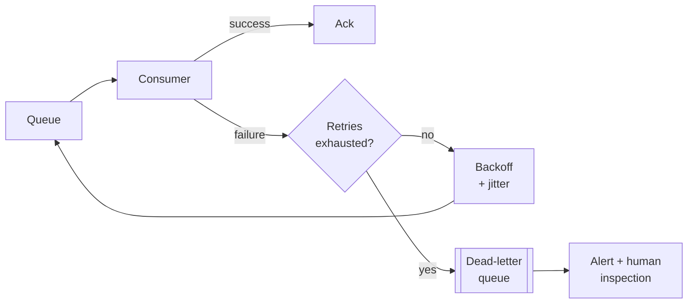

# Queues and streams

> **Adding a queue is how you turn a synchronous failure into an asynchronous
> delay.** That sentence is the whole justification, and it is also the whole
> cost — because the delay is now something you have to reason about.

---

## 1 · What a queue actually buys

Four things, and a good answer names which one it wants:

| Benefit | Meaning |
|---|---|
| **Decoupling** | The producer does not know or wait for the consumer |
| **Load levelling** | A 10× spike becomes a longer queue, not a crash |
| **Retry** | A failed unit of work is still in the queue |
| **Fan-out** | One event, many independent consumers |

And the costs, which you should volunteer:

| Cost | Meaning |
|---|---|
| **Eventual consistency** | The effect happens *later*; the UI must cope |
| **Duplicates** | At-least-once delivery means handlers must be idempotent |
| **Ordering** | Global ordering is expensive; usually only per-key |
| **Another failure domain** | The queue itself can fill, lag, or fail |
| **Harder debugging** | A request's story is now spread across systems |

> **"I'll make this async" is not free**, and saying what it costs is the
> difference between using a queue and knowing why. The most common real
> consequence: the user posts something and does not see it, because their own
> write has not been fanned out yet.

---

## 2 · Queue versus log

The distinction that matters most, and the one candidates blur.

```
TASK QUEUE (SQS, RabbitMQ)
  producer -> [ job job job ] -> consumer   consumes and DELETES
  - message is removed once acked
  - work is distributed; each job done once
  - no history, no replay
  - competing consumers scale trivially

LOG / STREAM (Kafka, Redis Streams, Kinesis)
  producer -> [ 0 1 2 3 4 5 6 7 ] partition, append-only, RETAINED
                      ^        ^
                  group A   group B     each tracks its OWN offset
  - messages persist for a retention window
  - many independent consumer groups read the same data
  - replay by resetting an offset
  - ordering guaranteed WITHIN a partition
```

| | Task queue | Log |
|---|---|---|
| **Model** | Work to be done | Facts that happened |
| **After consumption** | Deleted | Retained |
| **Replay** | No | Yes — rewind the offset |
| **Multiple consumers** | They compete | Independent groups |
| **Ordering** | Weak | Per partition |
| **Scaling unit** | Consumers | Partitions |
| **Use for** | Send email, resize image | Event sourcing, analytics, CDC, fan-out |

> **The clearest way to choose:** if a second team might later want the same
> events for a different purpose, you want a log. If the message is a unit of
> work that one worker should do once and forget, you want a queue. Replay alone
> often decides it — being able to reprocess a week of events after fixing a bug
> is worth a great deal.

---

## 3 · Delivery guarantees

| Guarantee | Means | Reality |
|---|---|---|
| **At-most-once** | Never duplicated, may be lost | Fire-and-forget; metrics |
| **At-least-once** | Never lost, may be duplicated | **What you will actually use** |
| **Exactly-once** | Once, exactly | Not achievable end-to-end |

**Exactly-once delivery is impossible; exactly-once *processing* is achievable.**
This is worth being able to say precisely, because it is a favourite probe.

```
The consumer must do two things:
  1. process the message
  2. acknowledge it

There is no way to make these atomic across two systems.

  ack first, then process   -> crash between = message LOST
  process first, then ack   -> crash between = message REDELIVERED

So you choose at-least-once (process, then ack) and make processing
idempotent. The DUPLICATE becomes harmless, which is the same
observable outcome as exactly-once.
```

The standard mechanisms:

| Mechanism | How |
|---|---|
| **Idempotency key** | Dedupe table on `message_id`, unique constraint |
| **Natural idempotence** | `SET status='paid'` is safe to repeat; `balance += 10` is not |
| **Transactional outbox** | Write the row and the outbox event in one DB transaction; a relay publishes |
| **Kafka transactions** | Exactly-once *within* Kafka only — not to your database |

> **The transactional outbox is the answer to "how do you write to the database
> and publish an event atomically?"** — a very common follow-up. You cannot
> two-phase-commit across a database and a broker in practice, so you write both
> the state change and the event into the *same* database transaction, and a
> separate relay reads the outbox table and publishes. The publish is
> at-least-once, so the consumer still needs to dedupe.

---

## 4 · Consumer groups and scaling

```
topic with 4 partitions, consumer group of 2:

  P0 ─┐
  P1 ─┴─> consumer A
  P2 ─┐
  P3 ─┴─> consumer B

scale to 4 consumers -> one partition each  (maximum parallelism)
scale to 5 consumers -> one sits IDLE
```

**Partitions are the unit of parallelism, and this caps your consumers.** You
cannot have more useful consumers than partitions, and repartitioning a live
topic is disruptive because it changes key placement — so partition count is a
capacity decision made early. Saying this shows operational experience.

**The partition key decides ordering.** Messages with the same key land on the
same partition and are ordered relative to each other. `user_id` as the key
gives per-user ordering, which is almost always what you actually need — global
ordering would mean one partition and therefore one consumer.

**What happens when a consumer dies** is a good deep-dive target:

| Broker | Mechanism |
|---|---|
| Kafka | Group coordinator detects the missed heartbeat, rebalances partitions to survivors, and the new owner resumes from the last committed offset |
| SQS | The message's visibility timeout expires and it reappears for another consumer |
| Redis Streams | The entry stays pending; another consumer takes it with `XCLAIM` after the idle threshold |

---

## 5 · Backpressure and lag

**Consumer lag is the number to monitor** — how far behind the head the consumer
is. It is the single best health signal for an async system, and "I'd alert on
consumer lag" is a good thing to say unprompted.

```
lag rising steadily     -> consumers are underprovisioned
lag spiking then draining -> normal; the queue is doing its job
lag rising with idle consumers -> a poison message or a stuck partition
```

When producers outrun consumers, something must give:

| Strategy | Effect |
|---|---|
| **Buffer** | Queue grows — fine, until retention or disk runs out |
| **Scale consumers** | The right first answer, bounded by partition count |
| **Shed load** | Reject at the edge; protects the system, drops work |
| **Slow the producer** | Rate limit or block; propagates the pressure upstream |
| **Sample or aggregate** | For metrics, drop precision rather than data |

> **An unbounded queue is not a solution, it is a deferred outage.** If arrival
> rate exceeds service rate persistently, the queue only decides *when* you
> fail, not whether. Say this — it is the queueing-theory point most candidates
> miss, and it reframes "just add a queue" correctly.

---

## 6 · Retries and the dead-letter queue



**Exponential backoff with jitter**, not fixed retries: `delay = base × 2^n ±
random`. The jitter matters — without it, everything that failed together
retries together, and you have rebuilt the thundering herd you were trying to
avoid.

**A dead-letter queue is mandatory, and its purpose is containment.** Without
one, a single unprocessable message ("poison pill") is retried forever, blocking
its partition and consuming capacity indefinitely. With one, after N attempts it
moves aside and everything else proceeds.

**Alert on DLQ depth.** A DLQ nobody looks at is a silent data-loss channel — it
looks healthy precisely because the failures are hidden.

---

## 7 · Choosing a technology

| Need | Reach for |
|---|---|
| Simple work queue, managed | SQS |
| Complex routing, priorities, per-message TTL | RabbitMQ |
| High-throughput event log, replay, many consumers | Kafka |
| You already run Redis and want a light stream | Redis Streams |
| Managed streaming on a cloud | Kinesis / Pub/Sub |
| Scheduled or delayed work | SQS delay, or a scheduler + queue |

**Name a category and one example, then justify by property, not brand.** *"An
append-only log with consumer groups and replay — Kafka, or Redis Streams if we
already run Redis and the volume is modest."*

---

## 8 · What to say in the round

> *"The write path is synchronous only as far as durably storing the post.
> Fan-out goes on a log — I want replay, and I expect a second consumer later
> for analytics. Partition by author ID so one author's events stay ordered.
> Delivery is at-least-once, so the fan-out worker dedupes on `(tweet_id,
> follower_id)` with a unique constraint. Retries back off with jitter and land
> in a DLQ after five attempts, and I'd alert on both consumer lag and DLQ
> depth. The user-visible cost is that a post may take a second or two to reach
> followers' timelines — I'd write it into the author's own view synchronously
> so they always see their own post immediately."*

**That last sentence is the one that gets noticed**: it shows you thought about
what eventual consistency feels like to a user, not just what it means to the
system.

---

## 9 · Interview questions

| Question | What to say |
|---|---|
| ⭐ "Why add a queue here?" | To decouple the write path from expensive downstream work, absorb spikes so a 10× burst becomes lag rather than errors, and get retries for free. The cost is eventual consistency, possible duplicates, and a new failure domain — all of which I have to design for. |
| ⭐ "Kafka or SQS?" | SQS if these are units of work to be done once and forgotten. Kafka if they are facts other consumers may later want, or if I need replay and per-key ordering. Replay usually decides it. |
| ⭐ "Can you guarantee exactly-once?" | Not for delivery — ack and process cannot be made atomic across two systems, so you pick at-least-once and make the handler idempotent. That yields exactly-once *processing*, which is what people actually mean. |
| "How do you write to the DB and publish atomically?" | Transactional outbox: state change and event row in one transaction, then a relay publishes from the outbox. The publish is still at-least-once, so consumers dedupe. |
| "A consumer crashes mid-message." | It never acked, so the message is redelivered — visibility timeout in SQS, `XCLAIM` after the idle threshold in Redis Streams, rebalance to the last committed offset in Kafka. The handler must be idempotent because that redelivery is a duplicate. |
| ⭐ "The queue is backing up." | Check whether lag is rising steadily or spiking and draining. Steady rise means underprovisioned consumers — scale them, capped by partition count. Rising with idle consumers means a poison message. And if arrival exceeds service rate persistently, no queue size saves you; you shed load or slow the producer. |
| "What is in your dead-letter queue design?" | Move aside after N attempts with jittered exponential backoff, alert on depth, and keep the original message plus the failure reason. Without a DLQ one poison message blocks its partition forever. |

---

## Stop condition

You know this block when you can:

1. state the four benefits and five costs of going async,
2. draw the queue-versus-log distinction and pick by replay,
3. explain why exactly-once delivery is impossible but exactly-once processing is not,
4. describe the transactional outbox,
5. say why an unbounded queue is a deferred outage, and
6. name the two metrics you would alert on.
