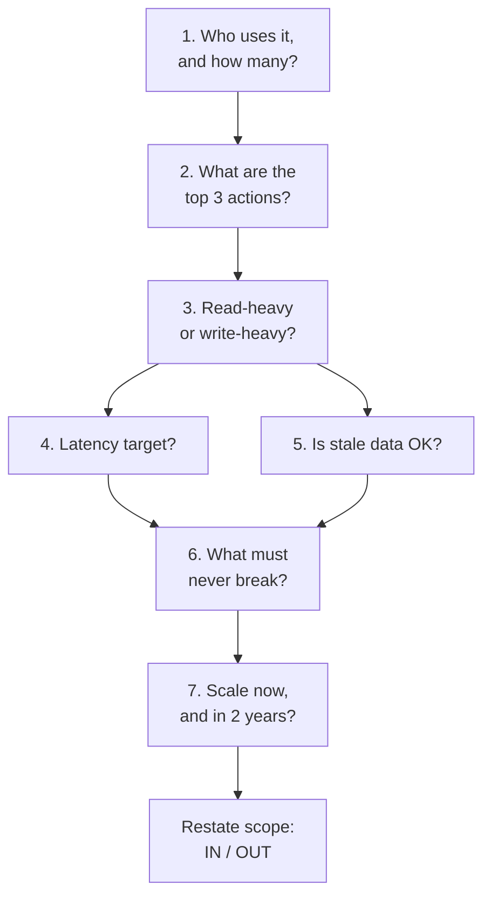

# Requirements and scope

> **The prompt is deliberately vague.** "Design Instagram" is not a problem
> statement, and treating it as one is the first mistake. Producing a bounded
> problem from it is the first thing being scored.

Five minutes. Roughly eight questions. Everything downstream depends on it.

---

## 1 · Why this phase is scored so heavily

The round simulates a real design task, and in a real design task the hardest
part is deciding what you are building. An engineer who starts coding on a
one-line ticket without asking anything is a liability regardless of how good
their code is — and the interviewer is checking for exactly that.

There is a second, more mechanical reason: **scoping protects you.** A candidate
who scoped search out of Instagram at minute three and runs out of time has
delivered what they promised. One who never scoped has simply not finished.

---

## 2 · The question set

Not all of these every time. The first three, always.



### The three that always come first

**"Who uses this and roughly how many?"**
Consumer or enterprise, 10k users or 500M. This one number decides whether the
answer is "a Postgres instance and a cache" or a sharded fleet, and both can be
correct.

**"What are the two or three most important things a user does?"**
Forces the interviewer to name the functional core. Everything else you are then
entitled to defer.

**"Is this read-heavy or write-heavy, and roughly what ratio?"**
The most decision-changing question in the round, and the one candidates skip
most often.

| Ratio | What it implies |
|---|---|
| 1000:1 reads | Cache everything, precompute, denormalise, read replicas |
| 100:1 reads | Cache the hot set; a primary plus replicas is fine |
| 1:1 | The write path is the design problem |
| Write-heavy | Batching, queues, LSM-tree storage, append-only |

### The four that shape the architecture

**"What is the latency target — and at p99, not average?"**
p99 is where the design lives. Averages hide the tail, and the tail is what
users experience as "the app is slow."

**"How stale can data be?"**
The cheapest question you can ask. "A few seconds is fine" unlocks async
replication, caching, and precomputation — most of your performance budget. "It
must be immediately consistent" removes them.

**"What is the cost of downtime versus the cost of a wrong answer?"**
This is the availability/consistency question asked in a way that gets a real
answer. A social feed prefers stale-and-up; a payment ledger prefers
down-and-correct. Ask it in business terms and people answer honestly.

**"What scale should I design for — today's, or a year out?"**
Prevents both over- and under-engineering, and demonstrates that you know
premature distribution is a real cost.

### The one that buys goodwill

**"Anything explicitly out of scope?"**
Interviewers often have a component they want you to reach. Asking gives them
permission to steer, which is what they want to do anyway.

---

## 3 · Functional versus non-functional

Keep them visibly separate on the board.

| | Functional | Non-functional |
|---|---|---|
| **Asks** | What can a user do? | How well must it do it? |
| **Examples** | Post, follow, read timeline | 200ms p99, 99.9% uptime, no lost writes |
| **Decides** | The API and the entities | The architecture |

> **Non-functional requirements are where the design comes from.** Two systems
> with identical functional requirements and different latency and consistency
> targets are completely different systems. Candidates who list only functional
> requirements end up designing a CRUD app for every prompt.

---

## 4 · Writing the scope down

Board, top-left, and leave it there:

```
IN SCOPE                      OUT OF SCOPE
- post a photo                - stories, reels
- follow a user               - direct messages
- view home feed              - search, explore
                              - ads, moderation

NON-FUNCTIONAL
- 500M DAU, 100:1 read:write
- feed p99 < 200ms
- feed may be seconds stale
- availability > consistency for reads
- no lost uploads (durability is hard)
```

**Five lines that pay for themselves three times:** they stop you drifting, they
let you skip things without looking forgetful, and they give you the summary you
need at minute 42.

---

## 5 · The requirement-to-decision map

Every non-functional requirement should visibly cause something later. This is
the mapping to have ready.

| Requirement | Forces |
|---|---|
| Very read-heavy | Cache layer, read replicas, precomputation |
| Write-heavy | Queue + async workers, batching, LSM storage |
| Low latency p99 | Cache, CDN, precompute, colocate data with compute |
| Stale reads acceptable | Async replication, cache TTLs, eventual consistency |
| Strong consistency needed | Single leader per key, transactions, quorum reads |
| Must never lose a write | Replicated durable log, ack after quorum, idempotency |
| Availability over consistency | Multi-leader or leaderless, conflict resolution |
| Huge objects (video, images) | Object storage + CDN; DB holds metadata only |
| Unbounded growth | Sharding from the start, and a chosen shard key |
| Spiky traffic | Queue to absorb, autoscaling, rate limiting, backpressure |

> **In the deep dive, refer back explicitly.** *"Because we said a few seconds of
> staleness is fine, I can serve this from an async replica instead of the
> leader."* Traceability from requirement to decision is the clearest available
> signal that you are designing rather than reciting.

---

## 6 · Scoping mistakes

| Mistake | Why it costs | Instead |
|---|---|---|
| No questions at all | Fails the top rubric line | Three questions minimum |
| Twenty minutes of questions | No time to design | Timebox to five |
| Only functional requirements | You design a CRUD app | Always get latency + consistency |
| Accepting "design Uber" as-is | Unbounded problem | Narrow to rider-driver matching |
| Not writing it down | You drift; nothing to point at | Board, top-left, all round |
| Asking with no follow-through | Looks like a checklist ritual | Cite requirements when deciding |
| Designing for 1B users unasked | Over-engineering is a real finding | Ask what scale to target |

**Asking questions and then ignoring the answers is worse than not asking**, and
it is common. If you learn the ratio is 1:1 and still build a read-through cache
as the centrepiece, the interviewer saw both things.

---

## 7 · A worked opening

> **Interviewer:** Design a URL shortener.
>
> **You:** Let me scope it first. Who's using this — is it a public service like
> bit.ly, or internal link management?
>
> *Public.*
>
> Roughly what scale — writes per day, and read-to-write ratio?
>
> *Say 100 million new URLs a month, and reads are about 100 times writes.*
>
> Good — so about 40 writes and 4,000 reads a second, and reads dominate, which
> means the redirect path is the design. Latency target on the redirect?
>
> *Under 100ms, p99.*
>
> Do users need custom aliases, and do links expire?
>
> *Custom aliases yes. Expiry, let's say optional TTL.*
>
> Last one — analytics? Click counts, referrers?
>
> *Out of scope.*
>
> So: in scope, shorten with optional custom alias and TTL, and redirect.
> Out of scope, analytics and user accounts. Non-functional: 4,000 read QPS,
> redirect p99 under 100ms, high availability — a redirect failing is worse than
> it being briefly stale — and short codes must never collide. Sound right?

**Four questions, ninety seconds, and the design is now determined:** read-heavy
means cache-first, collision-free means the ID generation strategy is the deep
dive, and analytics being out of scope means nobody expects a streaming
pipeline.

---

## 8 · Questions on this phase

| Question | What to say |
|---|---|
| ⭐ "Where do you start with a vague prompt?" | Bound it: users and scale, the two or three core actions, then the non-functional requirements — especially read/write ratio and staleness tolerance. Write in-scope and out-of-scope down before designing. |
| "Why does the read/write ratio matter so much?" | It decides whether the design problem is the read path or the write path. 1000:1 means precompute and cache; 1:1 means the write path is the bottleneck and caching barely helps. |
| ⭐ "How do you decide consistency requirements?" | Ask it in business terms — what is the cost of stale data versus the cost of unavailability. Feeds tolerate staleness; balances and inventory do not. Then apply it per operation, not per system: the same product can have an eventually consistent feed and a strongly consistent checkout. |
| "How do you avoid over-engineering?" | Ask what scale to design for, and start with the simplest thing that meets it — then evolve under pressure I name out loud. Presenting a multi-region sharded design for 10k users is a finding, not a strength. |

---

## Stop condition

You can move on when you can:

1. list the three questions you always ask,
2. explain why staleness tolerance is the cheapest question in the round,
3. produce the requirement-to-decision map from memory for six rows, and
4. run the URL-shortener opening in under two minutes, out loud.

Next: [estimation](estimation.html).
