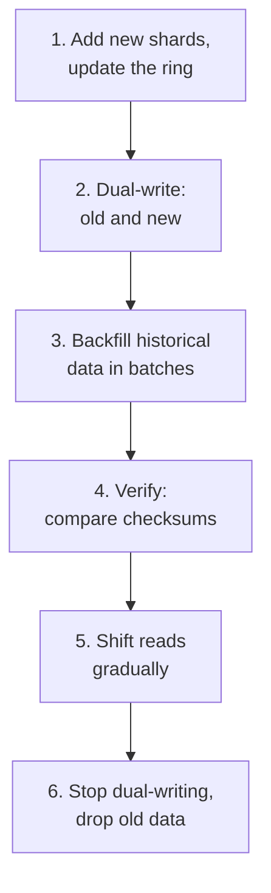

# Sharding and partitioning

> **Sharding is the point of no return.** It buys unbounded write throughput and
> costs you joins, transactions, and unique constraints. The interview is
> mostly about whether you know that, and whether you picked the key for a
> reason.

**Vertical scaling first.** A modern machine takes you a very long way, and
"I'd vertically scale until roughly X, then shard by Y" is a stronger answer
than sharding on slide one.

---

## 1 · Choosing the shard key

**The single most consequential decision in the design**, and it is very hard to
change later. Three properties, and you usually cannot have all three:

| Property | Why | Violated by |
|---|---|---|
| **High cardinality** | Enough distinct values to spread across shards | `country`, `status` |
| **Even distribution** | No shard takes disproportionate load | Celebrity `user_id`, `created_at` |
| **Present in your queries** | Otherwise every read hits every shard | Sharding by `id` but querying by `email` |

> **The third is the one candidates miss.** If you shard tweets by `tweet_id`
> but the main query is "tweets by author, newest first", every timeline read
> becomes a scatter-gather across every shard. The key must match the dominant
> access pattern established during scoping — this is exactly why you asked
> those questions.

**A scatter-gather query is as slow as your slowest shard**, and with 100 shards
you are sampling the tail of the latency distribution 100 times. That is why a
p99 that looks fine per-shard becomes a p50 problem for the fan-out query.

---

## 2 · The four strategies

### Range

```
shard 1: user_id 0        - 10,000,000
shard 2: user_id 10M      - 20,000,000
shard 3: user_id 20M      - 30,000,000
```

Range scans work; **sequential keys create a hot spot** — with autoincrement IDs
or timestamps, every new write lands on the last shard.

### Hash

```
shard = hash(user_id) % N
```

Even distribution, **no range scans**, and resharding moves everything — which
is why you use consistent hashing instead of plain modulo whenever N might
change.

### Consistent hashing

Servers and keys on a ring; a key belongs to the next server clockwise. Changing
N moves ~1/N of keys instead of all of them. **Virtual nodes** (~150 ring points
per physical server) keep the load even and spread a dead node's keys across all
survivors rather than dumping them on one neighbour.

### Directory-based

A lookup service maps key → shard.

Maximum flexibility — you can move an individual tenant, or give a large
customer their own shard. The cost is a lookup on every request and a new
component that must be highly available and is now a potential SPOF. **Standard
for multi-tenant SaaS**, where tenants differ in size by orders of magnitude.

| Strategy | Even | Range scans | Rebalancing | Use when |
|---|---|---|---|---|
| Range | ✗ | ✓ | Split ranges | Time-series with range queries |
| Hash | ✓ | ✗ | Everything moves | Fixed shard count |
| Consistent hash | ✓ | ✗ | ~1/N moves | Shard count changes |
| Directory | ✓ (managed) | Depends | Move one entry | Multi-tenant, uneven sizes |

---

## 3 · Hot spots

Even distribution of *keys* does not mean even distribution of *load*.

| Hot spot | Example | Fix |
|---|---|---|
| **Celebrity** | One user with 100M followers | Special-case them; do not fan out |
| **Sequential key** | Autoincrement or timestamp | Hash the key, or prefix with a bucket |
| **Time-based** | Today's partition takes all writes | Composite key: `(bucket, timestamp)` |
| **Single hot record** | A viral post's counter | Split into N sub-counters, sum on read |
| **Uneven tenants** | One customer is 40% of the data | Directory sharding; isolate them |

**Key salting**, concretely:

```
Hot:     key = "post:12345:likes"        one row, one shard, all writes
Salted:  key = "post:12345:likes:{0-99}" 100 rows, spread across shards
         write: increment a random one
         read:  sum all 100
```

**Writes spread 100×; reads cost 100 lookups.** State that trade — it is the
whole point, and it is only worth it when writes vastly outnumber reads, which
is exactly the case for a counter on a viral post.

> **The celebrity problem is the canonical hot-spot question** and it has a
> canonical answer: a hybrid. Fan out on write for ordinary users, skip fan-out
> entirely for accounts above a follower threshold, and merge their posts in at
> read time. One write to 100 million timelines is not a thing you do; merging
> five celebrity timelines at read time is cheap.

---

## 4 · What sharding breaks

**Volunteer this list.** Knowing the costs is the senior signal; every candidate
knows sharding scales writes.

| Breaks | Why | What you do instead |
|---|---|---|
| **Joins** | The other table is on another machine | Denormalise, or join in the application |
| **Transactions** | ACID is per-shard | Keep related data on one shard; sagas across |
| **Unique constraints** | Uniqueness is per-shard | Central ID service, or make the key include the shard |
| **Aggregates** | `COUNT(*)` must visit every shard | Precompute, or use an analytics store |
| **`ORDER BY` + `LIMIT`** | Global ordering needs all shards | Fetch k from each shard, merge |
| **Autoincrement IDs** | Two shards issue the same number | Snowflake IDs, or per-shard offsets |
| **Rebalancing** | Data must move while live | Consistent hashing, or virtual shards |

**Snowflake IDs** are the standard fix for the ID problem and are worth being
able to describe:

```
64 bits:  [ 41-bit timestamp ][ 10-bit machine ][ 12-bit sequence ]
          ~69 years            1024 machines     4096 per ms each

Sortable by time, unique without coordination, and generated locally --
no central service on the write path.
```

> **"Keep related data on the same shard" is the design move that avoids most of
> this.** Shard by `user_id` and a user's posts, comments and settings live
> together, so the common queries and transactions stay single-shard. Choosing
> the key so that your transactions do not cross shards is better than
> engineering distributed transactions.

---

## 5 · Resharding without downtime

A likely follow-up: *"you're at capacity — how do you double the shards?"*

**The trick most candidates miss: over-provision logical shards up front.**

```
Create 1024 LOGICAL shards on day one, mapped to 4 physical machines.
  shard = hash(key) % 1024        <- this NEVER changes
  logical -> physical is a small mapping table

To grow: move logical shards between machines. The hash is untouched,
so no key ever changes its logical shard. Rebalancing becomes a data
move plus a mapping update, not a rehash.
```

This is how Vitess, Citus and most large deployments actually work, and naming
it is a strong answer.

Without it, the live migration is:



**Every step is reversible until step 6.** Saying that — that you keep the old
path live and shift reads gradually so you can roll back — is what distinguishes
someone who has done a migration from someone who has read about one.

---

## 6 · Partitioning within a shard

Distinct from sharding and often conflated. **Partitioning splits a table inside
one database; sharding splits it across machines.**

Range-partitioning a large table by month gives you:

- **Partition pruning** — a query with a date filter reads one partition
- **Cheap deletion** — dropping a month is a `DROP PARTITION`, not a mass `DELETE`
- **Smaller indexes** — per-partition indexes stay in memory

**The retention argument is the strong one.** Deleting 100M rows with `DELETE`
generates enormous write-ahead log volume and bloat; dropping a partition is a
metadata operation. For any table with a retention policy, partition by time.

---

## 7 · What to say in the round

> *"I'd shard the tweet store by `author_id` — timeline reads are 'posts by the
> people I follow', so the dominant read is by author, and it keeps a user's
> posts co-located for the write transaction. Consistent hashing with virtual
> nodes, and 1024 logical shards over however many machines we need so growth is
> a mapping change rather than a rehash. IDs are Snowflake, so no central
> allocator on the write path.*
>
> *What this costs me: no cross-shard joins, so the graph lives separately and I
> join in the application; global aggregates need precomputing; and celebrities
> break the even-distribution assumption, so accounts over about a million
> followers skip fan-out and get merged at read time instead."*

**The second paragraph is what scores.** Anyone can pick a shard key; naming
what you just gave up, unprompted, is the senior behaviour.

---

## 8 · Interview questions

| Question | What to say |
|---|---|
| ⭐ "What would you shard on?" | Whatever the dominant read filters by — otherwise every query is a scatter-gather, and a scatter-gather is as slow as the slowest of N shards. Then check cardinality and distribution, and name the hot spot the key creates. |
| ⭐ "What does sharding break?" | Joins, cross-shard transactions, unique constraints, global aggregates, global ordering, and autoincrement IDs. Most of it is avoidable by co-locating related data under the same key, which is why the key choice matters more than the mechanism. |
| ⭐ "One user has 100M followers." | Do not fan out to them. Above a follower threshold, skip the write-time fan-out and merge those authors in at read time. Fan-out on write for the long tail, fan-out on read for celebrities — a hybrid, because neither pure strategy survives the distribution. |
| "How do you generate IDs across shards?" | Snowflake: 41-bit timestamp, 10-bit machine ID, 12-bit sequence. Unique without coordination, roughly time-sortable, and generated locally so there is no central service on the write path. |
| ⭐ "Double the shards with no downtime." | Ideally there is nothing to do, because I provisioned 1024 logical shards up front and only move the logical-to-physical mapping. Otherwise: add capacity, dual-write, backfill, verify with checksums, shift reads gradually, then stop dual-writing — reversible until the last step. |
| "Consistent hashing versus modulo?" | Modulo moves every key when N changes, which means a total cache miss or a full data migration. Consistent hashing moves ~1/N. Add virtual nodes or the distribution is uneven and one neighbour inherits all of a dead node's load. |
| "Sharding or partitioning?" | Partitioning splits a table within one database — it buys pruning, smaller indexes, and instant retention deletes. Sharding splits across machines and is what you do when one machine cannot take the write volume. I would partition long before I shard. |

---

## Stop condition

You know this block when you can:

1. give the three properties of a good shard key and which one candidates forget,
2. explain why a scatter-gather is worse than it looks,
3. name six things sharding breaks and the co-location argument,
4. describe salting and its read cost,
5. describe the celebrity hybrid, and
6. explain logical shards and the dual-write migration.
