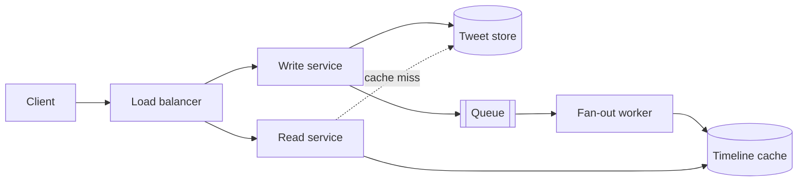

# The 45-minute framework

> **Learn this before any architecture.** The framework is what stops you
> freezing at minute three, and it is what makes the interviewer stop steering.
> The same six phases work for every prompt in the round.

---

## 1 · The clock

A 45-minute round. Adjust proportionally for 60.

```mermaid
gantt
    dateFormat mm
    axisFormat %M
    section Round
    Requirements and scope   :a, 00, 5m
    Estimation               :b, after a, 3m
    API and data model       :c, after b, 5m
    High-level design        :d, after c, 12m
    Deep dive                :e, after d, 15m
    Failure and wrap         :f, after e, 5m
```



| Phase | Minutes | You leave it with |
|---|---|---|
| 1 · Requirements & scope | 0–5 | A written list of what is in and out |
| 2 · Estimation | 5–8 | QPS, storage, and one number that shapes the design |
| 3 · API & data model | 8–13 | Three or four endpoints and the core entities |
| 4 · High-level design | 13–25 | A diagram that satisfies the functional requirements |
| 5 · Deep dive | 25–40 | One or two components taken three levels down |
| 6 · Failure & wrap | 40–45 | What breaks, how you know, what you would do next |

**Say the plan out loud at minute one.** *"Let me spend five minutes on
requirements, do some quick estimates, sketch the API, then a high-level design,
and leave us fifteen minutes to go deep on whatever you find most
interesting."* This single sentence tells the interviewer you have done this
before, and it buys you the scoping time that impatient candidates skip.

---

## 2 · Phase 1 — Requirements and scope (0–5)

The prompt is deliberately underspecified. *"Design Twitter"* is not a problem
statement; it is an invitation to produce one.

**Three questions, always:**

1. **Who uses it and how many?** — scale changes everything downstream
2. **What are the top three things they do?** — the functional core
3. **What must never break?** — the quality attribute that drives the design

Then state the split explicitly:

> *"So in scope: post a tweet, follow a user, and read a home timeline. Out of
> scope for today: search, DMs, ads, trending. And I'm hearing that timeline
> reads must be fast and always available — a few seconds of staleness is
> acceptable. Is that the right emphasis?"*

**Write in-scope and out-of-scope on the board.** It is a visible contract. When
you later skip something, you are not forgetting it — you scoped it out, and the
board proves it.

| Requirement kind | Ask about | Why it matters |
|---|---|---|
| Functional | The three core actions | Defines the API and the happy path |
| Scale | Users, requests, data volume, growth | Decides single-node vs distributed |
| Latency | p50 and p99 targets, read vs write | Decides caching and precomputation |
| Consistency | Is stale data acceptable, and for how long? | Decides replication and the database |
| Availability | What is the cost of downtime? | Decides redundancy and failover |
| Durability | Can you ever lose a write? | Decides replication factor and acks |

> **The read/write ratio is the single most useful number you can extract**, and
> most candidates never ask for it. 1000:1 reads-to-writes says *cache
> aggressively, precompute, denormalise*. 1:1 says *the write path is the
> problem*. Ask for it in phase 1 and refer back to it all round.

---

## 3 · Phase 2 — Estimation (5–8)

Not arithmetic for its own sake. **One number that changes a decision**, then
move on. See [estimation](estimation.html) for the method and the numbers.

The three that usually matter:

- **Write QPS** → does this fit on one database?
- **Storage per year** → one machine, or a sharded fleet?
- **Peak read QPS** → how many cache and app servers?

> *"500M daily actives, each reading their timeline twice a day, is about 1
> billion reads a day — roughly 12,000 QPS average, call it 30,000 at peak.
> That is well past a single database, so reads have to be served from cache
> and the timeline has to be precomputed."*

**Three sentences, one conclusion, and it justified an architectural decision.**
That is what estimation is for. Deriving seven numbers nobody uses burns four
minutes you needed for the deep dive.

---

## 4 · Phase 3 — API and data model (8–13)

Cheap, fast, and disproportionately valuable — it forces both of you to agree on
what the system *does* before arguing about how.

```
POST /v1/tweets            { text }              -> { tweet_id, created_at }
GET  /v1/timeline?cursor=  &limit=20             -> { tweets[], next_cursor }
POST /v1/users/{id}/follow                       -> 204
```

**Three or four endpoints. Not fifteen.**

Two details that get noticed:

- **Cursor pagination, not offset.** `?page=3` re-scans and skips rows, and
  shifts under concurrent writes so users see duplicates or gaps. A cursor on
  `(created_at, id)` is stable and indexable. Say why in one clause.
- **Version the path.** `/v1/` costs three characters and signals that you have
  had to evolve an API someone else was calling.

Then the entities — fields and access patterns, not full DDL:

| Entity | Key fields | Accessed by |
|---|---|---|
| `User` | id, handle, created_at | id, handle |
| `Tweet` | id, author_id, text, created_at | id; author_id + created_at |
| `Follow` | follower_id, followee_id | follower_id; **followee_id** |

> **Design the schema around the access patterns, not the nouns.** That
> `Follow` needs indexing in *both* directions is exactly the kind of detail
> that decides whether fan-out is feasible, and noticing it here rather than at
> minute 35 is a strong signal.

---

## 5 · Phase 4 — High-level design (13–25)

Now draw. Client → load balancer → services → storage, plus whatever
asynchronous path the problem needs.

**Rules that keep the board readable:**

1. **Boxes are services, arrows are calls, and every arrow gets a label.** An
   unlabelled arrow is an unanswered question.
2. **Start with the simplest thing that satisfies the requirements**, then
   evolve it under pressure you name. Beginning with the fully-sharded
   multi-region version skips the reasoning, which was the point.
3. **Narrate a request end to end.** *"A tweet comes in, hits the LB, the write
   service validates and writes to the tweet store, then publishes to a queue —
   and the fan-out worker picks it up from there."* This is what the
   interviewer is actually assessing.
4. **Leave room.** You will add to this diagram for another twenty minutes.



**Evolve, do not present.** *"The simplest version has the read service query
the database directly. At 30,000 QPS that will not hold, so I'll put a cache in
front — and because I want reads to be a single lookup, I'll precompute the
timeline on write instead of assembling it on read."* The interviewer now sees
the reasoning, which is the thing being scored.

---

## 6 · Phase 5 — Deep dive (25–40)

**The longest phase and where the score is decided.** Everything before it was
setup.

Offer a choice — it shows judgement and it lets the interviewer steer to the
rubric they are filling in:

> *"I could go deep on the fan-out path and the celebrity problem, or on how the
> timeline cache is sharded and kept warm. Which is more useful?"*

If they say "you pick", **pick the hardest thing you can actually defend.** The
depth score comes from one component explored properly, not six touched.

Three levels is the target:

| Level | Example — the fan-out worker |
|---|---|
| 1 | "A worker pushes each new tweet into followers' timeline caches" |
| 2 | "It reads from a queue, batches by follower shard, and writes with a capped list per user — 800 entries, trimmed on insert" |
| 3 | "Delivery is at-least-once, so writes are idempotent on `tweet_id`. A crashed worker's messages are reclaimed by the consumer group after a visibility timeout. For users with millions of followers, fan-out is skipped entirely and their tweets are merged in at read time — otherwise one write costs millions" |

**Level 3 is the interview.** Levels 1 and 2 are what everyone says.

---

## 7 · Phase 6 — Failure and wrap (40–45)

Do not let the round end on the happy path. **Volunteer the failure analysis** —
it is a rubric line, and most candidates run out of clock before reaching it.

Walk the diagram and kill each box:

| Component | Fails how | Mitigation |
|---|---|---|
| App server | Crashes | Stateless, health-checked, LB removes it |
| Cache | Node lost | Cold reads hit the DB — is the DB sized for that? |
| Queue | Backs up | Consumer lag alarm; the system degrades, not breaks |
| Database leader | Fails over | Writes pause for ~30s; replicas may lag |
| Whole region | Lost | In scope? If not, say so |

Then close deliberately:

> *"To summarise: precomputed timelines in a cache for read latency, async
> fan-out with a celebrity carve-out for write amplification, at-least-once
> delivery with idempotent writes for correctness. The main thing I'd want to
> validate is the cache hit rate — the whole read path assumes 95%+, and if it
> is really 70% the database is undersized by 6×. Given more time I'd look at
> multi-region."*

**Naming the assumption your design most depends on** is the strongest possible
closing sentence. It shows you know where the design is load-bearing.

---

## 8 · Recovery moves

Things go wrong. These are the moves.

| Situation | What to do |
|---|---|
| **You don't know a technology they named** | *"I haven't used it — I'd reach for X here; how does it differ?"* Bluffing loses more than not knowing. |
| **Blank on the whole problem** | Fall back to phase 1. Ask about scale and the three core actions. Structure buys thinking time. |
| **They push back on a choice** | Do not immediately fold. *"My reasoning was X — what am I missing?"* Then update if they are right, and say what changed your mind. |
| **You are at minute 30 with no diagram** | Say it: *"I'm over-indexing on requirements — let me sketch the high level now."* Naming it recovers most of the cost. |
| **You realise something earlier was wrong** | Fix it out loud. Self-correction scores; a wrong design defended does not. |
| **They go silent** | Silence is usually note-taking, not disapproval. Keep narrating. |
| **You finish early** | You scoped too small. Add a requirement: *"What if we needed this multi-region?"* |

> **Pushback is usually a probe, not a correction.** Interviewers test whether
> you fold under pressure or reason under it. Both instant capitulation and
> stubbornness score badly; "here was my reasoning, what am I missing?" scores
> well either way.

---

## 9 · The framework as a card

```
1. SCOPE      5m   functional, scale, latency, consistency. Write in/out.
2. ESTIMATE   3m   QPS, storage. ONE number that changes a decision.
3. API        5m   3-4 endpoints, cursor pagination, core entities.
4. HIGH LEVEL 12m  simplest thing first, then evolve under named pressure.
5. DEEP DIVE  15m  offer a choice, go THREE levels, this is the score.
6. FAILURE    5m   kill each box, then summarise + name the key assumption.
```

Learn this well enough to run it without thinking, because during the round you
will need the thinking for the problem.

---

## Stop condition

You are ready to move on when you can:

1. recite the six phases and their minute budgets,
2. give the three questions that open phase 1,
3. explain why the read/write ratio matters more than most numbers,
4. describe the difference between a level-2 and a level-3 answer, and
5. name three recovery moves.

Next: [requirements and scope](requirements-and-scope.html).
